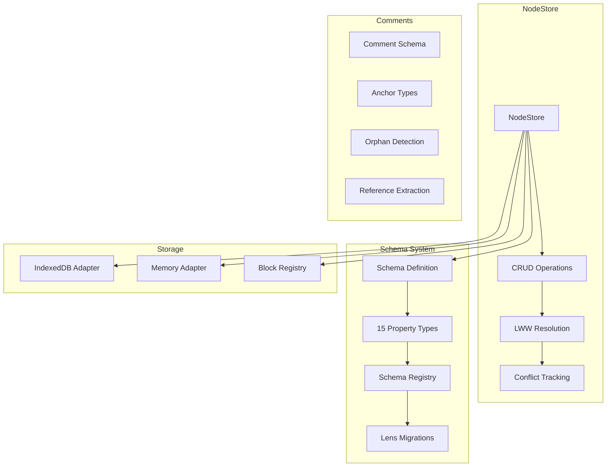

# 06 - Data & Schema System

## Overview

Review of `@xnet/data` - the NodeStore, schema system, property types, and storage adapters.



---

## Critical Issues

### DATA-01: Transaction Not Atomic on Storage Failure

**Package:** `@xnet/data`
**File:** `packages/data/src/store/store.ts:358-465`

```typescript
async transaction(operations: TransactionOperation[]): Promise<TransactionResult> {
  for (let i = 0; i < resolvedOps.length; i++) {
    await this.applyChange(change)  // If this fails, previous ops are committed
  }
}
```

No rollback mechanism. Partial transactions leave inconsistent state.

**Fix:** Implement two-phase commit with rollback.

---

### DATA-02: Remote Change Applied Without Signature Verification

**Package:** `@xnet/data`
**File:** `packages/data/src/store/store.ts:474-484`

```typescript
async applyRemoteChange(change: NodeChange): Promise<void> {
  // No signature verification!
  await this.applyChange(change)
}
```

**Fix:** Call `verifyChange()` before applying.

---

## Major Issues

### DATA-03: Memory Leak in Conflict Tracking

**Package:** `@xnet/data`
**File:** `packages/data/src/store/store.ts:530-532`

Conflicts array grows unbounded.

**Fix:** Trim when size exceeds threshold.

---

### DATA-04: Race Condition in initialize()

**Package:** `@xnet/data`
**File:** `packages/data/src/store/store.ts:76-79`

Concurrent initialization not guarded.

**Fix:** Add initialization guard.

---

### DATA-05: countNodes Loads All Into Memory

**Package:** `@xnet/data`
**File:** `packages/data/src/store/indexeddb-adapter.ts:234-251`

```typescript
async countNodes(options?: CountNodesOptions): Promise<number> {
  nodes = await db.getAll('nodes')  // Loads ALL
  return nodes.filter(...).length
}
```

**Fix:** Use IDB cursor-based counting.

---

### DATA-06: listNodes Loads All Then Paginates

**Package:** `@xnet/data`
**File:** `packages/data/src/store/indexeddb-adapter.ts:207-232`

Pagination provides no performance benefit.

**Fix:** Use cursor with advance/limit.

---

### DATA-07: Global Mutable Block Registry

**Package:** `@xnet/data`
**File:** `packages/data/src/blocks/registry.ts:16`

Module-level Map shared across all imports. Tests pollute each other.

**Fix:** Export class-based registry that can be instantiated.

---

### DATA-08: Lens Path Cache Not Invalidated on Unregister

**Package:** `@xnet/data`
**File:** `packages/data/src/schema/lens.ts:140-150`

Cache cleared locally but dependent code may have cached results.

---

## Minor Issues

### DATA-09: Schema Migration Warnings Not Surfaced

**Package:** `@xnet/data`
**File:** `packages/data/src/store/store.ts:182-199`

Lossy migrations silently logged.

---

### DATA-10: Memory Adapter Allows Duplicate Changes

**Package:** `@xnet/data`
**File:** `packages/data/src/store/memory-adapter.ts:38-48`

Uses `push()` instead of deduplicating by hash.

---

### DATA-11: Select Coercion Case-Insensitive Ambiguity

**Package:** `@xnet/data`
**File:** `packages/data/src/schema/properties/select.ts:69-74`

Two options differing only by case could match ambiguously.

---

### DATA-12: Date Property Year 3000 Limit

**Package:** `@xnet/data`
**File:** `packages/data/src/schema/properties/date.ts:42-43`

Arbitrary limitation not documented.

---

### DATA-13: URL Coercion Adds HTTPS Blindly

**Package:** `@xnet/data`
**File:** `packages/data/src/schema/properties/url.ts:48-51`

Could turn invalid strings into invalid URLs.

---

### DATA-14: Person DID Regex Too Permissive

**Package:** `@xnet/data`
**File:** `packages/data/src/schema/properties/person.ts:15`

Accepts `did:key:---` as valid.

---

### DATA-15: Formula/Rollup Types Not Implemented

**Package:** `@xnet/data`
**File:** `packages/data/src/schema/types.ts:20-21`

In `PropertyType` union but throw at runtime.

---

### DATA-16: Lazy Loading Race in Registry

**Package:** `@xnet/data`
**File:** `packages/data/src/store/registry.ts:97-112`

Small race window for duplicate loads.

---

### DATA-17: getAllVersions Type Lie

**Package:** `@xnet/data`
**File:** `packages/data/src/schema/registry.ts:264-266`

Returns `schema: undefined as unknown as DefinedSchema`.

---

### DATA-18: Remote Resolver Errors Swallowed

**Package:** `@xnet/data`
**File:** `packages/data/src/schema/registry.ts:127-128`

All errors become "schema not found".

---

### DATA-19: Block validateBlock Returns Boolean

**Package:** `@xnet/data`
**File:** `packages/data/src/blocks/registry.ts:39-43`

No indication of why validation failed.

---

### DATA-20: anchorData Not JSON-Validated

**Package:** `@xnet/data`
**File:** `packages/data/src/schema/schemas/comment.ts:58-59`

Stored as text but should be valid JSON.

---

### DATA-21: BFS Doesn't Prefer Lossless Paths

**Package:** `@xnet/data`
**File:** `packages/data/src/schema/lens.ts:282-317`

Shortest path wins over lossless path.

---

### DATA-22: Remove Lens Backward Is No-op

**Package:** `@xnet/data`
**File:** `packages/data/src/schema/lens-builders.ts:121-131`

Cannot restore removed data.

---

### DATA-23: TempID Scope Not Documented

**Package:** `@xnet/data`
**File:** `packages/data/src/store/tempids.ts:234-238`

Users might expect temp IDs to work across transactions.

---

### DATA-24: findSchemaIdForNode O(n^2)

**Package:** `@xnet/data`
**File:** `packages/data/src/store/tempids.ts:312-331`

Iterates all operations for each update.

**Fix:** Build lookup map in first pass.

---

## Test Coverage

| Module                    | Tests | Coverage |
| ------------------------- | ----- | -------- |
| store/store.test.ts       | 43    | HIGH     |
| store/tempids.test.ts     | 22    | HIGH     |
| schema/lens.test.ts       | 66    | HIGH     |
| schema/schema.test.ts     | 31    | MEDIUM   |
| blob/blob-service.test.ts | 16    | HIGH     |
| comment\*.test.ts         | ~120  | HIGH     |

**Gaps:**

- 15 property types - not individually tested
- IndexedDB adapter - no tests
- Block registry - no tests

---

## Recommendations

### Phase 1 (Daily Driver)

- [ ] **DATA-02:** Add signature verification to applyRemoteChange
- [ ] **DATA-03:** Trim conflicts array
- [x] **DATA-05/06:** Fix countNodes/listNodes to use cursors _(fixed bdada0a)_

### Phase 2 (Hub MVP)

- [ ] **DATA-01:** Implement transaction rollback
- [ ] **DATA-04:** Add initialization guard
- [ ] **DATA-07:** Make block registry instantiable
- [ ] **DATA-10:** Deduplicate in memory adapter

### Phase 3 (Production)

- [ ] **DATA-21:** Prefer lossless lens paths
- [ ] **DATA-24:** Build lookup map for temp ID resolution
- [ ] Add tests for all 15 property types
- [ ] Add tests for IndexedDB adapter
