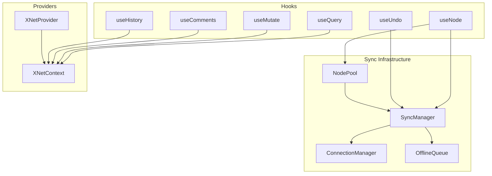
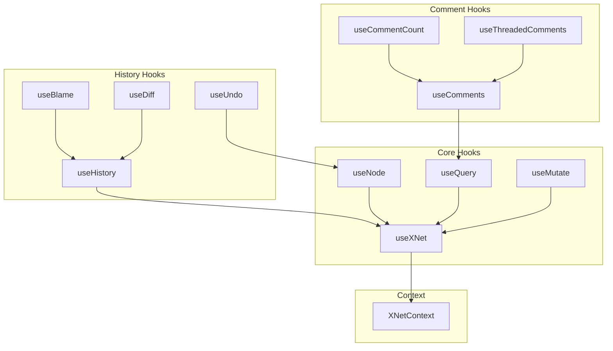

# 07 - React Hooks & State Management

## Overview

Review of `@xnet/react` - hooks, sync management, providers, and state management.



---

## Major Issues

### REACT-01: XNetProvider Context Value Not Memoized

**Package:** `@xnet/react`
**File:** `packages/react/src/context.ts:499-512`

```typescript
return (
  <XNetContext.Provider
    value={{  // New object every render!
      store,
      identity,
      sync,
      // ...
    }}
  >
```

**Impact:** Every XNetProvider render triggers re-renders of ALL context consumers.

**Fix:** Wrap in `useMemo`.

---

### REACT-02: Multiple Hooks Access Private store.storage

**Package:** `@xnet/react`
**Files:**

- `packages/react/src/hooks/useHistory.ts:70`
- `packages/react/src/hooks/useBlame.ts:47`
- `packages/react/src/hooks/useAudit.ts:60`
- `packages/react/src/hooks/useDiff.ts:58`
- `packages/react/src/hooks/useVerification.ts:59`

```typescript
const storage = (store as any).storage
```

Relies on internal implementation of NodeStore.

**Fix:** Add public `getStorageAdapter()` method to NodeStore.

---

### REACT-03: SyncManager Acquire Doesn't Await Room Join

**Package:** `@xnet/react`
**File:** `packages/react/src/sync/sync-manager.ts:612-646`

`joinNodeRoom(nodeId)` is synchronous but actual subscription is async. sync-step1 sent before subscription confirmed.

**Impact:** Potential message loss in fast-path scenarios.

**Fix:** Make joinRoom return promise that resolves on subscription confirmation.

---

### REACT-04: NodePool Eviction Doesn't Await Persistence

**Package:** `@xnet/react`
**File:** `packages/react/src/sync/node-pool.ts:116-117`

```typescript
config.storage.setDocumentContent(id, content).catch(() => {})
```

Fire-and-forget persistence. App crash = data loss.

**Fix:** Await persistence or at least log failures.

---

## Minor Issues

### REACT-05: useQuery JSON.stringify in Dependencies

**Package:** `@xnet/react`
**File:** `packages/react/src/hooks/useQuery.ts:312, 401`

```typescript
;[JSON.stringify(filter.where)] // New string every render
```

**Fix:** Memoize filter or use deep compare.

---

### REACT-06: useComments Stale Closure Risk

**Package:** `@xnet/react`
**File:** `packages/react/src/hooks/useComments.ts:132-167`

`loadComments` accesses `queryRef.current` - pattern is correct but not obvious.

---

### REACT-07: useUndo Ignores opts.options Changes

**Package:** `@xnet/react`
**File:** `packages/react/src/hooks/useUndo.ts:61-72`

UndoManager not recreated if options change.

---

### REACT-08: useNode update Missing schemaId Dependency

**Package:** `@xnet/react`
**File:** `packages/react/src/hooks/useNode.ts:546`

Uses `schemaId` but not in dependency array.

---

### REACT-09: useNode createIfMissing Race Condition

**Package:** `@xnet/react`
**File:** `packages/react/src/hooks/useNode.ts:343-358`

Small window between checking and setting `creatingRef`.

---

### REACT-10: useMutate optimistic Option Not Implemented

**Package:** `@xnet/react`
**File:** `packages/react/src/hooks/useMutate.ts:210`

`_options?: MutateOptions` accepted but never used.

---

### REACT-11: SyncManager Status Handlers Not Cleaned Up

**Package:** `@xnet/react`
**File:** `packages/react/src/sync/sync-manager.ts:556-572`

`connection.onStatus()` unsubscribe not stored or called.

---

### REACT-12: ConnectionManager Reconnect Timer Not Cleared

**Package:** `@xnet/react`
**File:** `packages/react/src/sync/connection-manager.ts:207-216`

Timer not cleared on successful connect.

---

### REACT-13: NodePool No Maximum Active Limit

**Package:** `@xnet/react`
**File:** `packages/react/src/sync/node-pool.ts`

Has `maxWarm` but no `maxActive`.

---

### REACT-14: WebSocketSyncProvider Handlers Not Cleared

**Package:** `@xnet/react`
**File:** `packages/react/src/sync/WebSocketSyncProvider.ts:167-189`

`eventHandlers` map not cleared in destroy().

---

### REACT-15: useNode Awareness Handler Potential Leak

**Package:** `@xnet/react`
**File:** `packages/react/src/hooks/useNode.ts:704-728`

Cleanup pattern slightly awkward.

---

### REACT-16: useQuery sortNodes Causes Extra Re-renders

**Package:** `@xnet/react`
**File:** `packages/react/src/hooks/useQuery.ts:313-314`

Filter object reference change causes sortNodes to change.

---

### REACT-17: OfflineQueue Saves on Every Enqueue

**Package:** `@xnet/react`
**File:** `packages/react/src/sync/offline-queue.ts:73-75`

**Fix:** Debounce save.

---

### REACT-18: Registry getTracked Recomputes TTL Every Call

**Package:** `@xnet/react`
**File:** `packages/react/src/sync/registry.ts:104-113`

O(n) on every access.

---

### REACT-19: FlatNode Type Assertion

**Package:** `@xnet/react`
**File:** `packages/react/src/utils/flattenNode.ts:156`

`as FlatNode<P>` bypasses type checking.

---

## Test Coverage

| Module                     | Tests | Coverage |
| -------------------------- | ----- | -------- |
| hooks/useQuery.test.tsx    | ~10   | LOW      |
| hooks/useMutate.test.tsx   | ~10   | LOW      |
| hooks/useNode.test.tsx     | ~10   | LOW      |
| hooks/useIdentity.test.tsx | ~5    | LOW      |
| sync/blob-sync.test.ts     | ~5    | LOW      |
| sync/initial-sync.test.ts  | ~10   | LOW      |

**Critical Gaps:**

- useUndo, useHistory, useBlame, useDiff, useAudit - NO TESTS
- useComments - NO TESTS
- useBackup, useHubStatus, usePeerDiscovery - NO TESTS
- connection-manager.ts - NO TESTS
- offline-queue.ts - NO TESTS
- sync-manager.ts - NO TESTS
- node-pool.ts - NO TESTS

---

## Hook Dependencies Analysis



---

## Recommendations

### Phase 1 (Daily Driver)

- [x] **REACT-01:** Memoize XNetProvider context value (highest impact) _(fixed f378ef6)_
- [x] **REACT-04:** Await persistence in NodePool eviction _(fixed 3b16835)_
- [x] **REACT-02:** Add public API for storage access _(fixed a190622 - HOOK-03)_

### Phase 2 (Hub MVP)

- [x] **REACT-03:** Await room join confirmation in SyncManager _(fixed - joinRoomAsync with subscription confirmation)_
- [x] **REACT-11:** Clean up status handlers on stop _(fixed - store and call statusHandlerCleanup in stop())_
- [x] **REACT-14:** Clear eventHandlers in destroy _(fixed - clear eventHandlers map in WebSocketSyncProvider.destroy())_
- [ ] Add tests for sync-manager, connection-manager, offline-queue

### Phase 3 (Production)

- [x] **REACT-05:** Fix dependency array in useQuery _(fixed - memoize filter.where with useMemo to avoid string recreation)_
- [ ] **REACT-10:** Implement optimistic updates or remove option
- [ ] **REACT-17:** Debounce offline queue saves
- [ ] Add tests for all hooks (useUndo, useHistory, useComments, etc.)
