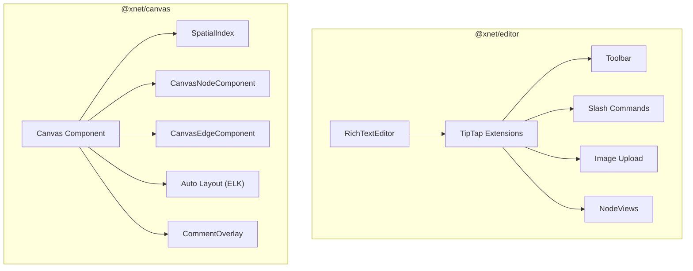

# 08 - Editor & Canvas Packages

## Overview

Review of `@xnet/editor` and `@xnet/canvas` - the UI-heavy content editing packages.



---

## Critical Issues

### EDITOR-01: Image Placeholder Uses Filename (Not Unique)

**Package:** `@xnet/editor`
**File:** `packages/editor/src/extensions/image/ImagePastePlugin.ts:111-129`

```typescript
// Finds placeholder by alt text (filename)
const placeholder = findNodeWithAlt(filename)
```

Multiple images with same filename will update wrong placeholder.

**Fix:** Generate unique upload ID for each placeholder.

---

### CANVAS-01: Node Dragging Reads Stale Position

**Package:** `@xnet/canvas`
**File:** `packages/canvas/src/renderer/Canvas.tsx:343-359`

```typescript
const currentNode = canvas.store.getNode(nodeId)
const newX = currentNode.x + deltaX // Current position may lag
```

Multi-select drag can cause nodes to drift during fast drags.

**Fix:** Track offset from initial positions instead of reading current.

---

## Major Issues

### EDITOR-02: Heading Input Rules Incorrect Regex

**Package:** `@xnet/editor`
**File:** `packages/editor/src/extensions.ts:153-156`

`#{1,1}` matches 1 hash, `#{1,2}` matches 1-2. Ambiguous matching.

**Fix:** Use exact match `new RegExp(\`^(#{${level}})\\s$\`)`.

---

### EDITOR-03: Mobile Keyboard Doesn't Adjust Toolbar

**Package:** `@xnet/editor`
**File:** `packages/editor/src/components/FloatingToolbar.tsx:473-475`

`keyboardVisible` result captured but not used.

---

### EDITOR-04: Editor Cleanup May Destroy Prematurely

**Package:** `@xnet/editor`
**File:** `packages/editor/src/components/RichTextEditor.tsx:655-658`

Cleanup runs on every `editor` change, not just unmount.

---

### EDITOR-05: Drag Drop Position May Be Stale After Collab Edit

**Package:** `@xnet/editor`
**File:** `packages/editor/src/extensions/drag-handle/DragDropPlugin.ts:202-215`

Position-based lookup after async operation.

**Fix:** Use stable node ID attribute.

---

### EDITOR-06: Redundant Event Subscriptions

**Package:** `@xnet/editor`
**File:** `packages/editor/src/hooks/useActiveStates.ts:109-111`

Subscribes to both `selectionUpdate` and `transaction`.

---

### CANVAS-02: handleNodesChange Emits Empty Changes

**Package:** `@xnet/canvas`
**File:** `packages/canvas/src/store.ts:331-342`

Always emits `{ changes: {} }`, listeners can't determine what changed.

**Fix:** Compute actual changed properties.

---

### CANVAS-03: Cursor Ref Doesn't Trigger Re-render

**Package:** `@xnet/canvas`
**File:** `packages/canvas/src/renderer/Canvas.tsx:383-385`

```typescript
cursor: isDragging.current ? 'grabbing' : 'default'
```

Ref changes don't cause re-render.

**Fix:** Use state for isDragging.

---

### CANVAS-04: autoLayout Uses Stale Closure

**Package:** `@xnet/canvas`
**File:** `packages/canvas/src/hooks/useCanvas.ts:287-302`

Reads `nodes` from closure during async ELK computation.

**Fix:** Read fresh from store inside callback.

---

### CANVAS-05: Global Listeners Not Cleaned on Unmount

**Package:** `@xnet/canvas`
**File:** `packages/canvas/src/nodes/CanvasNodeComponent.tsx:176-194`

Window event listeners added but not checked for unmount.

---

### CANVAS-06: findNodeAt Sorts on Every Call

**Package:** `@xnet/canvas`
**File:** `packages/canvas/src/spatial/index.ts:119-126`

Inefficient for many overlapping nodes.

---

## Minor Issues

### EDITOR-07: Slash Command Any Types

**Package:** `@xnet/editor`
**File:** `packages/editor/src/extensions/slash-command/index.ts:78`

---

### EDITOR-08: Focus Check Boundary Issue

**Package:** `@xnet/editor`
**File:** `packages/editor/src/nodeviews/hooks/useNodeFocus.ts:57`

Exclusive comparison misses boundary cases.

---

### EDITOR-09: Image Resize Max Width Fallback

**Package:** `@xnet/editor`
**File:** `packages/editor/src/extensions/image/ImageNodeView.tsx:112`

---

### EDITOR-10: Slash Menu No Scroll Into View

**Package:** `@xnet/editor`
**File:** `packages/editor/src/components/SlashMenu/index.tsx:42-49`

---

### EDITOR-11: Callout Backspace Handler Issue

**Package:** `@xnet/editor`
**File:** `packages/editor/src/extensions/callout/CalloutExtension.ts:165`

---

### EDITOR-12: Dead Code in applyDelta

**Package:** `@xnet/editor`
**File:** `packages/editor/src/core.ts:122`

---

### EDITOR-13: LivePreviewOptions Missing syntaxClass

**Package:** `@xnet/editor`
**File:** `packages/editor/src/extensions/live-preview/index.ts:36-39`

---

### EDITOR-14: EditorToolbar Inline isActive Calls

**Package:** `@xnet/editor`
**File:** `packages/editor/src/components/EditorToolbar.tsx:40-164`

Should use `useActiveStates` hook.

---

### CANVAS-07: ResizeObserver Doesn't Trigger State Update

**Package:** `@xnet/canvas`
**File:** `packages/canvas/src/renderer/Canvas.tsx:212-227`

---

### CANVAS-08: Bezier Tension Ignores Node Size

**Package:** `@xnet/canvas`
**File:** `packages/canvas/src/edges/CanvasEdgeComponent.tsx:60-81`

---

### CANVAS-09: generateNodeId Uses Math.random()

**Package:** `@xnet/canvas`
**File:** `packages/canvas/src/store.ts:426-428`

**Fix:** Use `crypto.randomUUID()`.

---

### CANVAS-10: selectAll Uses Stale Closure

**Package:** `@xnet/canvas`
**File:** `packages/canvas/src/hooks/useCanvas.ts:231-233`

---

### CANVAS-11: NodeJS.Timeout Type in Browser

**Package:** `@xnet/canvas`
**File:** `packages/canvas/src/comments/CommentOverlay.tsx:78`

---

### CANVAS-12: elkInstance Typed as Any

**Package:** `@xnet/canvas`
**File:** `packages/canvas/src/layout/index.ts:15`

---

### CANVAS-13: Keyboard Shortcuts Don't Check Focus

**Package:** `@xnet/canvas`
**File:** `packages/canvas/src/renderer/Canvas.tsx:293-328`

Delete key may delete canvas nodes when typing elsewhere.

**Fix:** Check if canvas has focus.

---

## Test Coverage

| Module                    | Tests | Coverage |
| ------------------------- | ----- | -------- |
| extensions/\*.test.ts     | ~100  | MEDIUM   |
| components/\*.test.tsx    | ~20   | LOW      |
| accessibility/\*.test.ts  | ~20   | MEDIUM   |
| hooks/\*.test.ts          | ~10   | LOW      |
| spatial.test.ts           | ~20   | HIGH     |
| layout.test.ts            | ~15   | MEDIUM   |
| store.test.ts             | ~15   | MEDIUM   |
| useCanvasComments.test.ts | ~10   | LOW      |

**Gaps:**

- Canvas.tsx component - NO TESTS
- CanvasNodeComponent - NO TESTS
- CanvasEdgeComponent - NO TESTS
- Comment extensions - NO TESTS
- Live preview - NO TESTS

---

## Summary Table

| ID        | Severity | Package | Issue                              |
| --------- | -------- | ------- | ---------------------------------- |
| EDITOR-01 | Critical | editor  | Image upload placeholder collision |
| CANVAS-01 | Critical | canvas  | Drag reads stale position          |
| EDITOR-02 | Major    | editor  | Heading regex ambiguous            |
| EDITOR-03 | Major    | editor  | Mobile keyboard not handled        |
| EDITOR-04 | Major    | editor  | Premature editor destroy           |
| EDITOR-05 | Major    | editor  | Collab drag position stale         |
| EDITOR-06 | Major    | editor  | Redundant event subscriptions      |
| CANVAS-02 | Major    | canvas  | Empty change events                |
| CANVAS-03 | Major    | canvas  | Cursor ref no re-render            |
| CANVAS-04 | Major    | canvas  | Layout stale closure               |
| CANVAS-05 | Major    | canvas  | Listener cleanup missing           |

---

## Recommendations

### Phase 1 (Daily Driver)

- [ ] **EDITOR-01:** Use unique upload IDs for placeholders
- [ ] **CANVAS-01:** Track drag offset from initial positions
- [ ] **EDITOR-02:** Fix heading regex for exact level matching
- [ ] **CANVAS-09:** Use crypto.randomUUID for node IDs

### Phase 2 (Hub MVP)

- [ ] **CANVAS-02:** Emit actual changes in handleNodesChange
- [ ] **CANVAS-03:** Use state for isDragging
- [ ] **CANVAS-05:** Check mounted state before window listener updates
- [ ] **CANVAS-13:** Check canvas focus before keyboard shortcuts

### Phase 3 (Production)

- [ ] **EDITOR-03:** Adjust toolbar position when keyboard visible
- [ ] **EDITOR-05:** Use stable node IDs in drag-drop
- [ ] **CANVAS-04:** Read fresh nodes in autoLayout callback
- [ ] Add component tests for Canvas and NodeViews
