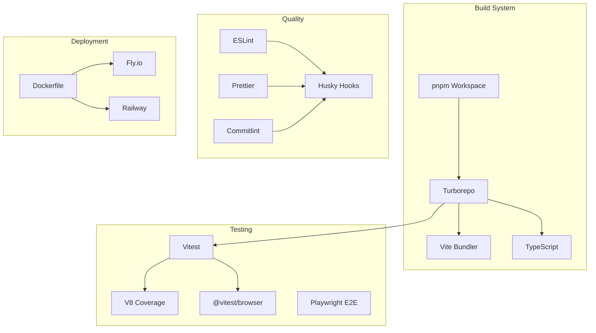
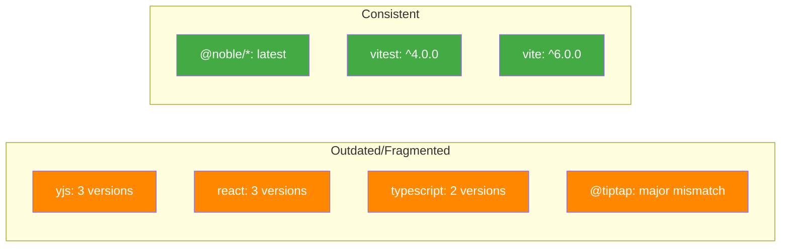
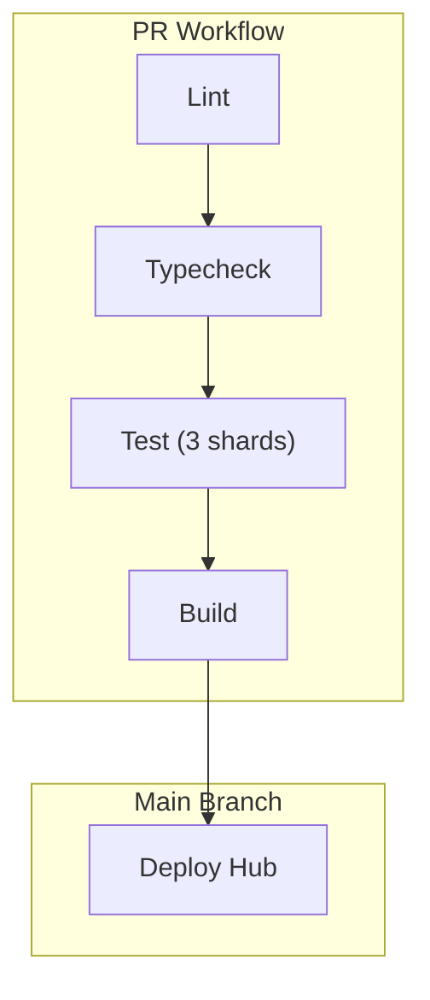

# 09 - Infrastructure & Build System

## Overview

Review of build configuration, dependencies, deployment, and CI/CD across the monorepo.



---

## Major Issues

### INFRA-01: Yjs Version Fragmentation

**Files:** Multiple package.json

| Version    | Packages                            |
| ---------- | ----------------------------------- |
| `^13.6.0`  | electron, canvas, devtools, history |
| `^13.6.24` | data, editor, hub, network, react   |
| `^13.6.18` | web                                 |

Yjs has strict singleton requirements for document sharing.

**Fix:** Standardize to `^13.6.24` or use pnpm overrides:

```json
"pnpm": {
  "overrides": {
    "yjs": "^13.6.24"
  }
}
```

---

### INFRA-02: React Version Fragmentation

**Files:** Multiple package.json

| Version   | Packages            |
| --------- | ------------------- |
| `^18.2.0` | electron, most pkgs |
| `^18.3.0` | web                 |
| `18.3.1`  | expo (pinned)       |

Could cause "Invalid hook call" errors.

**Fix:** Standardize with pnpm overrides.

---

### INFRA-03: Expo TypeScript Version Mismatch

**File:** `apps/expo/package.json`

Expo uses `~5.3.0` while all other packages use `^5.4.0`.

---

### INFRA-04: TipTap Peer Dependency Version Mismatch

**File:** `packages/plugins/package.json`

Plugins peer depends on `@tiptap/core: ^2.0.0` but editor uses `^3.15.3`.

**Fix:** Update to `@tiptap/core: ^3.0.0`.

---

## Minor Issues

### INFRA-05: Duplicate Lockfile in Site

**File:** `site/pnpm-lock.yaml`

Should use root workspace lockfile.

---

### INFRA-06: jsdom Version Fragmentation

| Version   | Packages                   |
| --------- | -------------------------- |
| `^25.0.0` | editor                     |
| `^26.0.0` | canvas, plugins, ui, views |

---

### INFRA-07: @testing-library/react Version Fragmentation

| Version   | Packages                 |
| --------- | ------------------------ |
| `^14.0.0` | integration tests        |
| `^16.0.0` | editor                   |
| `^16.2.0` | canvas, react, ui, views |

---

### INFRA-08: @tanstack/react-router Version Mismatch

**Files:**

- `apps/electron`: `^1.45.0`
- `apps/web`: `^1.57.0`

---

### BUILD-01: skipLibCheck Enabled Globally

**File:** `tsconfig.json`

Library type errors won't be caught.

---

### BUILD-02: noUnusedLocals Disabled in Web

**File:** `apps/web/tsconfig.json`

Dead code accumulation.

---

### BUILD-03: Explicit 'any' Usage (~100+ occurrences)

Production code with `as any`:

- `packages/views/src/properties/index.ts`
- `packages/devtools/src/panels/VersionPanel/useVersionInfo.ts`

---

### DEPLOY-01: Dockerfile Uses Node 22 Alpine

**File:** `packages/hub/Dockerfile`

CI uses Node 23.

---

### DEPLOY-02: Fly.toml Relative Dockerfile Path

**File:** `packages/hub/fly.toml`

Assumes deployment from hub directory.

---

### TEST-01: Coverage Thresholds Disabled in CI

**File:** `vitest.config.ts`

No coverage enforcement due to sharding.

---

### TEST-02: Sharded Tests Don't Aggregate Coverage

**File:** `.github/workflows/ci.yml`

Only shard 1/3 uploads coverage.

---

### PKG-01: Packages Export src/ Instead of dist/

**Files:** Most package.json files

```json
"main": "./src/index.ts"
```

Consumers get TypeScript source, requires bundler support.

---

### PKG-02: Missing Test Script in Some Packages

**Files:** `packages/crypto`, `packages/core`

No tests defined.

---

## Dependency Analysis



---

## Git Hooks Configuration

| Hook       | Runs                                            | Time  |
| ---------- | ----------------------------------------------- | ----- |
| Pre-commit | lint-staged, turbo typecheck --affected, vitest | 5-15s |
| Commit-msg | commitlint (conventional commits)               | <1s   |
| Pre-push   | pnpm typecheck && pnpm test                     | ~30s  |

The pre-push hook duplicates pre-commit checks (belt and suspenders).

---

## CI/CD Pipeline



---

## Recommendations

### Immediate

- [ ] **INFRA-01:** Add pnpm override for Yjs version
- [ ] **INFRA-02:** Add pnpm override for React version
- [ ] **INFRA-04:** Update @tiptap peer dependency

### Before Production

- [ ] **TEST-01:** Set up coverage aggregation for sharded tests
- [ ] **DEPLOY-01:** Align Node versions between Docker and CI
- [ ] **BUILD-01:** Consider enabling skipLibCheck: false

### Maintenance

- [ ] **INFRA-05:** Remove duplicate site lockfile
- [ ] **INFRA-06/07:** Standardize jsdom and testing-library versions
- [ ] **PKG-01:** Add dual exports for published packages
- [ ] **PKG-02:** Add test scripts to all packages
