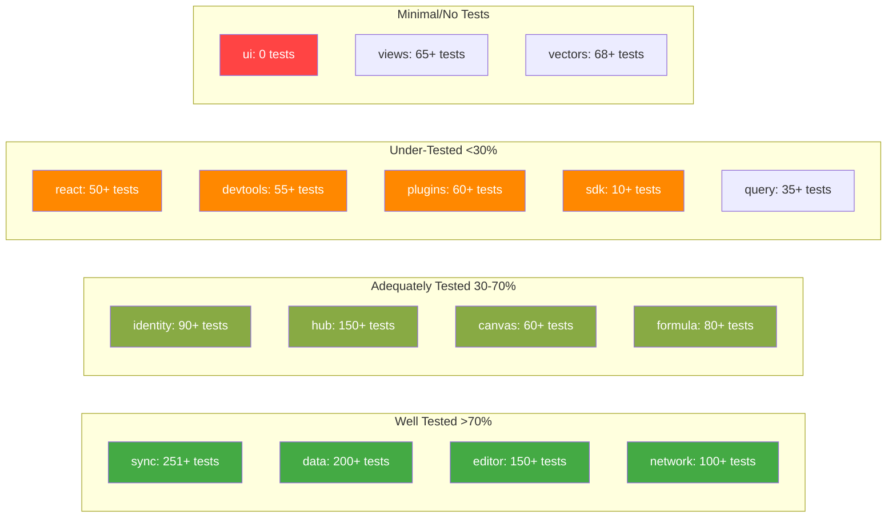
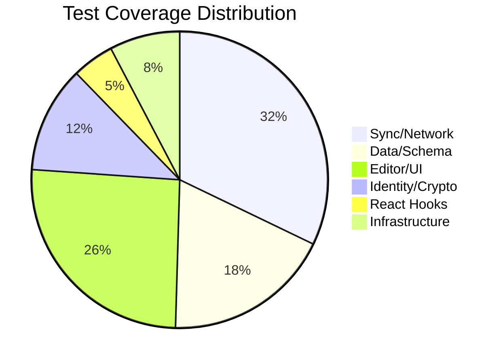

# 10 - Test Coverage Analysis

## Overview

Analysis of test coverage across the xNet monorepo: 160 test files, 2,792 tests passing.



---

## Coverage by Package

| Package           | Test Files | Tests | Coverage | Risk   |
| ----------------- | ---------- | ----- | -------- | ------ |
| @xnetjs/sync      | 19         | 251+  | HIGH     | LOW    |
| @xnetjs/data      | 13         | 200+  | MEDIUM   | MEDIUM |
| @xnetjs/editor    | 27         | 150+  | MEDIUM   | LOW    |
| @xnetjs/network   | 8          | 100+  | HIGH     | LOW    |
| @xnetjs/identity  | 9          | 90+   | MEDIUM   | MEDIUM |
| @xnetjs/hub       | 20         | 150+  | MEDIUM   | MEDIUM |
| @xnetjs/react     | 9          | 50+   | LOW      | HIGH   |
| @xnetjs/canvas    | 4          | 60+   | MEDIUM   | LOW    |
| @xnetjs/formula   | 4          | 80+   | HIGH     | LOW    |
| @xnetjs/vectors   | 4          | 68+   | HIGH     | LOW    |
| @xnetjs/views     | 7          | 65+   | LOW      | LOW    |
| @xnetjs/devtools  | 3          | 55+   | LOW      | LOW    |
| @xnetjs/plugins   | 8          | 60+   | MEDIUM   | MEDIUM |
| @xnetjs/query     | 2          | 35+   | LOW      | LOW    |
| @xnetjs/sdk       | 1          | 10+   | LOW      | LOW    |
| @xnetjs/crypto    | 4          | 27+   | HIGH     | MEDIUM |
| @xnetjs/storage   | 4          | 50+   | HIGH     | LOW    |
| @xnetjs/telemetry | 5          | 80+   | MEDIUM   | LOW    |
| @xnetjs/core      | 5          | 34+   | MEDIUM   | MEDIUM |
| @xnetjs/ui        | 0          | 0     | NONE     | LOW    |
| @xnetjs/cli       | 1          | 13+   | LOW      | LOW    |
| @xnetjs/history   | 0          | 0     | NONE     | LOW    |

---

## Critical Gaps

### Security-Critical Code Without Tests

| Package  | Module                | Risk   |
| -------- | --------------------- | ------ |
| identity | passkey/fallback.ts   | HIGH   |
| network  | security/tracker.ts   | MEDIUM |
| plugins  | sandbox/ast-validator | MEDIUM |
| core     | verification.ts       | MEDIUM |
| crypto   | utils.ts (validation) | MEDIUM |
| crypto   | random.ts             | LOW    |

### Data Integrity Code Without Tests

| Package | Module                  | Risk   |
| ------- | ----------------------- | ------ |
| data    | 15 property types       | MEDIUM |
| data    | indexeddb-adapter.ts    | MEDIUM |
| react   | sync/offline-queue.ts   | HIGH   |
| react   | sync/connection-manager | MEDIUM |
| storage | since parameter         | MEDIUM |

### React Hooks Without Tests

| Hook             | Impact            |
| ---------------- | ----------------- |
| useUndo          | Undo/redo         |
| useHistory       | Time travel       |
| useBlame         | Attribution       |
| useDiff          | Diff viewing      |
| useAudit         | Audit log         |
| useVerification  | Integrity checks  |
| useComments      | Comments feature  |
| useFileUpload    | File uploads      |
| useHubStatus     | Connection status |
| usePeerDiscovery | Peer finding      |
| useBackup        | Backup/restore    |

### Infrastructure Without Tests

| Package | Module                    | Impact                 |
| ------- | ------------------------- | ---------------------- |
| react   | sync/sync-manager.ts      | Sync orchestration     |
| react   | sync/connection-manager   | WebSocket multiplexing |
| react   | sync/offline-queue.ts     | Offline resilience     |
| react   | sync/node-pool.ts         | Document caching       |
| hub     | middleware/rate-limit.ts  | DDoS protection        |
| ui      | Entire package (49 files) | UI components          |

---

## Test Quality Assessment

### Strengths

- **Sync package (251+ tests):** Excellent coverage of Lamport clocks, change chains, Yjs security layers, rate limiting, peer scoring, client attestation
- **Comment system (~120 tests):** Comprehensive anchor/thread/orphan testing
- **Network security (~100 tests):** Rate limiting, gating, auto-blocking well tested
- **Formula parser (80+ tests):** Lexer, parser, evaluator fully covered

### Weaknesses

- **No adversarial/fuzz testing:** Security code lacks malicious input tests
- **No integration tests for sync flow:** Full peer-to-peer sync untested
- **No concurrent operation tests:** Multi-user CRDT merge untested
- **Property types only indirectly tested:** 15 types validated through schema tests only

---

## Recommended Test Plan

### Priority 1: Security Tests (Immediate)

```
packages/crypto/src/utils.test.ts (NEW)
  - hexToBytes: invalid hex, odd length
  - bytesToBase64: large arrays (>65K)
  - constantTimeEqual: timing consistency

packages/identity/src/ucan.test.ts (EXTEND)
  - Malformed tokens
  - alg: 'none' header
  - Expired boundary cases
  - Large payloads

packages/identity/src/passkey/fallback.test.ts (NEW)
  - Key derivation
  - Encryption/decryption
  - Error handling
```

### Priority 2: Data Integrity Tests

```
packages/data/src/schema/properties/*.test.ts (NEW)
  - Each of 15 types with:
    - null, undefined, NaN, Infinity
    - Boundary values
    - Type mismatches

packages/data/src/store/indexeddb-adapter.test.ts (NEW)
  - Using fake-indexeddb
  - CRUD operations
  - Concurrent access
```

### Priority 3: React Hook Tests

```
packages/react/src/hooks/useUndo.test.ts (NEW)
packages/react/src/hooks/useHistory.test.ts (NEW)
packages/react/src/hooks/useComments.test.ts (NEW)
packages/react/src/sync/sync-manager.test.ts (NEW)
packages/react/src/sync/connection-manager.test.ts (NEW)
packages/react/src/sync/offline-queue.test.ts (NEW)
```

### Priority 4: Integration Tests

```
tests/integration/sync-flow.test.ts (NEW)
  - Two peers editing same document
  - LWW conflict resolution
  - Offline + reconnect merge
```

---

## Coverage by Domain



---

## Test Infrastructure

```json
{
  "test": "vitest run",
  "test:watch": "vitest watch",
  "test:coverage": "vitest run --coverage"
}
```

Coverage configuration in `vitest.config.ts`:

- Provider: V8
- Thresholds: 80% statements, 80% functions, 80% lines, 75% branches
- Thresholds disabled in CI due to sharding

---

## Recommendations

### Phase 1 (Daily Driver)

- [ ] Create `crypto/src/utils.test.ts` for validation edge cases
- [ ] Extend `identity/src/ucan.test.ts` with malformed tokens
- [ ] Create `identity/src/passkey/fallback.test.ts`
- [ ] Create `data/src/schema/properties/*.test.ts` for all 15 types
- [ ] Fix any type errors in existing tests

### Phase 2 (Hub MVP)

- [ ] Create `react/src/hooks/useComments.test.ts`
- [ ] Create `react/src/sync/sync-manager.test.ts`
- [ ] Create `react/src/sync/connection-manager.test.ts`
- [ ] Create `react/src/sync/offline-queue.test.ts`
- [ ] Add coverage aggregation for sharded CI

### Phase 3 (Production)

- [ ] Create `tests/integration/sync-flow.test.ts`
- [ ] Add fuzz testing for crypto/identity
- [ ] Add concurrent CRDT operation tests
- [ ] Add snapshot tests for UI components
