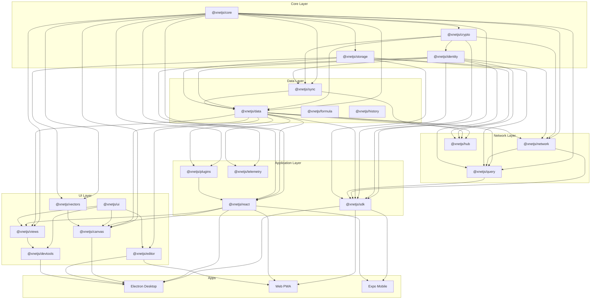

# xNet Codebase Review - February 6, 2026

## Executive Summary

This document presents a comprehensive code review of the xNet monorepo -- a local-first data platform built on CRDTs, Ed25519 cryptography, and peer-to-peer sync. The review covers **22 packages**, **3 applications**, and infrastructure comprising approximately **60,000+ lines** of TypeScript across **160 test files** with **2,792 passing tests**.

**Overall assessment: The codebase has matured significantly since the January 30 review, with the Hub Phase 1 complete and strong test coverage in core packages. However, several security and performance issues remain that should be addressed before production deployment.**

> **Important context:** This review is calibrated against the [6-month roadmap](../../ROADMAP.md) and [project vision](../../VISION.md). Phase 1 ("Daily Driver") is nearing completion. Findings are tagged with their roadmap relevance.

### Findings Summary

| Severity       | Count | Description                                                      |
| -------------- | ----- | ---------------------------------------------------------------- |
| **Critical**   | 8     | Security vulnerabilities, data corruption risks, silent failures |
| **Major**      | 47    | Bugs, significant design issues, performance problems            |
| **Minor**      | 89    | Code quality, minor bugs, inconsistencies                        |
| **Suggestion** | 32    | Improvements, best practices, future considerations              |

### Phase 1 Priority: What Blocks Daily Use

| #   | Severity | Package  | Issue                                               | Why it matters                            |
| --- | -------- | -------- | --------------------------------------------------- | ----------------------------------------- |
| 1   | Critical | electron | Chromium sandbox disabled                           | Full system access on renderer compromise |
| 2   | Critical | identity | Passkey fallback stores key with encrypted data     | No actual security in fallback mode       |
| 3   | Critical | sync     | YjsBatcher default merge corrupts data              | Document corruption on batch flush        |
| 4   | Major    | query    | Every query performs full table scan                | Slow search, blocks Local Search          |
| 5   | Major    | canvas   | No viewport culling despite SpatialIndex            | Canvas unusable at 200+ nodes             |
| 6   | Major    | data     | countNodes/listNodes load all data                  | Sidebar slows with more content           |
| 7   | Major    | react    | XNetProvider context value not memoized             | Cascading re-renders on every change      |
| 8   | Major    | editor   | Image upload placeholder uses filename (not unique) | Wrong image updated on concurrent uploads |

### Architecture Strengths

- Clean layered dependency graph with no circular dependencies
- Excellent sync package coverage (251+ tests for Lamport clocks, Yjs security, peer scoring)
- Hub Phase 1 complete with relay, federation, search shards, and deployment configs
- Strong TypeScript inference patterns throughout the schema system
- Comment system thoroughly tested (~120 tests)

### Architecture Concerns

- **Electron security regressed:** sandbox disabled, unrestricted IPC, code injection via local API
- **Performance not optimized:** full table scans, no viewport culling, O(n) counting
- **Test coverage uneven:** Core sync excellent, React hooks and UI components sparse
- **Dependency fragmentation:** Multiple Yjs and React versions across packages

## Review Documents

| #   | Document                                         | Scope                                                  |
| --- | ------------------------------------------------ | ------------------------------------------------------ |
| 1   | [01-security.md](./01-security.md)               | Security vulnerabilities across all packages           |
| 2   | [02-data-integrity.md](./02-data-integrity.md)   | Data corruption, CRDT, and sync correctness issues     |
| 3   | [03-performance.md](./03-performance.md)         | Performance bottlenecks and optimization opportunities |
| 4   | [04-crypto-identity.md](./04-crypto-identity.md) | Cryptography and identity package review               |
| 5   | [05-sync-network.md](./05-sync-network.md)       | Sync primitives and network layer review               |
| 6   | [06-data-schema.md](./06-data-schema.md)         | Data package and schema system review                  |
| 7   | [07-react-hooks.md](./07-react-hooks.md)         | React hooks, state management, and rendering           |
| 8   | [08-editor-canvas.md](./08-editor-canvas.md)     | Editor and canvas package review                       |
| 9   | [09-infrastructure.md](./09-infrastructure.md)   | Build tooling, dependencies, and configuration         |
| 10  | [10-test-coverage.md](./10-test-coverage.md)     | Test coverage analysis and gaps                        |

## Dependency Graph



## Test Results

```
Test Files  160 passed (160)
     Tests  2792 passed (2792)
  Duration  6.84s
```

| Package          | Test Files | Tests | Coverage |
| ---------------- | ---------- | ----- | -------- |
| @xnetjs/sync     | 19         | 251+  | HIGH     |
| @xnetjs/data     | 13         | 200+  | MEDIUM   |
| @xnetjs/editor   | 27         | 150+  | MEDIUM   |
| @xnetjs/network  | 8          | 100+  | HIGH     |
| @xnetjs/identity | 9          | 90+   | MEDIUM   |
| @xnetjs/hub      | 20         | 150+  | MEDIUM   |
| @xnetjs/react    | 9          | 50+   | LOW      |
| @xnetjs/canvas   | 4          | 60+   | MEDIUM   |
| @xnetjs/ui       | 0          | 0     | NONE     |

## Fix Priority Checklist

### Immediate (Before Daily Use)

- [x] **SEC-01:** Enable Electron sandbox (`sandbox: true`) and restrict IPC channels _(fixed f378ef6, bdada0a)_
- [x] **SEC-02:** Add IPC channel allowlist _(fixed bdada0a)_
- [x] **SEC-03:** Fix code injection in Local API executeJavaScript calls _(fixed this commit)_
- [x] **ID-01:** Mark BrowserPasskeyStorage as insecure/test-only _(fixed this commit)_
- [x] **SY-03:** Make `mergeUpdates` required in YjsBatcher (remove concatenation fallback) _(fixed f378ef6)_
- [x] **PERF-01:** Implement viewport culling in Canvas renderer _(fixed this commit)_
- [x] **PERF-04:** Fix countNodes to use IDB cursor-based counting _(fixed bdada0a)_

### Before Hub Launch

- [x] **SEC-04:** Add authentication to Local API _(fixed this commit)_
- [x] **NW-01:** Wire Yjs security stack into network sync protocol _(fixed this commit)_
- [x] **CRYPTO-02:** Fix hexToBytes to validate hex characters _(fixed f378ef6)_
- [x] **INFRA-01:** Standardize Yjs version across all packages _(fixed this commit)_
- [x] **INFRA-02:** Standardize React version across all packages _(fixed this commit)_

### Before Production

- [x] **PERF-06:** Memoize XNetProvider context value _(fixed f378ef6)_
- [x] **PERF-07/08:** Memoize Canvas maps _(fixed this commit)_
- [x] **PERF-10:** Fix getLastChange to use cursor _(fixed this commit)_
- [x] **SEC-14:** Use constant-time token comparison _(fixed this commit)_
- [x] **HOOK-03:** Add public API to NodeStore for storage access _(fixed this commit)_
- [x] **ID-02:** Use proper HKDF in deriveKeyBundle _(fixed this commit)_
- [x] **CRYPTO-05:** Validate UCAN header algorithm field _(fixed f378ef6)_
- [ ] Add tests for React hooks (useUndo, useHistory, useComments)
- [ ] Add tests for offline queue and connection manager

## Methodology

This review was conducted by:

1. Running all tests to establish baseline (2,792 passing)
2. Using exploration agents to analyze each major area in parallel
3. Cross-referencing findings with previous reviews
4. Categorizing by severity and roadmap phase

Each finding includes:

- Specific file path and line number references
- Severity classification (Critical/Major/Minor/Suggestion)
- Description of the issue and its impact
- Recommended fix where applicable

The review focuses on: security, correctness, performance, type safety, error handling, test coverage, API design, and adherence to project conventions (AGENTS.md).
