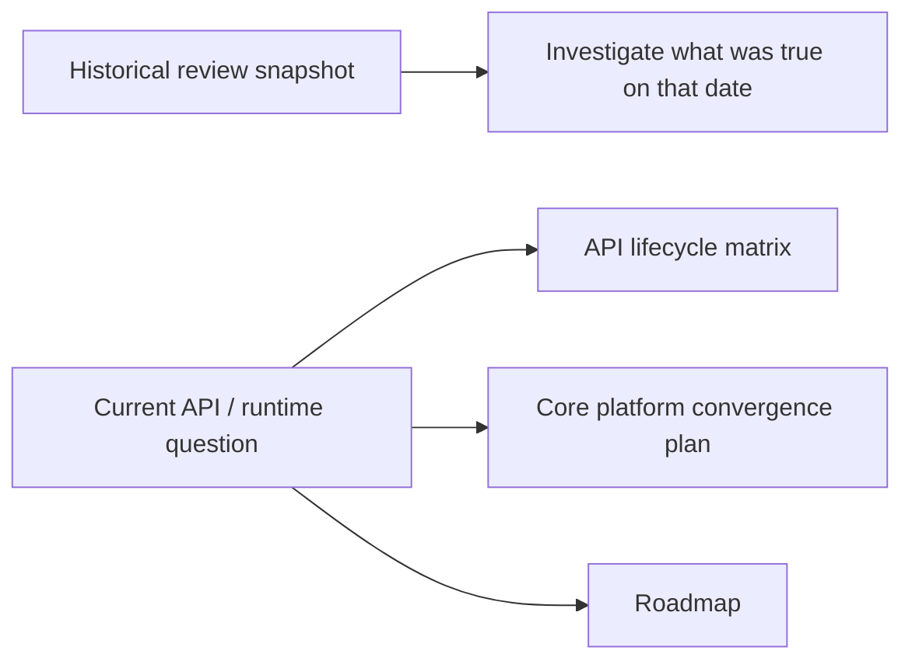

# Historical Reviews

These dated review folders are archived point-in-time assessments, not the current source of truth for xNet's public API or runtime contract.

Use the current docs below when you want today's guidance:

- [`docs/reference/api-lifecycle-matrix.md`](../reference/api-lifecycle-matrix.md) for stable vs experimental entrypoints
- [`docs/plans/plan03_9_82CorePlatformConvergence/README.md`](../plans/plan03_9_82CorePlatformConvergence/README.md) for the active convergence execution sequence
- [`docs/ROADMAP.md`](../ROADMAP.md) for the strategic roadmap

Treat the dated review findings as context for why certain changes happened, not as the latest recommendation set.
