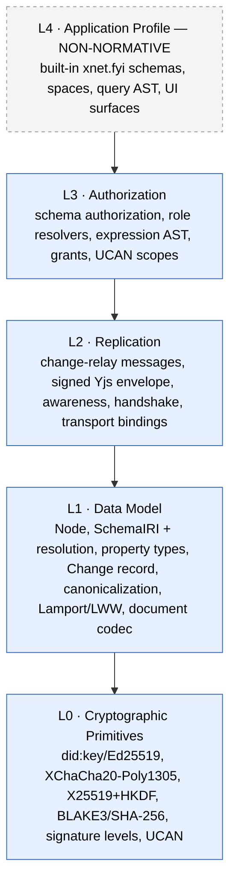

# xNet Protocol — Overview & Conformance

**Status:** Draft · **Umbrella version:** `xnet/1.0` · **This document is normative.**

## 1. Purpose

xNet is a local‑first data protocol: a graph of schema‑typed, signed, encrypted
**nodes** that replicate peer‑to‑peer and through relays, owned by
self‑sovereign **identities**, governed by data‑defined **authorization**. This
specification defines the boundaries an independent implementation MUST honour to
interoperate with others. It deliberately does **not** specify how an
implementation stores, indexes, queries, or renders that data.

## 2. Conformance language

The key words **MUST**, **MUST NOT**, **REQUIRED**, **SHALL**, **SHOULD**,
**SHOULD NOT**, **MAY**, and **OPTIONAL** are to be interpreted as described in
[RFC 2119](https://www.rfc-editor.org/rfc/rfc2119) and
[RFC 8174](https://www.rfc-editor.org/rfc/rfc8174).

A **conforming implementation** is one that reproduces the
[golden‑vector corpus](90-conformance.md) for every layer it claims to
implement, and emits/accepts wire messages as specified in
[Replication](03-replication.md).

## 3. The layer model

The protocol is four normative layers plus one non‑normative application
profile. Each layer is independently versioned; the umbrella version bundles
them (§5).



| Layer | Document | Conformance obligation |
|------|----------|------------------------|
| **L0 Primitives** | [01](01-primitives.md) | Produce identical DIDs, signatures, ciphertext‑decryptions for the L0 vectors |
| **L1 Data Model** | [02](02-data-model.md) | Produce **byte‑identical** canonical change bytes, hashes, signatures; converge LWW state |
| **L2 Replication** | [03](03-replication.md) | Emit/parse the wire messages; negotiate the version handshake |
| **L3 Authorization** | [04](04-authorization.md) | Reach identical allow/deny decisions for the L3 decision‑trace vectors |
| **L4 Application** | — | None. Documented for compatibility, never required for conformance. |

## 4. The interop kernel (the minimum that makes it xNet)

An implementation that does **only** L0 + L1 can already participate in the node
graph: create, sign, verify, and converge nodes. It is the irreducible core.
Concretely, the kernel is:

1. A **`did:key`** identity derived from an Ed25519 key ([L0](01-primitives.md)).
2. A **`Node`** = four universal fields (`id`, `schemaId`, `createdAt`,
   `createdBy`) + schema‑defined properties ([L1](02-data-model.md)).
3. A **`Change`** = a signed, hash‑chained, Lamport‑stamped mutation whose
   **canonical bytes and BLAKE3 hash are specified exactly**, signed with
   Ed25519 ([L1](02-data-model.md)).
4. **Last‑Write‑Wins** per‑property conflict resolution keyed on the Lamport
   clock ([L1](02-data-model.md)).

Everything else — Yjs document bodies, the relay, awareness, grants — layers on
top of this kernel and is **optional to interpret** (though L2 messages MUST be
relayed faithfully even when not interpreted; see the document‑codec rule in
[L1 §Document Codec](02-data-model.md)).

## 5. The umbrella xNet Protocol Version

Five subsystems version independently today (change record `3`, sync envelope
`2`, awareness `1`, schema `1.0.0`, crypto level `0`). To avoid a five‑way
negotiation, implementations advertise a single **named bundle**, exactly as
Matrix bundles breaking changes into *room versions*.

```
xnet/1.0 = {
  dataModel:     1,
  change:        3,     // CURRENT_PROTOCOL_VERSION (packages/sync/src/change.ts)
  syncEnvelope:  2,     // SignedYjsEnvelopeV2
  awareness:     1,     // y-protocols awareness
  schema:        "1.0.0",
  cryptoLevel:   0,     // Ed25519/X25519 default; 1=hybrid, 2=post-quantum
  ucan:          "1.0"  // capability token profile
}
```

The canonical machine‑readable bundle is
[`XNET_PROTOCOL_VERSION`](../../../packages/runtime/src/protocol.ts), exported by
`@xnetjs/sdk`. Two peers are **compatible** when they share at least one umbrella
version id; the negotiation happens in the [L2 handshake](03-replication.md).
A breaking change to *any* normative layer mints a **new umbrella version**
(`xnet/1.1`, `xnet/2.0`) via an [XPP](xpp/); old and new can coexist on the wire
because the handshake advertises a *set*.

## 6. Scope boundaries (what is NOT in the protocol)

The following are explicitly implementation‑private and MUST NOT be required for
interoperability:

- **Storage layout** — SQLite, Postgres, a log file, memory. The reference hub's
  `HubStorage` is a port; conforming hubs choose their own backend.
- **Local query & indexing** — the query AST, full‑text indexes (MiniSearch /
  FTS5), materialized views. Two peers never exchange queries to interoperate.
- **UI, editor, plugins, runtime ergonomics** — entirely out of scope.
- **The built‑in `xnet.fyi` application schemas** (Page, Task, Space, CRM, …) —
  these are an **L4 profile**, documented for compatibility, not required for
  conformance. A conforming implementation can define an entirely different
  schema vocabulary and still be an xNet implementation.

## 7. Versioning of this specification

This spec evolves through the [XPP process](xpp/). Each normative change either
(a) is backwards‑compatible and clarifying (patch), or (b) mints a new umbrella
version. No normative change is accepted without (i) a working implementation and
(ii) updated [golden vectors](90-conformance.md). This rule — *prove it before
you spec it* — is borrowed from the Matrix MSC process and is the single most
important defence against spec/implementation drift.

## 8. Relationship to external standards

xNet's L0 is mostly a **profile over existing standards**; implementations
SHOULD reuse audited libraries rather than re‑implement primitives:

| xNet uses | External standard |
|---|---|
| `did:key` (Ed25519) | [W3C DID](https://www.w3.org/TR/did-core/) + [did:key method](https://w3c-ccg.github.io/did-key-spec/) |
| Capability tokens | [UCAN](https://github.com/ucan-wg/spec) (pin the version) |
| Signatures | Ed25519 ([RFC 8032](https://www.rfc-editor.org/rfc/rfc8032)) |
| AEAD encryption | XChaCha20‑Poly1305 ([RFC 8439](https://www.rfc-editor.org/rfc/rfc8439) family) |
| Key agreement | X25519 ([RFC 7748](https://www.rfc-editor.org/rfc/rfc7748)) + HKDF ([RFC 5869](https://www.rfc-editor.org/rfc/rfc5869)) |
| Post‑quantum (optional) | ML‑DSA ([FIPS 204](https://csrc.nist.gov/pubs/fips/204/final)), ML‑KEM ([FIPS 203](https://csrc.nist.gov/pubs/fips/203/final)) |

Continue to [L0 · Primitives →](01-primitives.md)
