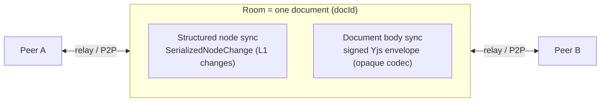
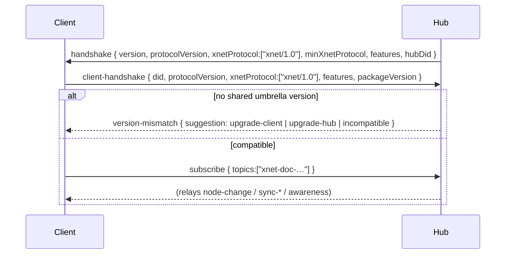

# L2 · Replication

**This document is normative.** Part of [xNet Protocol `xnet/1.0`](00-overview.md).

L2 defines how nodes and document bodies move between peers: the message types,
the signed envelope, presence, the version handshake, and the transport
bindings. The *semantics* are defined once; they bind to multiple transports
(WebSocket, libp2p).

Reference: [`packages/hub/src/server.ts`](../../../packages/hub/src/server.ts),
[`packages/hub/src/services/`](../../../packages/hub/src/services/),
[`packages/network/src/`](../../../packages/network/src/),
[`packages/sync/src/yjs-envelope.ts`](../../../packages/sync/src/yjs-envelope.ts).

## 1. Two replication streams

A document (room) carries two complementary streams. An implementation MUST relay
both faithfully; it need only *interpret* the first.



1. **Structured node sync** — the L1 `Change` records, serialized (§3).
2. **Document body sync** — the Yjs CRDT updates for nodes with a document codec,
   wrapped in a signed envelope (§4). Opaque per [L1 §8](02-data-model.md).

## 2. Rooms and subscription

A **room** corresponds to one document, addressed by `docId`. In the reference
relay, rooms are topics named `xnet-doc-<docId>`. The pub/sub control messages
(JSON over the transport):

```jsonc
{ "type": "subscribe",   "topics": ["xnet-doc-<docId>"] }
{ "type": "unsubscribe", "topics": ["xnet-doc-<docId>"] }
{ "type": "publish",     "topic": "xnet-doc-<docId>", "data": { /* sync msg */ } }
```

A subscriber receives every `publish` to its subscribed topics (subject to L3
authorization, §6). A relay MUST authorize `subscribe`/`publish` per
[L3](04-authorization.md) before forwarding.

## 3. Structured node sync messages

```ts
// peer → peer (via relay): a single new change
{ type: "node-change", room: string, change: SerializedNodeChange }

// catch-up request: "send me everything after this logical time"
{ type: "node-sync-request", room: string, sinceLamport: number }

// catch-up response
{ type: "node-sync-response", room: string,
  changes: SerializedNodeChange[], highWaterMark: number }
```

`SerializedNodeChange` is the [L1 `Change`](02-data-model.md) with binary fields
encoded for JSON transport (`signature` as base64, the hash chain preserved). A
receiver MUST verify each change's signature (L1 §6) and MUST be idempotent —
applying a change whose `hash` it already holds is a no‑op. Ordering is by
`lamport`; `highWaterMark` is the relay's max applied Lamport for the room,
enabling resumable catch‑up. Reference:
[`node-relay.ts`](../../../packages/hub/src/services/node-relay.ts),
[`storage/interface.ts`](../../../packages/hub/src/storage/interface.ts). The
catch‑up filter (changes strictly after `sinceLamport`, lamport‑ordered, plus the
high‑water mark) and the version handshake (§7) are pinned by
[`conformance/vectors/replication/`](../../../conformance/vectors/replication).

## 4. Document body sync: the signed Yjs envelope

Yjs sync uses the [y‑protocols sync v1](https://github.com/yjs/y-protocols/blob/master/PROTOCOL.md)
message types, with each update/step2 wrapped in a **`SignedYjsEnvelopeV2`** so
the relay can authenticate authorship without parsing the CRDT.

```ts
// y-protocols sync messages, carried in `publish.data`
{ type: "sync-step1", from, sv: base64 }                 // state vector
{ type: "sync-step2", from, update?: base64, envelope? } // delta
{ type: "sync-update", from, update?: base64, envelope? }// incremental
{ type: "awareness",  from, update?: base64 }            // presence (§5)
```

The compact wire form of the envelope
([`yjs-envelope.ts`](../../../packages/sync/src/yjs-envelope.ts)):

```jsonc
{
  "v": 2,
  "u": "base64(Yjs update bytes)",   // OPAQUE codec payload
  "m": { "a": "did:key:…",           // author DID
         "c": 12345,                 // Yjs clientId
         "t": 1718641200000,         // wall time (ms)
         "d": "<docId>" },           // document id
  "s": { "ed25519": "base64",        // signature over BLAKE3(update || JSON(meta))
         "mlDsa": null, "level": 0 } // optional PQ signature + crypto level
}
```

Rules (MUST): the envelope signature is computed over `BLAKE3(update ||
utf8(JSON(meta)))` and verified against `m.a`. **`meta` is serialized in
declaration order `{ authorDID, clientId, timestamp, docId }` — *not* sorted**
(unlike the L1 change hash in [§6](02-data-model.md), which sorts keys). A
re‑implementation that canonicalizes these keys will produce a different signing
input and fail verification. A relay MUST forward the envelope byte‑preserving. A
peer that does not implement the `yjs-v1` codec MUST still forward and persist the
`u` bytes (see [L1 §8](02-data-model.md)). The byte‑exact tuple `{ seed, update,
meta } → { signingHash, wire envelope }` is pinned by
[`conformance/vectors/replication/0007-yjs-envelope-sign.json`](../../../conformance/vectors/replication).

## 5. Awareness (presence)

Ephemeral presence (cursor, selection, online status, user color) uses
[y‑protocols awareness](https://github.com/yjs/y-protocols). Awareness state is
**not persisted** as node data and is exempt from the hash chain. A relay
SHOULD rate‑limit and expire awareness entries. Reference:
[`awareness.ts`](../../../packages/hub/src/services/awareness.ts).

## 6. Authorization at the sync boundary

Before relaying, a hub MUST evaluate authorization (full semantics in
[L3](04-authorization.md)):

- `subscribe`/read requires a read decision for the room's nodes (or a share /
  space‑containment grant, or a valid UCAN `hub/relay` capability).
- `publish`/write requires a write decision; the relay also verifies the change
  or envelope signature so an authenticated author cannot be spoofed.

Reference: `authorizeRoomAction` in
[`server.ts`](../../../packages/hub/src/server.ts), `YjsAuthGate` in
[`yjs-authorization.ts`](../../../packages/sync/src/yjs-authorization.ts).

## 7. The version handshake

On connect, the hub sends a handshake and the client replies. `xnet/1.0` adds the
**umbrella version** advertisement (`xnetProtocol` / `minXnetProtocol`) alongside
the existing per‑subsystem `protocolVersion`. Reference:
[`packages/network/src/types.ts`](../../../packages/network/src/types.ts).



Two peers are compatible iff their `xnetProtocol` sets intersect. A peer that
receives no acceptable umbrella version MUST refuse with a typed
`version-mismatch` rather than partially syncing. The canonical version token is
[`XNET_PROTOCOL_VERSION.id`](../../../packages/runtime/src/protocol.ts)
(`"xnet/1.0"`), exported by `@xnetjs/sdk`.

## 8. Transport bindings

The message *semantics* above are transport‑independent. `xnet/1.0` defines two
bindings:

| Binding | Framing | Used by |
|---|---|---|
| **WebSocket** | JSON text frames; `subscribe`/`publish` envelope (§2) | Browser/web clients ↔ hub |
| **libp2p** | length‑prefixed msgpack over protocol `/xnet/sync/1.0.0` | P2P clients |

Both carry the same logical messages; the binary fields (state vectors, updates,
signatures) are base64 in the JSON binding and raw bytes in the msgpack binding.
A relay MAY bridge between bindings. Reference:
[`network/src/protocols/sync.ts`](../../../packages/network/src/protocols/sync.ts),
[`network/src/types.ts`](../../../packages/network/src/types.ts).

Continue to [L3 · Authorization →](04-authorization.md)
