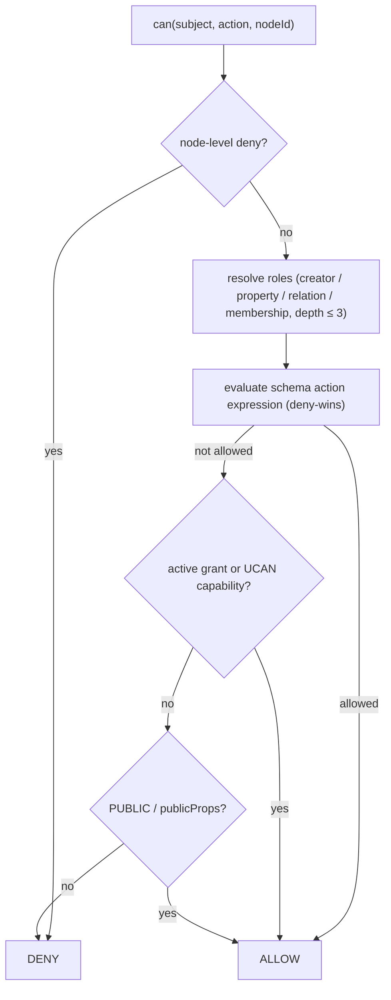

# L3 · Authorization

**This document is normative.** Part of [XNet Protocol `xnet/1.0`](00-overview.md).

Authorization in XNet is **data, not application logic**: access rules are
declared on schemas and delegated through `Grant` nodes and UCAN tokens, and they
are enforced at the [sync boundary](03-replication.md). Because two
implementations that disagree on policy evaluation will make different read/write
decisions on the same graph, the _decision semantics_ are normative — even though
caching and indexing strategies are private.

Reference: [`packages/core/src/auth-types.ts`](../../../packages/core/src/auth-types.ts),
[`packages/data/src/auth/`](../../../packages/data/src/auth/),
[`packages/data/src/schema/schemas/grant.ts`](../../../packages/data/src/schema/schemas/grant.ts).

## 1. Actions

```
action ∈ { read, create, update, write, delete, share, admin }
```

A decision is a function `can(subject: DID, action, nodeId) → { allowed, reasons }`.

`create` and `update` are **refinements of `write`** (exploration 0304, additive
in `xnet/1.x`): `create` governs bringing a node into existence, `update`
governs mutating an existing node. A schema MAY declare either refinement; the
expression governing a checked action is resolved with a fixed fallback
(MUST):

| checked action     | expression used                     |
| ------------------ | ----------------------------------- |
| `create`           | `actions.create` ?? `actions.write` |
| `update` / `write` | `actions.update` ?? `actions.write` |
| anything else      | `actions[action]` (no fallback)     |

A schema that only declares `write` therefore behaves exactly as before, and a
legacy `write` check on an existing node follows the `update` rule. A missing
expression (after fallback) denies.

**Create checks evaluate against the draft node** built from the create payload
(`createdBy` = the requesting subject, properties = the payload's properties).
Role resolution over the draft works normally — in particular, container
relations present in the payload (e.g. a `space` or `channel` relation) resolve
membership roles, which is how creation into a shared container is gated.
Because the `creator` resolver always matches on a draft, a schema wanting real
admission control MUST NOT include a creator‑derived role in its `create`
expression.

**Grants:** a grant carrying `write` satisfies `create` and `update` checks; a
granular grant satisfies only its own action (a `create`‑only grant does not
satisfy legacy `write` checks — fail closed). Implementations MUST ignore
unknown action strings in grants.

## 2. Schema authorization definition

A schema MAY carry an `authorization` block defining **roles** (how a subject
acquires a role on a node) and **actions** (which roles may perform each action):

```ts
interface AuthorizationDefinition {
  roles: Record<string, RoleResolver> // how to earn a role
  actions: Record<AuthAction, AuthExpression> // who may do what
  publicProps?: string[] // props readable without decryption
  fieldRules?: Record<string, { allow: AuthExpression; deny?: AuthExpression }>
}
```

Common presets (reference [`auth/presets.ts`](../../../packages/data/src/auth/presets.ts)):
`presets.private()` (owner‑only), `spaceCascadeAuthorization()` (inherit from a
containing Space). The default for a schema with no `authorization` is
implementation‑defined but SHOULD be owner‑only.

## 3. Role resolvers

A role resolver determines whether a subject holds a named role on a node. `xnet/1.0`
defines four kinds (reference [`auth-types.ts`](../../../packages/core/src/auth-types.ts)):

| Kind           | Subject earns the role when…                                                                                                                                 |
| -------------- | ------------------------------------------------------------------------------------------------------------------------------------------------------------ |
| **creator**    | `subject == node.createdBy`                                                                                                                                  |
| **property**   | `subject` appears in a named `person`/`relation` property (e.g. `editors`)                                                                                   |
| **relation**   | `subject` holds a role on a _related_ node (role inheritance along a relation)                                                                               |
| **membership** | a membership edge node (e.g. `SpaceMembership`) links `subject`→container with a role ≥ `minRole`; supports cascade to nested containers via a `parent` prop |

Role resolution walks relations/memberships with a **bounded depth** (the
reference bound is 3) and MUST terminate (cycles are broken). Implementations
MUST resolve roles identically for the decision‑trace vectors (§7).

## 4. The expression AST

Actions map to a boolean expression over roles:

```
expr ::= allow(role…) | deny(role…) | roleRef(name)
       | and(expr…) | or(expr…) | not(expr)
       | PUBLIC | AUTHENTICATED
```

Evaluation rules (MUST):

- **Deny wins.** If any matching `deny` evaluates true, the action is denied,
  regardless of any `allow`.
- `and` requires all sub‑expressions; `or` requires any; `not` negates.
- `PUBLIC` is always true; `AUTHENTICATED` is true for any valid DID subject.
- Evaluation is total and deterministic for a given (subject, node, graph).

## 5. Encryption as access control

For private nodes, **the ability to decrypt is the read‑control mechanism**:
content keys are wrapped per recipient ([L0 §5](01-primitives.md)). A subject not
in the recipient set cannot read the encrypted properties even if it receives the
bytes. `publicProps` (and the four universal node fields) remain readable for
indexing/attribution; `createdBy` is always readable. Field‑level rules
(`fieldRules`) further gate individual properties. Read‑filtering happens
_after_ decryption.

## 6. Grants and UCAN (delegation)

Authority is delegated two ways:

**Grant nodes** — a `Grant` is an ordinary XNet node (schema
[`grant.ts`](../../../packages/data/src/schema/schemas/grant.ts)) recording
`{ issuer, grantee, resource, resourceSchema, actions, expiresAt, revokedAt,
ucanToken?, parentGrantId? }`. A grant is **active** iff not revoked and not
expired. An implementation maintains an index `resource → grantee → grants` and
consults it during evaluation.

**UCAN tokens** — [UCAN 1.0](https://github.com/ucan-wg/spec) capability tokens
(JWT/EdDSA) carry `{ iss, aud, exp, att:[{ with, can }], prf:[…] }`. Verification
(MUST): valid EdDSA signature by `iss`; not expired; each capability is an
**attenuation** of (a subset of) its proof chain's capabilities; child `exp` ≤
parent `exp`; proof chains are acyclic. Capability matching: `can = "*"` matches
any action; `with` matches by exact resource or a `prefix/*` wildcard. Reference:
[`packages/identity/src/ucan.ts`](../../../packages/identity/src/ucan.ts).

## 7. Evaluation pipeline & determinism



The order is fixed: **node‑deny → role‑resolve → schema‑eval → grant/UCAN →
public**. Caching, TTLs, and the grant index are implementation‑private, but the
_decisions_ MUST match the [decision‑trace golden vectors](90-conformance.md)
(`conformance/vectors/authz/`), which give `{ graph, subject, action, nodeId } →
{ allowed, reason }`.

The current [`authz` suite](../../../conformance/vectors/authz) pins the
deterministic heart of §4 — **expression‑AST evaluation** (`{ expression, roles,
isAuthenticated } → { allowed }`), covering `allow`/`deny`/`and`/`or`/`not`/
`roleRef`/`PUBLIC`/`AUTHENTICATED` and the `and(allow(…), not(deny(…)))`
deny‑wins composition. The
[`authz-actions` suite](../../../conformance/vectors/authz-actions) pins §1's
**action‑expression resolution** (`{ actions, action, roles, isAuthenticated }
→ { allowed }`) — the `create`/`update` → `write` fallback table. Full
end‑to‑end decision traces (role resolution over a node graph + grants/UCAN)
are tracked as a follow‑up XPP and added as that reference path stabilises.

Continue to [Schema evolution →](05-schema-evolution.md)
