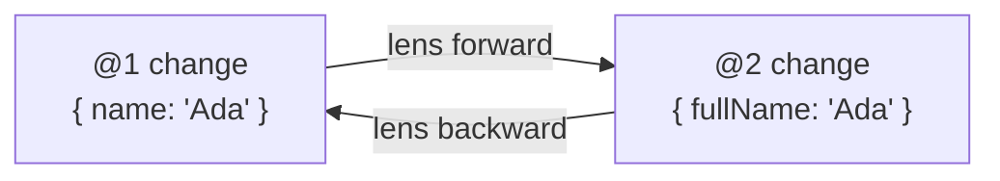

# Schema Evolution & Cross‑Version Coexistence

**This document is normative.** Part of [xNet Protocol `xnet/1.0`](00-overview.md).

Schemas are versioned (`xnet://authority/Name@semver`,
[L1 §4](02-data-model.md)). This document specifies how a schema may change and
how clients on different versions coexist on the same live document — the
problem that sinks most evolving data protocols.

Reference: [`docs/sync/`](../../sync/) (the reference implementation's migration
guide, version‑compatibility matrix, and lens cookbook).

## 1. Compatibility rules

Within a **major** version (`@1.x.y`), changes MUST be **additive and
non‑breaking**:

- ✅ Add an OPTIONAL property.
- ✅ Add a `select`/`multiSelect` option.
- ✅ Relax a constraint (e.g. raise `maxLength`).
- ❌ Remove or rename a property, change its `type`, or make an existing optional
  property required → these are **breaking** and MUST mint a new **major**
  version (`@2.0.0`) with a new `SchemaIRI`.

A node records the schema version it was authored against (`schemaId`). Readers
MUST round‑trip properties they do not recognise (forward compatibility,
[L1 §3](02-data-model.md)) rather than dropping them.

## 2. Unknown‑field preservation

Because `Change` payloads are sparse and nodes are self‑describing, an
implementation that encounters a property defined in a *newer* minor version it
does not know MUST:

1. Preserve the value verbatim in materialized state and history.
2. Re‑emit it unchanged when it authors subsequent changes.

This makes minor‑version skew safe without coordination.

## 3. Cross‑major coexistence: lenses

When `@1` and `@2` clients must edit the same document, breaking differences are
reconciled with **bidirectional lenses** (after Ink & Switch's
[Cambria](https://www.inkandswitch.com/cambria/)). A lens is a composition of
primitive operators — `rename`, `convert`, `wrap`, `hoist`, `add`, `remove` —
that translates a change/patch in both directions:

Rules (MUST, for implementations that support cross‑major coexistence):

- A lens MUST be **invertible** for the fields it maps.
- Lens application happens on the sparse change payload, not the whole node, so
  it composes with the LWW fold ([L1 §7](02-data-model.md)).
- Unmapped fields fall through unchanged.

Cross‑major coexistence is **OPTIONAL** in `xnet/1.0`: a conforming
implementation MAY instead require all editors of a document to share a major
version. When supported, the lens registry format is specified by a future
[XPP](xpp/).

## 4. Schema distribution

How a schema document reaches an implementation follows the resolution paths in
[L1 §4](02-data-model.md): built‑in `xnet.fyi` schemas ship with implementations;
DID‑authority schemas sync as nodes; domain‑authority resolution is reserved for
`xnet/1.1`. A schema node is itself versioned data, so schema changes are
auditable and replicate like any other node.

## 5. Migrating the protocol itself

Schema evolution (above) is data‑level. Evolving the **protocol** (a normative
layer) is governed separately: it mints a new [umbrella version](00-overview.md)
through the [XPP process](xpp/), requires a working implementation and updated
[golden vectors](90-conformance.md), and is negotiated by the
[handshake](03-replication.md) so old and new peers interoperate during the
transition.

Continue to [Conformance →](90-conformance.md)
