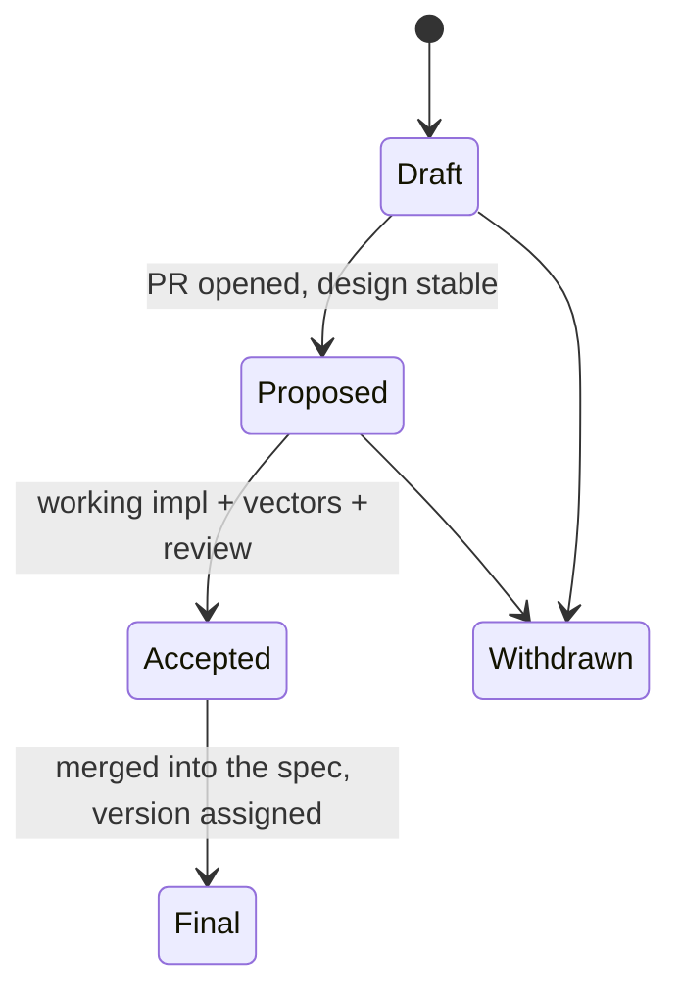

# XPP — xNet Protocol Proposals

The protocol evolves through **xNet Protocol Proposals**. The process is modeled
on [Matrix's MSC](https://spec.matrix.org/proposals/) and the fediverse's
[FEPs](https://codeberg.org/fediverse/fep): lightweight enough for a small team,
credible enough to attract independent implementers.

## Principles

1. **Prove it before you spec it.** No XPP is accepted without a *working
   implementation* of the change.
2. **Vectors travel with the change.** A normative XPP MUST update the
   [conformance corpus](../90-conformance.md). Spec claims are executable.
3. **Breaking changes mint a version.** Any change to a normative layer
   (L0–L3) that is not backwards‑compatible mints a new
   [umbrella version](../00-overview.md) (`xnet/1.1`, `xnet/2.0`). The
   [handshake](../03-replication.md) lets old and new peers coexist.
4. **L4 is out of scope.** Application‑profile changes (built‑in schemas, UI) do
   not require an XPP.

## Lifecycle

| Stage | Meaning |
|---|---|
| **Draft** | A `xpp/NNNN-title.md` file exists; design under discussion. |
| **Proposed** | Design is stable; PR open for review. |
| **Accepted** | A working implementation exists, vectors are updated, reviewers approve. |
| **Final** | Merged into the normative docs; umbrella version assigned if breaking. |
| **Withdrawn** | Abandoned or superseded. |

## How to file one

1. Copy [`0000-template.md`](0000-template.md) to `xpp/NNNN-short-title.md` (use
   the next free number; the PR number MAY be used as the permanent id).
2. Fill in the sections. Link the reference implementation and the vector diff.
3. Open a PR against this repository. Discussion happens on the PR.
4. An editor merges once the principles above are satisfied.

## Editors

The editorial board (2–3 maintainers) shepherds XPPs and assigns umbrella
versions. Until a formal board is named, the repository maintainers act as
editors. As independent implementations appear, the spec SHOULD graduate to a
dedicated `xnet-protocol` repository and a W3C Community Group report for
external citation (see
[exploration 0200 §Governance](../../../explorations/0200_%5B_%5D_PORTABLE_XNET_PROTOCOL_BOUNDARIES_AND_STANDARD.md)).
