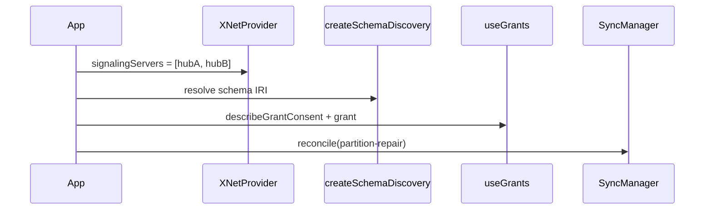

# System Schema Federation Example

Standalone React example showing the node-native schema federation flow:

1. Configure multiple hubs.
2. Discover a schema from replicated `SchemaDefinition` nodes.
3. Preview an access grant with what/where/how-long fields.
4. Surface `store.auth.explain` traces.
5. Trigger partition repair with `syncManager.reconcile`.

This directory is intentionally outside `pnpm-workspace.yaml`; it is a copyable
sample for app teams rather than a built workspace package.

See [`src/App.tsx`](src/App.tsx).
