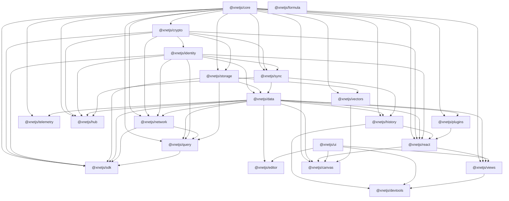
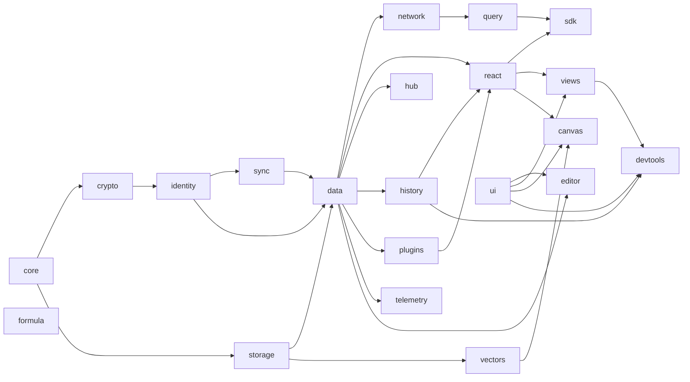

# @xnetjs packages

Core xNet packages for decentralized data, sync, UI, and tooling.

## Packages

### Foundation

| Package                        | Description                                           | Tests | Status |
| ------------------------------ | ----------------------------------------------------- | ----- | ------ |
| [@xnetjs/core](./core)         | Types, content addressing (CIDs), permissions, RBAC   | 5     | Stable |
| [@xnetjs/crypto](./crypto)     | BLAKE3 hashing, Ed25519 signing, XChaCha20 encryption | 4     | Stable |
| [@xnetjs/identity](./identity) | DID:key generation, UCAN tokens, passkey storage      | 4     | Stable |

### Infrastructure

| Package                      | Description                                             | Tests | Status |
| ---------------------------- | ------------------------------------------------------- | ----- | ------ |
| [@xnetjs/storage](./storage) | SQLite/memory adapters and blob storage                 | 4     | Stable |
| [@xnetjs/sync](./sync)       | Change\<T\>, Lamport clocks, hash chains, Yjs security  | 10    | Stable |
| [@xnetjs/data](./data)       | Schema system, NodeStore, 16 property helpers, Yjs CRDT | 10    | Stable |
| [@xnetjs/network](./network) | libp2p node, y-webrtc provider, security suite          | 1     | Stable |
| [@xnetjs/query](./query)     | Local query engine, MiniSearch FTS, federation          | 2     | Stable |
| [@xnetjs/hub](./hub)         | Signaling, sync relay, backup, FTS5, sharding           | 0     | Stable |

### Application

| Package                          | Description                                         | Tests | Status |
| -------------------------------- | --------------------------------------------------- | ----- | ------ |
| [@xnetjs/react](./react)         | useQuery, useMutate, useNode, hub/plugin hooks      | 2     | Stable |
| [@xnetjs/sdk](./sdk)             | Unified SDK re-exports and client bootstrap         | 1     | Stable |
| [@xnetjs/editor](./editor)       | TipTap editor, slash commands, wikilinks, drag-drop | 23    | Stable |
| [@xnetjs/ui](./ui)               | Base UI primitives, composed components, theme      | 0     | Stable |
| [@xnetjs/views](./views)         | Table, Board, Gallery, Timeline, Calendar           | 7     | Stable |
| [@xnetjs/canvas](./canvas)       | Infinite canvas, R-tree, ELK.js layout              | 4     | Stable |
| [@xnetjs/devtools](./devtools)   | 9-panel debug suite                                 | 2     | Stable |
| [@xnetjs/history](./history)     | Time machine, undo/redo, audit, blame, diff         | 3     | Stable |
| [@xnetjs/plugins](./plugins)     | Plugin registry, sandbox, AI generation, MCP        | 8     | Stable |
| [@xnetjs/telemetry](./telemetry) | Privacy-preserving telemetry, tiered consent        | 0     | Stable |
| [@xnetjs/formula](./formula)     | Expression parser, evaluator, built-in functions    | 4     | Stable |
| [@xnetjs/vectors](./vectors)     | HNSW vector index, semantic + hybrid search         | 4     | Stable |

### Tooling

| Package                              | Description                                            | Tests | Status |
| ------------------------------------ | ------------------------------------------------------ | ----- | ------ |
| [@xnetjs/cli](./cli)                 | CLI commands for schema diff/migration and diagnostics | -     | Stable |
| [@xnetjs/data-bridge](./data-bridge) | Bridge abstraction for off-main-thread data access     | -     | Stable |

## Dependency Graph



## Build Order



## Development

```bash
# Build all packages
pnpm build

# Test all packages
pnpm test

# Test single package
pnpm --filter @xnetjs/data test

# Run a single test file
pnpm --filter @xnetjs/sync vitest run src/clock.test.ts

# Test with pattern matching
pnpm --filter @xnetjs/data vitest run -t "NodeStore"

# Watch mode
pnpm --filter @xnetjs/sync test:watch

# Type check
pnpm typecheck
```
