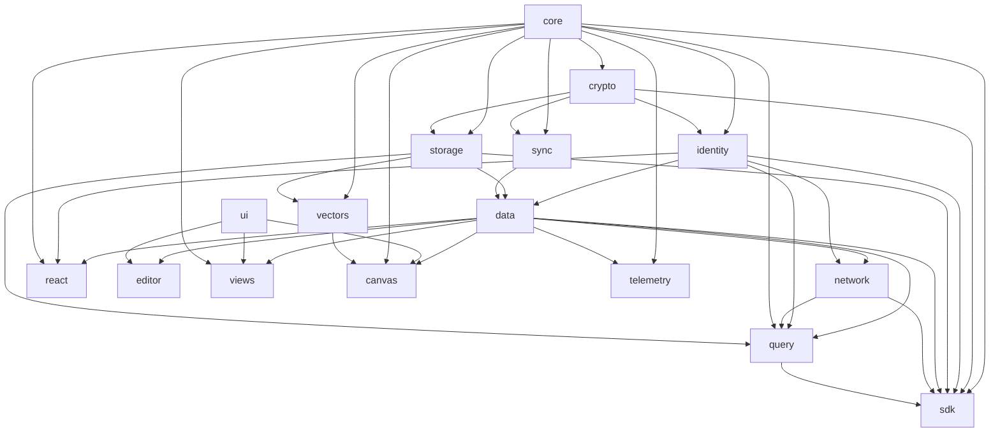
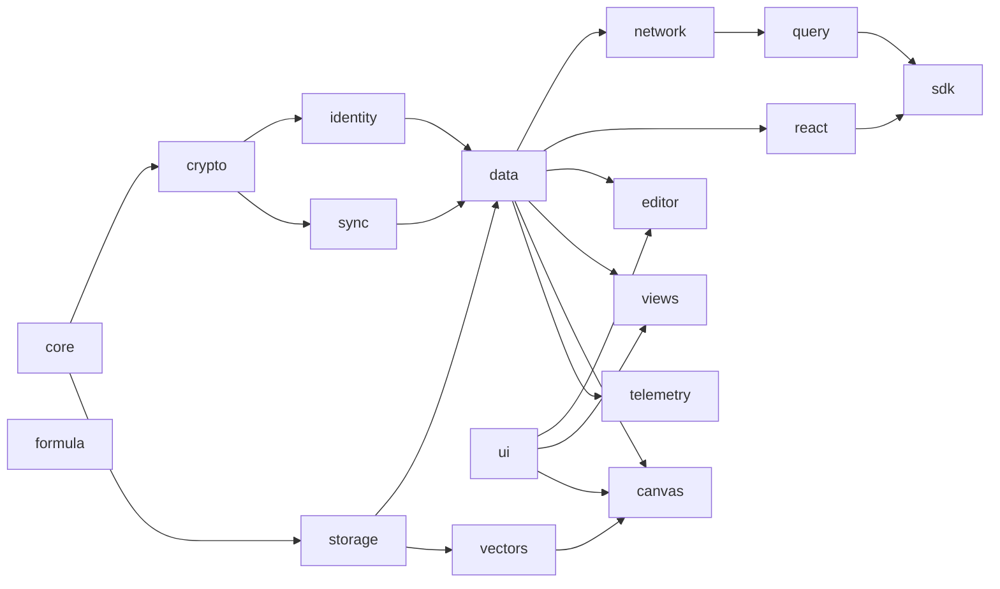

# @xnet packages

Core SDK packages for the xNet decentralized infrastructure.

## Packages

### Infrastructure

| Package                      | Description                                             | Status |
| ---------------------------- | ------------------------------------------------------- | ------ |
| [@xnet/core](./core)         | Types, content addressing (CIDs), permissions           | Stable |
| [@xnet/crypto](./crypto)     | BLAKE3 hashing, Ed25519 signing, XChaCha20 encryption   | Stable |
| [@xnet/identity](./identity) | DID:key generation, UCAN tokens, key management         | Stable |
| [@xnet/storage](./storage)   | IndexedDB adapter, snapshot management                  | Stable |
| [@xnet/sync](./sync)         | Change\<T\>, Lamport clocks, hash chains, SyncProvider  | Stable |
| [@xnet/data](./data)         | Schema system, NodeStore, Yjs CRDT, document operations | Stable |
| [@xnet/network](./network)   | libp2p node, y-webrtc provider, DID resolution          | Stable |
| [@xnet/query](./query)       | Local query engine, full-text search (Lunr.js)          | Stable |

### Application

| Package                        | Description                                             | Status  |
| ------------------------------ | ------------------------------------------------------- | ------- |
| [@xnet/react](./react)         | useQuery, useMutate, useNode, useIdentity, XNetProvider | Stable  |
| [@xnet/sdk](./sdk)             | Unified client, browser/node presets                    | Stable  |
| [@xnet/editor](./editor)       | TipTap-based collaborative rich text editor             | Stable  |
| [@xnet/ui](./ui)               | Shared UI components, design tokens                     | Stable  |
| [@xnet/telemetry](./telemetry) | Privacy-preserving telemetry, consent, event collection | WIP     |
| [@xnet/views](./views)         | Table, Board, Calendar, Gallery, Timeline views         | WIP     |
| [@xnet/vectors](./vectors)     | Embeddings (placeholder)                                | Planned |
| [@xnet/canvas](./canvas)       | Infinite canvas (placeholder)                           | Planned |
| [@xnet/formula](./formula)     | Formula engine (placeholder)                            | Planned |

## Dependency Graph



## Build Order



## Development

```bash
# Build all packages
pnpm build

# Test all packages
pnpm test

# Test single package
pnpm --filter @xnet/data test

# Test core packages (sync + data)
pnpm vitest run packages/sync packages/data

# Test with coverage
pnpm test:coverage
```
