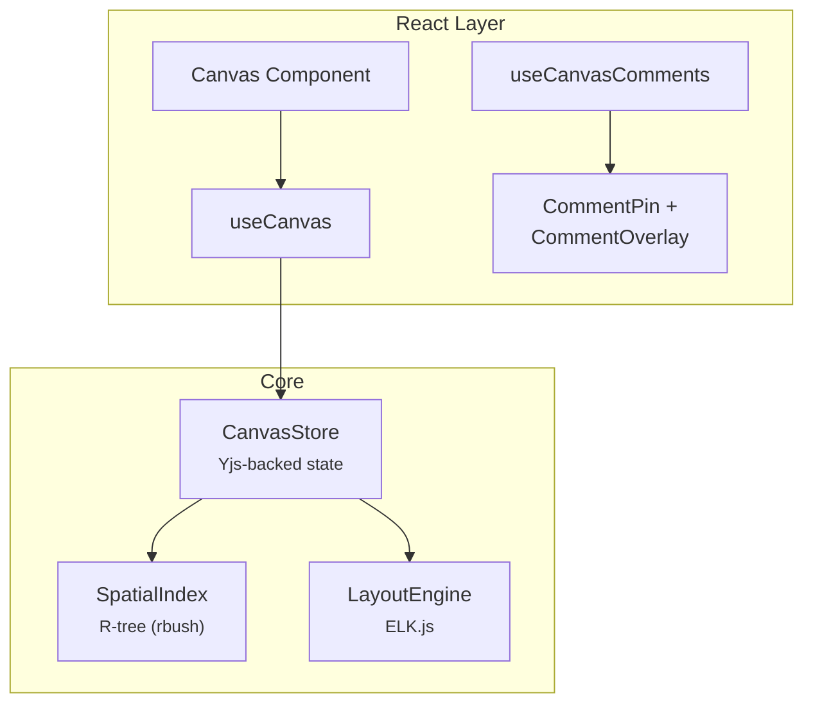

# @xnetjs/canvas

Infinite canvas for spatial visualization of xNet documents -- R-tree spatial indexing, ELK.js auto-layout, and Yjs-backed state.

## Installation

```bash
pnpm add @xnetjs/canvas
```

## Features

- **Spatial indexing** -- R-tree (rbush) for efficient viewport queries
- **Auto-layout** -- ELK.js graph layout algorithms
- **Yjs-backed store** -- Canvas state synced via CRDT
- **Pan/zoom** -- Smooth viewport navigation
- **Canvas comments** -- Spatial comment pins with overlay
- **React hooks** -- `useCanvas`, `useCanvasComments`
- **Storybook workbench** -- Isolated canvas scenario for interaction and layout tuning

## Usage

```tsx
import { Canvas, useCanvas, createCanvasDoc, createNode, createEdge } from '@xnetjs/canvas'

function MyCanvas() {
  const doc = createCanvasDoc('canvas-1', 'My canvas')
  const { addNode, updateNodePosition, addEdge, pan, zoomAt } = useCanvas({ doc })

  // Example operations
  const nodeA = createNode('page', { x: 100, y: 120 })
  const nodeB = createNode('database', { x: 320, y: 200 })
  addNode(nodeA)
  addNode(nodeB)
  updateNodePosition(nodeA.id, { x: 140, y: 150 })
  addEdge(createEdge(nodeA.id, nodeB.id))
  pan(24, 12)
  zoomAt(0, 0, 1.1)

  return <Canvas doc={doc} />
}
```

### Spatial Index

```typescript
import { SpatialIndex } from '@xnetjs/canvas'

const index = new SpatialIndex()
index.insert({ id: '1', x: 0, y: 0, width: 100, height: 50 })

// Query a viewport rectangle
const visible = index.search({ minX: -50, minY: -50, maxX: 200, maxY: 200 })
```

### Layout Engine

```typescript
import { LayoutEngine } from '@xnetjs/canvas'

const engine = new LayoutEngine()
const layout = await engine.layout(nodes, edges, {
  algorithm: 'layered',
  direction: 'DOWN'
})
```

### Canvas Store (Yjs)

```typescript
import { CanvasStore, createEdge, createNode } from '@xnetjs/canvas'

// Yjs-backed canvas state
const store = new CanvasStore(ydoc)
const note = createNode('note', { x: 100, y: 200 })
const page = createNode('page', { x: 360, y: 240 })
store.addNode(note)
store.addNode(page)
store.addEdge(createEdge(note.id, page.id))
```

### Canvas Comments

```tsx
import { CommentOverlay } from '@xnetjs/canvas'

function CanvasWithComments({ canvasNodeId, transform, objects }) {
  return <CommentOverlay canvasNodeId={canvasNodeId} transform={transform} objects={objects} />
}
```

## Architecture



## Modules

| Module                       | Description                                        |
| ---------------------------- | -------------------------------------------------- |
| `spatial/index.ts`           | R-tree spatial indexing                            |
| `layout/index.ts`            | ELK.js auto-layout                                 |
| `store.ts`                   | Yjs-backed canvas store                            |
| `hooks/useCanvas.ts`         | Canvas React hook                                  |
| `hooks/useCanvasComments.ts` | Comments React hook                                |
| `comments/index.ts`          | CommentPin, CommentOverlay                         |
| `types.ts`                   | Point, Rect, CanvasNode, CanvasEdge, ViewportState |

## Dependencies

- `@xnetjs/core`, `@xnetjs/data`, `@xnetjs/react`, `@xnetjs/ui`, `@xnetjs/vectors`
- `rbush` -- R-tree spatial indexing
- `elkjs` -- Graph layout algorithms
- `yjs` -- CRDT state

## Testing

```bash
pnpm --filter @xnetjs/canvas test
```

4 test files covering spatial indexing, layout, store, and comments.

## Storybook Workbench

Run the root Storybook workspace from the repo root:

```bash
pnpm dev:stories
```

`@xnetjs/canvas` now includes a dedicated Storybook workbench for the canvas renderer so layout, navigation, and presentation changes can be iterated without launching the full app shell.
