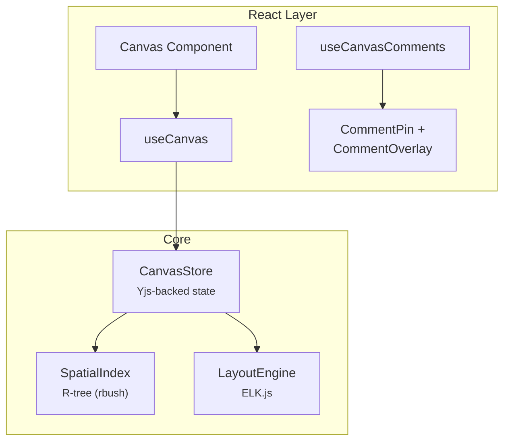

# @xnet/canvas

Infinite canvas for spatial visualization of xNet documents -- R-tree spatial indexing, ELK.js auto-layout, and Yjs-backed state.

## Installation

```bash
pnpm add @xnet/canvas
```

## Features

- **Spatial indexing** -- R-tree (rbush) for efficient viewport queries
- **Auto-layout** -- ELK.js graph layout algorithms
- **Yjs-backed store** -- Canvas state synced via CRDT
- **Pan/zoom** -- Smooth viewport navigation
- **Canvas comments** -- Spatial comment pins with overlay
- **React hooks** -- `useCanvas`, `useCanvasComments`

## Usage

```tsx
import { Canvas, useCanvas } from '@xnet/canvas'

function MyCanvas({ canvasId }) {
  const { nodes, edges, viewport, addNode, moveNode, connect, panTo, zoomTo } = useCanvas(canvasId)

  return <Canvas nodes={nodes} edges={edges} viewport={viewport} />
}
```

### Spatial Index

```typescript
import { SpatialIndex } from '@xnet/canvas'

const index = new SpatialIndex()
index.insert({ id: '1', x: 0, y: 0, width: 100, height: 50 })

// Query a viewport rectangle
const visible = index.search({ minX: -50, minY: -50, maxX: 200, maxY: 200 })
```

### Layout Engine

```typescript
import { LayoutEngine } from '@xnet/canvas'

const engine = new LayoutEngine()
const layout = await engine.layout(nodes, edges, {
  algorithm: 'layered',
  direction: 'DOWN'
})
```

### Canvas Store (Yjs)

```typescript
import { CanvasStore } from '@xnet/canvas'

// Yjs-backed canvas state
const store = new CanvasStore(ydoc)
store.addNode({ id: '1', type: 'document', x: 100, y: 200 })
store.addEdge({ source: '1', target: '2' })
```

### Canvas Comments

```tsx
import { useCanvasComments, CommentPin, CommentOverlay } from '@xnet/canvas'

function CanvasWithComments({ canvasId }) {
  const { comments, addComment } = useCanvasComments(canvasId)
  return <CommentOverlay comments={comments} onAdd={addComment} />
}
```

## Architecture



## Modules

| Module                       | Description                                        |
| ---------------------------- | -------------------------------------------------- |
| `spatial/index.ts`           | R-tree spatial indexing                            |
| `layout/index.ts`            | ELK.js auto-layout                                 |
| `store.ts`                   | Yjs-backed canvas store                            |
| `hooks/useCanvas.ts`         | Canvas React hook                                  |
| `hooks/useCanvasComments.ts` | Comments React hook                                |
| `comments/index.ts`          | CommentPin, CommentOverlay                         |
| `types.ts`                   | Point, Rect, CanvasNode, CanvasEdge, ViewportState |

## Dependencies

- `@xnet/core`, `@xnet/data`, `@xnet/react`, `@xnet/ui`, `@xnet/vectors`
- `rbush` -- R-tree spatial indexing
- `elkjs` -- Graph layout algorithms
- `yjs` -- CRDT state

## Testing

```bash
pnpm --filter @xnet/canvas test
```

4 test files covering spatial indexing, layout, store, and comments.
