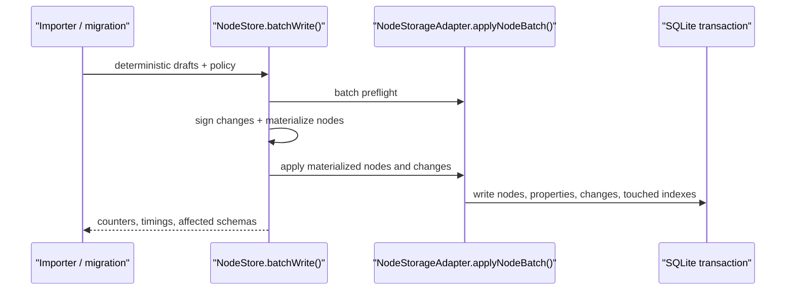
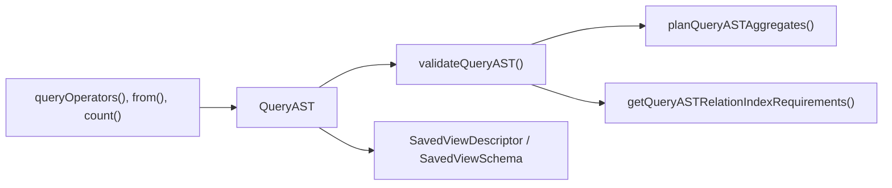
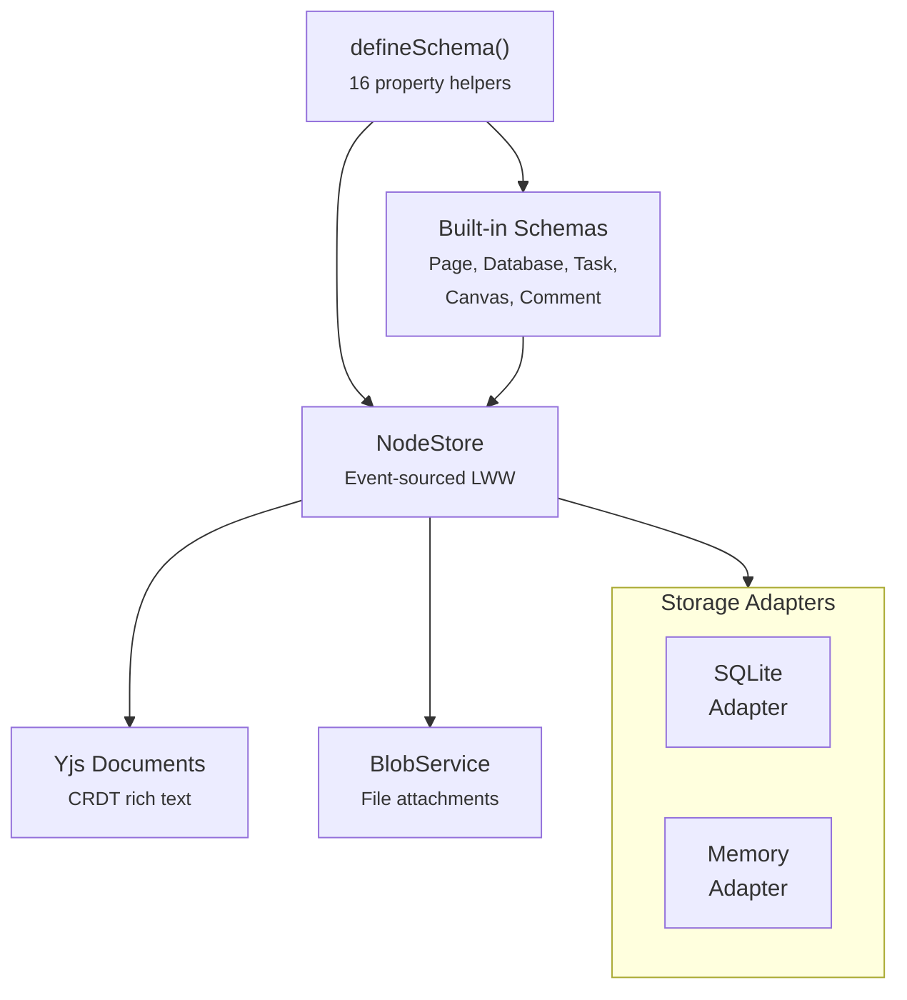

# @xnetjs/data

Schema system, NodeStore, and Yjs CRDT engine for xNet. This is the central data package -- it defines how structured data and rich text documents are created, stored, and synced.

> **Alpha software.** xNet is released but early: this package is on npm and
> usable today, but its API can change between releases, sometimes without a
> migration path. Pin your version. See the
> [project README](https://github.com/crs48/xNet#readme) for what alpha means here.

> **Status:** Mixed
> Stable entrypoints: `@xnetjs/data/schema`, `@xnetjs/data/store`, `@xnetjs/data/updates`, `@xnetjs/data/awareness`
> Experimental entrypoints: `@xnetjs/data/database`, `@xnetjs/data/auth`

The root `@xnetjs/data` barrel remains supported for compatibility, but new code should prefer the narrower entrypoints above. See [`docs/reference/api-lifecycle-matrix.md`](../../docs/reference/api-lifecycle-matrix.md) for the current matrix.

## Installation

```bash
pnpm add @xnetjs/data
```

## Features

- **Schema system** -- `defineSchema()` with 16 typed property helpers
- **NodeStore** -- Event-sourced LWW (Last-Writer-Wins) storage engine
- **Built-in schemas** -- Page, Database, Task, Canvas, Comment
- **Yjs CRDT** -- Y.Doc helpers for signed updates and merge/state-vector workflows
- **Awareness/presence** -- Real-time user presence
- **Blob service** -- File upload/download with content addressing
- **Storage adapters** -- SQLite and in-memory NodeStore adapters
- **Temp ID mapping** -- Optimistic creates with server-assigned IDs
- **Query AST** -- Validated relation, aggregate, query-set, and saved-view descriptors

## Usage

### Define a Schema

```typescript
import { defineSchema, text, number, select, date, checkbox, relation } from '@xnetjs/data'

const TaskSchema = defineSchema({
  name: 'Task',
  namespace: 'myapp://',
  document: 'yjs', // Enable rich text body
  properties: {
    title: text({ required: true }),
    priority: number(),
    done: checkbox(),
    dueDate: date(),
    status: select({
      options: [
        { id: 'todo', name: 'To Do' },
        { id: 'in-progress', name: 'In Progress' },
        { id: 'done', name: 'Done' }
      ] as const
    }),
    assignee: relation({ schema: 'myapp://Person' })
  }
})
```

### Property Helpers

| Type          | Import          | Description                 |
| ------------- | --------------- | --------------------------- |
| `text`        | `text()`        | String values               |
| `number`      | `number()`      | Numeric values              |
| `checkbox`    | `checkbox()`    | Boolean toggle              |
| `date`        | `date()`        | Single date                 |
| `dateRange`   | `dateRange()`   | Start + end date            |
| `select`      | `select()`      | Single choice               |
| `multiSelect` | `multiSelect()` | Multiple choices            |
| `person`      | `person()`      | DID reference               |
| `relation`    | `relation()`    | Link to another node        |
| `url`         | `url()`         | URL string                  |
| `email`       | `email()`       | Email address               |
| `phone`       | `phone()`       | Phone number                |
| `file`        | `file()`        | File attachment             |
| `created`     | `created()`     | Auto-set creation timestamp |
| `updated`     | `updated()`     | Auto-set update timestamp   |
| `createdBy`   | `createdBy()`   | Auto-set author DID         |

### NodeStore

```typescript
import { NodeStore, MemoryNodeStorageAdapter } from '@xnetjs/data'

const store = new NodeStore({
  storage: new MemoryNodeStorageAdapter(),
  authorDID: identity.did,
  signingKey: privateKey
})

// Create
const task = await store.create(TaskSchema, { title: 'Buy milk', status: 'todo' })

// Read
const loaded = await store.get(TaskSchema, task.id)

// Update
await store.update(TaskSchema, task.id, { status: 'done' })

// List
const tasks = await store.list(TaskSchema)

// Delete (soft)
await store.remove(task.id)
```

### Batch Writes

Use `NodeStore.batchWrite()` for high-volume deterministic imports, restores, migrations, and other
bulk workflows that already know stable node IDs. The store still signs one change per draft and
preserves LWW semantics, but storage adapters can apply materialized nodes, changes, Lamport state,
and touched secondary indexes in one owned batch.



```typescript
const result = await store.batchWrite({
  kind: 'deterministic-import',
  drafts: [
    {
      id: 'social:content:example',
      schemaId: 'xnet://xnet.fyi/social/Content',
      properties: { title: 'Example post', platform: 'youtube' }
    }
  ],
  policy: {
    indexMode: 'touched',
    notificationMode: 'batch',
    syncMode: 'defer'
  }
})

console.log(result.created, result.updated, result.timings.applyMs, result.storage)
```

`indexMode: 'touched'` is the import default. It avoids whole-schema rebuilds by reindexing only the
nodes changed by the batch. `notificationMode: 'batch'` coalesces live reload work. Deferred sync is
an advisory hint for runtimes that can coalesce outbound replication.
`importDeterministicNodes()` remains available for existing callers and returns the same storage
counters and phase timings while preserving its detailed `changes` array.

### Yjs Documents

```typescript
import { YDoc, captureUpdate, applySignedUpdate, signUpdate, mergeDocuments } from '@xnetjs/data'

const authorDID = identity.did
const signingKey = keyBundle.signingKey

const docA = new YDoc()
const docB = new YDoc()

// Edit rich text content
docA.getText('content').insert(0, 'Hello world')

// Capture and sign update bytes
const update = captureUpdate(docA)
const signed = signUpdate(update, { authorDID, signingKey })

// Verify/apply to another replica
applySignedUpdate(docB, signed)

// Merge full state from one doc into another
mergeDocuments(docA, docB)
```

### Canonical Query AST

`useQuery()` remains the stable React read API. Advanced relation includes, aggregate reads, dashboards, and saved views are represented in `@xnetjs/data` as a canonical AST before they become public hook shortcuts.



```typescript
import {
  PageSchema,
  TaskSchema,
  count,
  countDistinct,
  defineNodeQueryAST,
  defineSavedViewDescriptor,
  from,
  queryOperators,
  validateSavedViewDescriptor
} from '@xnetjs/data'

const task = queryOperators<(typeof TaskSchema)['_properties']>()

const query = defineNodeQueryAST(PageSchema, {
  include: {
    tasks: from(TaskSchema, 'page', {
      where: task.neq('status', 'done'),
      page: { first: 25, count: 'exact' },
      aggregates: [count(), countDistinct('assignee', 'assigneeCount')]
    })
  }
})

const saved = defineSavedViewDescriptor({
  title: 'Open task dashboard',
  scope: 'workspace',
  query
})

const validation = validateSavedViewDescriptor(saved)
```

The AST helpers only construct and validate descriptors. Execution of relation expansion, aggregate pushdown, and future `useFind()` pattern queries should go through planner gates before becoming stable public APIs.

## Architecture



### Storage Adapters

| Adapter                    | Platform | Description                            |
| -------------------------- | -------- | -------------------------------------- |
| `SQLiteNodeStorageAdapter` | All      | Primary adapter using `@xnetjs/sqlite` |
| `MemoryNodeStorageAdapter` | All      | In-memory storage for testing          |

**Recommended:** Use `SQLiteNodeStorageAdapter` with the appropriate `@xnetjs/sqlite` adapter for your platform:

```typescript
import { NodeStore, SQLiteNodeStorageAdapter } from '@xnetjs/data'
import { ElectronSQLiteAdapter } from '@xnetjs/sqlite/electron' // or /web, /expo

const sqliteAdapter = new ElectronSQLiteAdapter()
await sqliteAdapter.open({ path: 'xnet.db' })

const storage = new SQLiteNodeStorageAdapter(sqliteAdapter)
await storage.open()

const store = new NodeStore({
  storage,
  authorDID: identity.did,
  signingKey: privateKey
})
```

### Telemetry Integration

NodeStore supports optional telemetry for tracking CRUD operations, performance, and errors:

```typescript
import { NodeStore } from '@xnetjs/data'
import { TelemetryCollector, ConsentManager } from '@xnetjs/telemetry'

const consent = new ConsentManager()
const telemetry = new TelemetryCollector({ consent })

const store = new NodeStore({
  storage,
  authorDID: identity.did,
  signingKey: privateKey,
  telemetry // <-- Add telemetry collector
})
```

When telemetry is enabled, NodeStore automatically reports:

- **Performance metrics**: `data.create`, `data.update`, `data.delete`, `data.list`, `data.applyRemoteChange`
- **Usage metrics**: Operation counts
- **Security events**: Hash/signature verification failures, unauthorized remote changes
- **Crash reports**: Errors with context

All telemetry respects user consent settings and privacy buckets (no exact values, no PII).

## Modules

| Module                    | Description                            |
| ------------------------- | -------------------------------------- |
| `schema/define.ts`        | `defineSchema()` factory               |
| `schema/node.ts`          | FlatNode type (flattened properties)   |
| `schema/registry.ts`      | Schema registry                        |
| `store/store.ts`          | NodeStore engine                       |
| `store/query-ast.ts`      | Canonical query AST and planner gates  |
| `store/sqlite-adapter.ts` | SQLite NodeStore adapter (recommended) |
| `store/memory-adapter.ts` | In-memory NodeStore adapter            |
| `store/tempids.ts`        | Temp ID mapping for optimistic creates |
| `updates.ts`              | Signed update and merge utilities      |
| `blob/blob-service.ts`    | File blob storage                      |
| `sync/awareness.ts`       | Presence awareness                     |
| `blocks/registry.ts`      | Block type registry                    |

## Dependencies

- `@xnetjs/core`, `@xnetjs/crypto`, `@xnetjs/identity`, `@xnetjs/storage`, `@xnetjs/sync`, `@xnetjs/sqlite`
- `yjs`, `y-protocols` -- CRDT engine
- `nanoid` -- ID generation

## Testing

```bash
pnpm --filter @xnetjs/data test
```

10 test files covering schema system, NodeStore, comments, and blob service.
