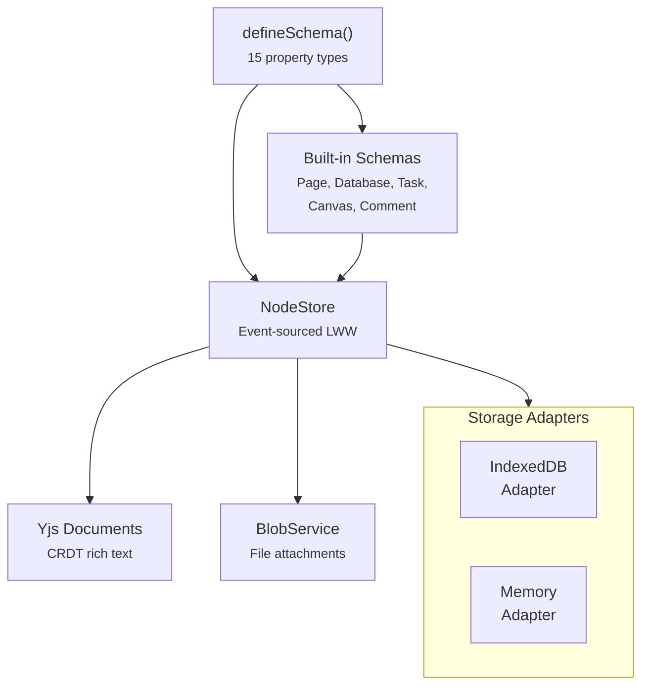

# @xnet/data

Schema system, NodeStore, and Yjs CRDT engine for xNet. This is the central data package -- it defines how structured data and rich text documents are created, stored, and synced.

## Installation

```bash
pnpm add @xnet/data
```

## Features

- **Schema system** -- `defineSchema()` with 15 typed property types
- **NodeStore** -- Event-sourced LWW (Last-Writer-Wins) storage engine
- **Built-in schemas** -- Page, Database, Task, Canvas, Comment
- **Yjs CRDT** -- Document creation, loading, state management
- **Awareness/presence** -- Real-time user presence
- **Blob service** -- File upload/download with content addressing
- **Storage adapters** -- SQLite, IndexedDB, and in-memory NodeStore adapters
- **Temp ID mapping** -- Optimistic creates with server-assigned IDs

## Usage

### Define a Schema

```typescript
import { defineSchema, text, number, select, date, checkbox, relation } from '@xnet/data'

const TaskSchema = defineSchema({
  name: 'Task',
  namespace: 'myapp://',
  document: 'yjs', // Enable rich text body
  properties: {
    title: text({ required: true }),
    priority: number(),
    done: checkbox(),
    dueDate: date(),
    status: select({
      options: [
        { id: 'todo', name: 'To Do' },
        { id: 'in-progress', name: 'In Progress' },
        { id: 'done', name: 'Done' }
      ] as const
    }),
    assignee: relation({ schema: 'myapp://Person' })
  }
})
```

### 15 Property Types

| Type          | Import          | Description                 |
| ------------- | --------------- | --------------------------- |
| `text`        | `text()`        | String values               |
| `number`      | `number()`      | Numeric values              |
| `checkbox`    | `checkbox()`    | Boolean toggle              |
| `date`        | `date()`        | Single date                 |
| `dateRange`   | `dateRange()`   | Start + end date            |
| `select`      | `select()`      | Single choice               |
| `multiSelect` | `multiSelect()` | Multiple choices            |
| `person`      | `person()`      | DID reference               |
| `relation`    | `relation()`    | Link to another node        |
| `url`         | `url()`         | URL string                  |
| `email`       | `email()`       | Email address               |
| `phone`       | `phone()`       | Phone number                |
| `file`        | `file()`        | File attachment             |
| `created`     | `created()`     | Auto-set creation timestamp |
| `updated`     | `updated()`     | Auto-set update timestamp   |

### NodeStore

```typescript
import { NodeStore, MemoryNodeStorageAdapter } from '@xnet/data'

const store = new NodeStore({
  adapter: new MemoryNodeStorageAdapter(),
  authorDID: identity.did,
  signingKey: privateKey
})

// Create
const task = await store.create(TaskSchema, { title: 'Buy milk', status: 'todo' })

// Read
const loaded = await store.get(TaskSchema, task.id)

// Update
await store.update(TaskSchema, task.id, { status: 'done' })

// List
const tasks = await store.list(TaskSchema)

// Delete (soft)
await store.remove(task.id)
```

### Yjs Documents

```typescript
import { createDocument, loadDocument, getDocumentState } from '@xnet/data'

// Create a Yjs document
const doc = createDocument({
  id: 'my-doc',
  workspace: 'default',
  type: 'page',
  title: 'My Page',
  createdBy: identity.did,
  signingKey: keyBundle.signingKey
})

// Edit rich text content
doc.ydoc.getText('content').insert(0, 'Hello world')

// Persist state
const state = getDocumentState(doc)

// Restore from state
const loaded = loadDocument(id, workspace, type, state)
```

## Architecture



## Modules

| Module                       | Description                            |
| ---------------------------- | -------------------------------------- |
| `schema/define.ts`           | `defineSchema()` factory               |
| `schema/node.ts`             | FlatNode type (flattened properties)   |
| `schema/registry.ts`         | Schema registry                        |
| `store/store.ts`             | NodeStore engine                       |
| `store/memory-adapter.ts`    | In-memory NodeStore adapter            |
| `store/indexeddb-adapter.ts` | IndexedDB NodeStore adapter            |
| `store/tempids.ts`           | Temp ID mapping for optimistic creates |
| `document.ts`                | Yjs document creation/loading          |
| `updates.ts`                 | Document state management              |
| `blob/blob-service.ts`       | File blob storage                      |
| `sync/awareness.ts`          | Presence awareness                     |
| `blocks/registry.ts`         | Block type registry                    |

## Dependencies

- `@xnet/core`, `@xnet/crypto`, `@xnet/identity`, `@xnet/storage`, `@xnet/sync`
- `yjs`, `y-protocols` -- CRDT engine
- `nanoid` -- ID generation
- `idb` -- IndexedDB

## Testing

```bash
pnpm --filter @xnet/data test
```

10 test files covering schema system, NodeStore, comments, and blob service.
