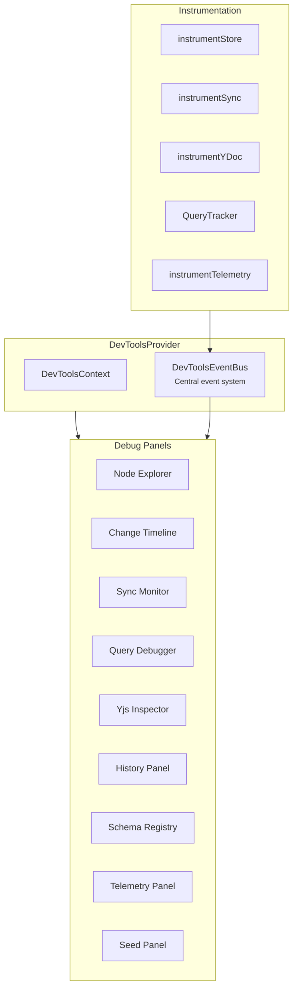

# @xnet/devtools

Protocol-level developer tools for xNet applications -- a 9-panel debug suite that tree-shakes to zero in production.

## Installation

```bash
pnpm add @xnet/devtools
```

## Features

- **Production-safe** -- Exports a no-op provider in production; full UI only in dev
- **9 debug panels:**
  1. **Node Explorer** -- Browse and inspect all nodes
  2. **Change Timeline** -- Visualize change history
  3. **Sync Monitor** -- Watch real-time sync status
  4. **Query Debugger** -- Inspect query execution
  5. **Yjs Inspector** -- Examine Y.Doc state and updates
  6. **History Panel** -- Browse undo/redo and audit trail
  7. **Schema Registry** -- View registered schemas
  8. **Telemetry Panel** -- Monitor telemetry events
  9. **Seed Panel** -- Generate test data
- **Event bus** -- Centralized event system for instrumentation
- **Instrumentation hooks** -- Tap into store, sync, Yjs, query, and telemetry

## Usage

```tsx
import { XNetDevToolsProvider, useDevTools } from '@xnet/devtools'

function App() {
  return (
    <XNetDevToolsProvider>
      <YourApp />
    </XNetDevToolsProvider>
  )
}

// In any component
function DebugInfo() {
  const { events, isOpen } = useDevTools()
  // ...
}
```

### Instrumentation

```typescript
import {
  instrumentStore,
  instrumentSync,
  instrumentYDoc,
  instrumentTelemetry
} from '@xnet/devtools'

// Tap into store operations
instrumentStore(store, eventBus)

// Monitor sync events
instrumentSync(syncProvider, eventBus)

// Watch Yjs updates
instrumentYDoc(ydoc, eventBus)

// Track telemetry events
instrumentTelemetry(collector, eventBus)
```

## Architecture



## Production vs Development

```typescript
// In production (index.ts): no-op, zero bundle cost
export const XNetDevToolsProvider = ({ children }) => children
export const useDevTools = () => ({})

// In development (index.dev.ts): full panel UI
export { XNetDevToolsProvider } from './provider/DevToolsProvider'
export { useDevTools } from './provider/useDevTools'
// ... all panels, instrumentation, etc.
```

## Dependencies

- `@xnet/history`, `@xnet/ui`, `@xnet/views` (runtime)
- Peer deps: `@xnet/data`, `@xnet/sync`, `@xnet/react`, `react`, `react-dom`, `yjs`

## Testing

```bash
pnpm --filter @xnet/devtools test
```

2 test files covering no-op exports and event bus.
