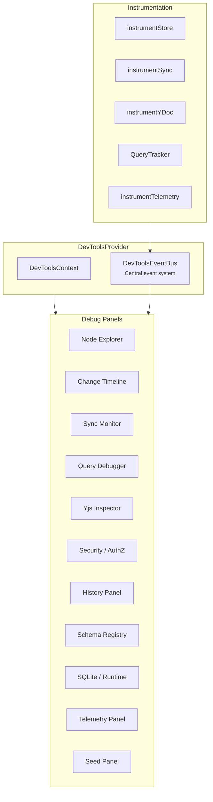

# @xnetjs/devtools

Protocol-level developer tools for xNet applications -- a 15-panel debug suite that tree-shakes to zero in production.

## Installation

```bash
pnpm add @xnetjs/devtools
```

## Features

- **Production-safe** -- Exports a no-op provider in production; full UI only in dev
- **15 debug panels:**
  1. **Nodes** -- Browse and inspect all nodes
  2. **Changes** -- Visualize change history
  3. **Sync** -- Watch connection status, lifecycle phase, replay queue, and rejected replication
  4. **Yjs** -- Examine Y.Doc state and updates
  5. **AuthZ** -- Inspect authorization diagnostics
  6. **Queries** -- Inspect active subscriptions, descriptor keys, and update activity
  7. **Telemetry** -- Monitor telemetry, performance, and consent signals
  8. **Schemas** -- View registered schemas
  9. **Schema History** -- Inspect schema evolution metadata
  10. **Security** -- Watch security-focused diagnostics
  11. **SQLite** -- Inspect runtime mode, storage mode, browser support, and persistence state
  12. **Version** -- Compare runtime and package versions
  13. **Migrate** -- Walk through schema migration flows
  14. **Seed** -- Generate test data
  15. **History** -- Browse undo/redo, audit, and snapshot state
- **Event bus** -- Centralized event system for instrumentation
- **Instrumentation hooks** -- Tap into store, sync, Yjs, query, and telemetry
- **Runtime diagnostics** -- Surface requested vs active runtime mode, fallback usage, sync lifecycle, and storage durability from `XNetProvider`

## Usage

```tsx
import { XNetDevToolsProvider, useDevTools } from '@xnetjs/devtools'

function App() {
  return (
    <XNetDevToolsProvider>
      <YourApp />
    </XNetDevToolsProvider>
  )
}

// In any component
function DebugInfo() {
  const { isOpen, runtimeStatus, syncDiagnostics, storageDurability } = useDevTools()

  return (
    <pre>
      {JSON.stringify({ isOpen, runtimeStatus, syncDiagnostics, storageDurability }, null, 2)}
    </pre>
  )
}
```

### Instrumentation

```typescript
import {
  instrumentStore,
  instrumentSync,
  instrumentYDoc,
  instrumentTelemetry
} from '@xnetjs/devtools'

// Tap into store operations
instrumentStore(store, eventBus)

// Monitor sync events
instrumentSync(syncProvider, eventBus)

// Watch Yjs updates
instrumentYDoc(ydoc, eventBus)

// Track telemetry events
instrumentTelemetry(collector, eventBus)
```

## Architecture



## Production vs Development

```typescript
// In production (index.ts): no-op, zero bundle cost
export const XNetDevToolsProvider = ({ children }) => children
export const useDevTools = () => ({})

// In development (index.dev.ts): full panel UI
export { XNetDevToolsProvider } from './provider/DevToolsProvider'
export { useDevTools } from './provider/useDevTools'
// ... all panels, instrumentation, etc.
```

## Dependencies

- `@xnetjs/history`, `@xnetjs/ui`, `@xnetjs/views` (runtime)
- Peer deps: `@xnetjs/data`, `@xnetjs/sync`, `@xnetjs/react`, `react`, `react-dom`, `yjs`

## Testing

```bash
pnpm --filter @xnetjs/devtools test
```

Core package coverage currently focuses on export/no-op behavior plus runtime typecheck. Query, sync, and storage diagnostics are exercised through the `@xnetjs/react` and app-level test suites that emit the underlying instrumentation.
