# @xnetjs/editor

Collaborative rich text editor for xNet, built on [TipTap](https://tiptap.dev/) and [Yjs](https://yjs.dev/).

## Features

- **Collaborative editing** -- Real-time sync via Yjs CRDT
- **Notion-like shortcuts** -- Markdown-style formatting as you type
- **Wikilinks** -- `[[page name]]` syntax with navigation callbacks
- **Live preview** -- Obsidian-style reveal of markdown syntax
- **Slash commands** -- `/` menu for inserting blocks
- **Drag-and-drop** -- Reorder blocks with drag handles
- **Task lists** -- Checkbox items with nesting support
- **Mermaid diagrams** -- Inline mermaid code block rendering
- **Database embeds** -- Embed database views in documents
- **Toggle blocks** -- Collapsible content sections
- **Callouts** -- Styled info/warning/error callout blocks
- **Image and file uploads** -- Drag-drop or paste media
- **Accessibility** -- Focus trapping, screen reader announcements
- **Floating toolbar** -- Context-aware formatting toolbar
- **Comments** -- Inline comment annotations
- **Storybook workbench** -- Feature-rich isolated editor scenario for development

## Installation

```bash
pnpm add @xnetjs/editor @xnetjs/react @xnetjs/data
```

## Quick Start with React

```tsx
import { useNode } from '@xnetjs/react'
import { RichTextEditor } from '@xnetjs/editor/react'
import { defineSchema, text } from '@xnetjs/data'

const PageSchema = defineSchema({
  name: 'Page',
  namespace: 'myapp://',
  properties: { title: text({ required: true }) },
  document: 'yjs'
})

function DocumentEditor({ pageId }: { pageId: string }) {
  const {
    data: page,
    doc,
    loading,
    error,
    syncStatus,
    peerCount
  } = useNode(PageSchema, pageId, {
    createIfMissing: { title: 'Untitled' }
  })

  if (loading) return <p>Loading...</p>
  if (error) return <p>Error: {error.message}</p>
  if (!doc) return <p>Not found</p>

  return (
    <div>
      <h1>{page?.title}</h1>
      <span>
        {syncStatus === 'connected' ? 'Synced' : 'Offline'} ({peerCount} peers)
      </span>
      <RichTextEditor
        ydoc={doc}
        field="content"
        placeholder="Start writing..."
        onNavigate={(docId) => (window.location.href = `/doc/${docId}`)}
      />
    </div>
  )
}
```

## Architecture

```mermaid
flowchart TD
    subgraph React["React Layer"]
        RTE["RichTextEditor"]
        Toolbar["FloatingToolbar +<br/>EditorToolbar"]
        Comments["EditorComments"]
        SlashMenu["SlashMenu"]
        DragHandle["DragHandle"]
    end

    subgraph Extensions["TipTap Extensions"]
        Core["StarterKit<br/><small>Bold, italic, lists, etc.</small>"]
        Collab["Collaboration<br/><small>Yjs binding</small>"]
        Wikilink["Wikilinks<br/><small>[[page]] syntax</small>"]
        Slash["SlashCommand<br/><small>/ menu</small>"]
        Mermaid["Mermaid<br/><small>Diagram rendering</small>"]
        DBEmbed["DatabaseEmbed<br/><small>Inline views</small>"]
        Toggle["Toggle<br/><small>Collapsible</small>"]
        Callout["Callout<br/><small>Info/warning boxes</small>"]
        Image["Image + File<br/><small>Upload support</small>"]
        LivePreview["LivePreview<br/><small>Obsidian-style</small>"]
        Comment["Comment<br/><small>Inline annotations</small>"]
    end

    subgraph Core2["Core"]
        Editor["Editor class"]
        CreateEditor["createEditor()"]
    end

    React --> Extensions --> Core2
    Core2 --> Yjs["Y.Doc (CRDT)"]
```



## React Components

### `RichTextEditor`

```tsx
import { RichTextEditor } from '@xnetjs/editor/react'
;<RichTextEditor
  ydoc={doc}
  field="content"
  placeholder="Start writing..."
  showToolbar={true}
  readOnly={false}
  onNavigate={(docId) => navigate(`/doc/${docId}`)}
  className="my-editor"
/>
```

| Prop          | Type                      | Default              | Description              |
| ------------- | ------------------------- | -------------------- | ------------------------ |
| `ydoc`        | `Y.Doc`                   | required             | Yjs document to bind to  |
| `field`       | `string`                  | `'content'`          | Y.XmlFragment field name |
| `placeholder` | `string`                  | `'Start writing...'` | Placeholder text         |
| `showToolbar` | `boolean`                 | `true`               | Show formatting toolbar  |
| `readOnly`    | `boolean`                 | `false`              | Disable editing          |
| `onNavigate`  | `(docId: string) => void` | -                    | Wikilink click handler   |
| `className`   | `string`                  | -                    | Additional CSS class     |

### `EditorToolbar`

Standalone toolbar component.

```tsx
import { EditorToolbar, useEditor } from '@xnetjs/editor/react'
```

## Keyboard Shortcuts

**Text Formatting:**

- `**text**` or `Cmd+B` -- **bold**
- `*text*` or `Cmd+I` -- _italic_
- `~~text~~` -- ~~strikethrough~~
- `` `code` `` -- `inline code`

**Headings:** `# `, `## `, `### `

**Lists:** `- ` (bullet), `1. ` (numbered), `[] ` (task)

**Blocks:** `> ` (blockquote), `---` (horizontal rule), ` ``` ` (code block)

**Links:** `[[page name]]` (wikilink)

## Vanilla JavaScript

```ts
import { createEditor } from '@xnetjs/editor'
import * as Y from 'yjs'

const ydoc = new Y.Doc()
const editor = createEditor({
  ydoc,
  field: 'content',
  onChange: (content) => console.log('Changed:', content)
})

editor.getContent()
editor.setContent('Hello, world!')
editor.insert(5, ' beautiful')
editor.delete(0, 6)
editor.destroy()
```

## Exports

```ts
// React components (recommended)
import { RichTextEditor, EditorToolbar, FloatingToolbar } from '@xnetjs/editor/react'

// Re-exported from @tiptap/react
import { useEditor, EditorContent, Editor } from '@xnetjs/editor/react'

// Extensions collection
import { ... } from '@xnetjs/editor/extensions'

// Vanilla JS core
import { createEditor, Editor } from '@xnetjs/editor'
```

## Related Packages

- `@xnetjs/react` -- React hooks (`useNode`, `useQuery`, `useMutate`)
- `@xnetjs/data` -- Schema system and NodeStore
- `@xnetjs/ui` -- Shared UI primitives

## Testing

```bash
pnpm --filter @xnetjs/editor test
```

23 test files covering extensions, components, accessibility, and performance.

## Storybook Workbench

Run the root Storybook workspace from the repo root:

```bash
pnpm dev:stories
```

The editor package now includes a dense workbench story that exercises:

- collaborative cursor and selection states
- inline comments and anchors
- rich marks, links, and smart references
- image, file, and rich embed nodes
- database and task-view embeds
- nested toggles and callouts
