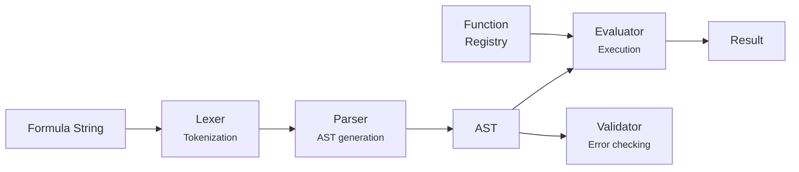

# @xnetjs/formula

Formula parser and evaluator for database computed properties -- a standalone package with zero `@xnetjs/*` dependencies.

## Installation

```bash
pnpm add @xnetjs/formula
```

## Features

- **Lexer** -- Tokenizes formula expressions
- **Parser** -- Generates an AST from tokens
- **Evaluator** -- Evaluates AST nodes with a context
- **Validator** -- Validates formulas before evaluation
- **Compiler** -- Pre-compiles formulas for repeated evaluation
- **Built-in functions** -- Math, string, date, and logic functions
- **Property references** -- Extract referenced properties from formulas

## Usage

```typescript
import { parseFormula, evaluateFormula, validateFormula } from '@xnetjs/formula'

// Parse and evaluate
const result = evaluateFormula('prop("Price") * prop("Quantity")', {
  props: { Price: 29.99, Quantity: 3 }
})
// => 89.97

// Validate before evaluating
const { valid, errors } = validateFormula('if(prop("Status") == "Done", "Complete", "Pending")')

// Extract property references
import { extractPropertyReferences } from '@xnetjs/formula'
const refs = extractPropertyReferences('prop("Price") * prop("Quantity")')
// => ["Price", "Quantity"]
```

### Compiled Formulas

```typescript
import { compileFormula } from '@xnetjs/formula'

// Pre-compile for repeated evaluation
const compiled = compileFormula('prop("Price") * prop("Quantity") * (1 + prop("Tax"))')

const result1 = compiled.evaluate({ props: { Price: 10, Quantity: 2, Tax: 0.1 } })
const result2 = compiled.evaluate({ props: { Price: 20, Quantity: 1, Tax: 0.2 } })
```

### Advanced: Direct AST Access

```typescript
import { Lexer, Parser, Evaluator } from '@xnetjs/formula'

const tokens = new Lexer('1 + 2 * 3').tokenize()
const ast = new Parser(tokens).parse()
const result = new Evaluator().evaluate(ast, context)
```

## Formula Language

```
// Arithmetic
prop("Price") * prop("Quantity")
(prop("Subtotal") + prop("Tax")) / 100

// Comparisons
prop("Status") == "Done"
prop("Priority") > 3

// Conditionals
if(prop("Status") == "Done", "Complete", "Pending")

// String functions
concat(prop("First"), " ", prop("Last"))
length(prop("Title"))

// Date functions
formatDate(prop("Due Date"), "MMM D, YYYY")

// Math functions
round(prop("Score"), 2)
sum(prop("Values"))
```

## Architecture



## Modules

| Module               | Description                 |
| -------------------- | --------------------------- |
| `lexer.ts`           | Tokenizer                   |
| `parser.ts`          | AST parser                  |
| `evaluator.ts`       | Expression evaluator        |
| `ast.ts`             | AST node types and builders |
| `functions/index.ts` | Built-in function registry  |

## Testing

```bash
pnpm --filter @xnetjs/formula test
```

4 test files covering lexer, parser, evaluator, and built-in functions.
