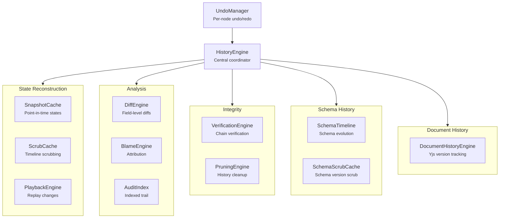

# @xnetjs/history

History, audit, and time travel for xNet -- point-in-time reconstruction, undo/redo, diffs, blame, and verification.

## Installation

```bash
pnpm add @xnetjs/history
```

## Features

- **HistoryEngine** -- Central engine for history operations
- **Snapshot cache** -- Cached point-in-time state snapshots
- **Audit index** -- Indexed audit trail of all changes
- **Undo/redo** -- Per-node undo manager with proper CRDT integration
- **Scrub cache** -- Timeline scrubbing with interpolated states
- **Playback** -- Play back changes over time
- **Diff engine** -- Field-level diffs between versions
- **Blame engine** -- Per-field attribution (who changed what)
- **Verification** -- Cryptographic verification of change chains
- **Pruning** -- Remove old history while preserving checkpoints
- **Schema timeline** -- Track schema evolution over time
- **Document history** -- Rich text (Yjs) document version tracking

## Usage

```typescript
import { HistoryEngine } from '@xnetjs/history'

const engine = new HistoryEngine(store)

// Get history entries for a node
const entries = engine.getHistory(nodeId)

// Reconstruct state at a point in time
const snapshot = engine.getSnapshotAt(nodeId, timestamp)

// Go to a specific version
engine.goTo(nodeId, version)
```

### Undo/Redo

```typescript
import { UndoManager } from '@xnetjs/history'

const undo = new UndoManager(store, nodeId)
undo.undo()
undo.redo()
undo.canUndo // boolean
undo.canRedo // boolean
```

### Diffs

```typescript
import { DiffEngine } from '@xnetjs/history'

const differ = new DiffEngine(store)
const diff = differ.diff(nodeId, version1, version2)
// => { fields: [{ field: 'title', old: 'Draft', new: 'Final' }] }
```

### Blame

```typescript
import { BlameEngine } from '@xnetjs/history'

const blame = new BlameEngine(store)
const attribution = blame.blame(nodeId)
// => { title: { author: 'did:key:...', timestamp: 1706..., version: 5 } }
```

### Verification

```typescript
import { VerificationEngine } from '@xnetjs/history'

const verifier = new VerificationEngine(store)
const result = verifier.verify(nodeId)
// => { valid: true, checkedVersions: 42 }
```

## Architecture



## Modules

| Module                  | Description                      |
| ----------------------- | -------------------------------- |
| `engine.ts`             | Central history engine           |
| `snapshot-cache.ts`     | Point-in-time snapshot caching   |
| `audit-index.ts`        | Indexed audit trail              |
| `undo-manager.ts`       | Undo/redo operations             |
| `scrub-cache.ts`        | Timeline scrubbing cache         |
| `playback.ts`           | Change playback engine           |
| `diff.ts`               | Field-level diff computation     |
| `blame.ts`              | Per-field attribution            |
| `verification.ts`       | Cryptographic chain verification |
| `pruning.ts`            | History pruning with checkpoints |
| `schema-timeline.ts`    | Schema evolution tracking        |
| `schema-scrub-cache.ts` | Schema version scrubbing         |
| `document-history.ts`   | Yjs document version history     |

## Dependencies

- `@xnetjs/core`, `@xnetjs/data`, `@xnetjs/sync`
- `yjs` -- Document history operations

## Testing

```bash
pnpm --filter @xnetjs/history test
```

3 test files covering history engine, document history, and edge cases.
