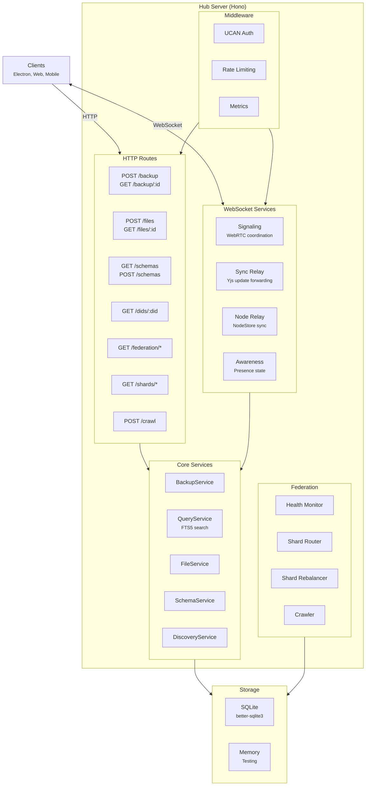

# @xnetjs/hub

xNet Hub -- signaling server, sync relay, backup, query server, and federation gateway. Runs as a standalone Node.js server with a CLI.

## Installation

```bash
pnpm add @xnetjs/hub
```

## Quick Start

```bash
# Start a hub server
npx xnet-hub start --port 4444

# Or via pnpm in the monorepo
cd packages/hub && pnpm dev
```

## Features

- **WebSocket signaling** -- Coordinate WebRTC peer connections
- **Sync relay** -- Relay Yjs updates between peers via WebSocket
- **Node relay** -- Relay NodeStore changes between peers
- **Backup service** -- Persistent backup of node data and Yjs documents
- **File storage** -- Upload and serve file attachments
- **Schema registry** -- Store and serve shared schemas
- **Full-text search** -- FTS5-powered search across backed-up nodes
- **Awareness** -- Real-time presence and user state relay
- **Peer discovery** -- Help peers find each other
- **UCAN authentication** -- Verify DID-based authorization tokens
- **Rate limiting** -- HTTP and WebSocket rate limiting
- **Metrics middleware** -- Request timing and counting
- **Graceful shutdown** -- Clean connection draining
- **Federation** -- Cross-hub queries, schema sharing, health monitoring
- **Sharding** -- Distributed data across shard groups with rebalancing
- **Crawling** -- Web content crawling with robots.txt compliance

## Architecture



## Usage (Programmatic)

```typescript
import { createHub, resolveConfig } from '@xnetjs/hub'

const config = resolveConfig({
  port: 4444,
  dataDir: './hub-data',
  storage: 'sqlite'
})

const hub = await createHub(config)
// hub.server is a Hono app
// hub.close() for graceful shutdown
```

## CLI

```bash
xnet-hub start [options]

Options:
  --port <number>       Port to listen on (default: 4444)
  --data-dir <path>     Data directory (default: ./hub-data)
  --storage <type>      Storage backend: sqlite | memory (default: sqlite)
```

## Durability (Litestream → S3, opt-in)

Self-hosters can get the same continuous SQLite backup the managed cloud uses
(exploration 0288) by running the hub image with Litestream enabled and pointing
it at **any S3-compatible object store** (Cloudflare R2, AWS S3, MinIO, …). The
hub's entrypoint restores `hub.db` from the replica on boot, then supervises
replication (~1s RPO) for the life of the process.

```bash
# Bring-your-own S3 bucket. Credentials are read from the environment; the
# rendered Litestream config never embeds them.
docker run \
  -e LITESTREAM=1 \
  -e LITESTREAM_PATH="hubs/my-hub/db" \
  -e R2_ENDPOINT="https://s3.us-east-1.amazonaws.com" \
  -e R2_BUCKET="my-xnet-backups" \
  -e R2_ACCESS_KEY_ID=… -e R2_SECRET_ACCESS_KEY=… \
  -e LITESTREAM_REGION="us-east-1" \        # default "auto" (R2)
  -e LITESTREAM_FORCE_PATH_STYLE="false" \  # default "true" (R2); AWS wants false
  xnet-hub
```

You can also mount your own `/etc/litestream.yml` — a baked/mounted config always
wins over the env-generated one. Backup freshness is published on `GET /health`
(`backup.lastSyncMs` / `backup.fresh`), scraped from Litestream's loopback metrics.

## Modules

| Module                   | Description                 |
| ------------------------ | --------------------------- |
| `server.ts`              | Hub server factory          |
| `config.ts`              | Configuration resolution    |
| `cli.ts`                 | Commander CLI               |
| `auth/ucan.ts`           | UCAN token verification     |
| `auth/capabilities.ts`   | Capability checking         |
| `routes/backup.ts`       | Backup HTTP routes          |
| `routes/files.ts`        | File upload/download routes |
| `routes/schemas.ts`      | Schema registry routes      |
| `routes/dids.ts`         | DID resolution routes       |
| `routes/federation.ts`   | Federation routes           |
| `routes/shards.ts`       | Shard management routes     |
| `routes/crawl.ts`        | Web crawl routes            |
| `services/signaling.ts`  | WebSocket signaling         |
| `services/relay.ts`      | Yjs sync relay              |
| `services/node-relay.ts` | NodeStore sync relay        |
| `services/backup.ts`     | Backup persistence          |
| `services/query.ts`      | FTS5 query service          |
| `services/files.ts`      | File storage service        |
| `services/schemas.ts`    | Schema registry service     |
| `services/awareness.ts`  | Presence relay              |
| `services/discovery.ts`  | Peer discovery              |
| `services/federation.ts` | Hub-to-hub federation       |
| `services/crawl.ts`      | Web content crawler         |
| `storage/sqlite.ts`      | SQLite storage backend      |
| `storage/memory.ts`      | Memory storage backend      |

## Dependencies

- `@xnetjs/core`, `@xnetjs/crypto`, `@xnetjs/identity`, `@xnetjs/data`, `@xnetjs/sync`
- `hono` + `@hono/node-server` -- HTTP framework
- `better-sqlite3` -- SQLite database
- `ws` -- WebSocket server
- `commander` -- CLI framework
- `yjs`, `y-protocols` -- CRDT handling

## Testing

```bash
pnpm --filter @xnetjs/hub test
```

> Note: run tests through the **root** vitest config (`pnpm vitest run
> packages/hub/test/<file>`) — the per-package filter breaks project
> resolution.

## Shipping a hub change (the PR tax)

`@xnetjs/hub` is `private: true`, so hub-only changes take **no changeset**
(confirm with `node scripts/changeset/publishable-pathspec.mjs`). Two things
ARE required (exploration 0383 W0):

1. **A changelog fragment** whenever behaviour is user-visible:
   `node scripts/changelog/new.mjs --title "…" --summary "…" --tags platform,sync`
   (valid tags are `KNOWN_TAGS` in that script). Pure refactors/CI can use the
   `skip-changelog` PR label instead.
2. **Expect one `electron-e2e` rerun.** The `xnet://` deep-link case
   (`electron-smoke.spec.ts:161`) times out flakily and the lane runs
   `--fail-on-flaky-tests`, so a single timeout reds the PR on identical code.
   Before debugging, check `git log --oneline HEAD..origin/main` — if your
   delta is docs-only or unrelated, it is the flake:
   `gh run rerun <run-id> --failed`.
