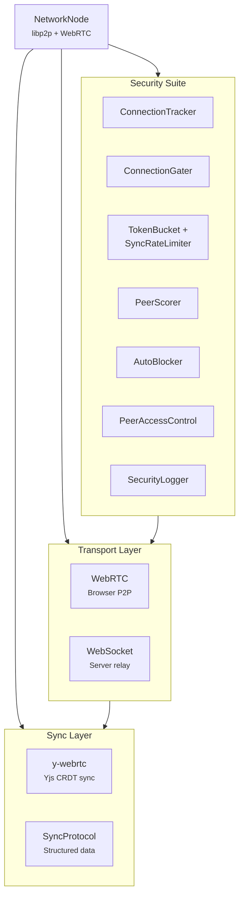

# @xnet/network

P2P networking for xNet -- libp2p, WebRTC, y-webrtc provider, and a comprehensive security suite.

## Installation

```bash
pnpm add @xnet/network
```

## Features

- **libp2p node** -- Create, start, stop, and connect P2P nodes
- **WebRTC transport** -- Browser-to-browser connectivity
- **y-webrtc provider** -- Yjs CRDT sync over WebRTC
- **Sync protocol** -- Custom sync protocol for structured data
- **DID resolver** -- Resolve DIDs to public keys and endpoints
- **Security suite**:
  - Connection tracking and gating
  - Token bucket rate limiter
  - Sync-specific rate limiting
  - Peer scoring (reputation)
  - Auto-blocking of abusive peers
  - Peer access control lists
  - Security event logging

## Usage

```typescript
import { createNode } from '@xnet/network'

// Create a network node
const node = await createNode({
  did: identity.did,
  privateKey: keyBundle.signingKey
})

// Start networking
await node.libp2p.start()

// Connect to a peer
await node.libp2p.dial(peerMultiaddr)

// Stop
await node.libp2p.stop()
```

## Architecture



## Modules

| Module                     | Description                         |
| -------------------------- | ----------------------------------- |
| `node.ts`                  | NetworkNode creation and management |
| `protocols/sync.ts`        | Custom sync protocol                |
| `providers/ywebrtc.ts`     | y-webrtc Yjs provider               |
| `resolution/did.ts`        | DID resolution                      |
| `security/tracker.ts`      | Connection tracking                 |
| `security/gater.ts`        | Connection gating                   |
| `security/rate-limiter.ts` | Token bucket rate limiter           |
| `security/limits.ts`       | Sync-specific rate limits           |
| `security/peer-scorer.ts`  | Peer reputation scoring             |
| `security/auto-blocker.ts` | Automatic peer blocking             |
| `security/access-list.ts`  | Peer access control                 |
| `security/logging.ts`      | Security event logging              |

## Dependencies

- `@xnet/core`, `@xnet/crypto`, `@xnet/identity`, `@xnet/data`
- libp2p ecosystem (noise, yamux, webrtc, websockets, circuit-relay, kad-dht)
- `y-webrtc`, `yjs` -- CRDT sync
- `@chainsafe/libp2p-noise` -- Encrypted transport

## Telemetry Integration

PeerScorer supports optional telemetry for security monitoring and performance tracking:

```typescript
import { PeerScorer } from '@xnet/network'
import { TelemetryCollector } from '@xnet/telemetry'

const telemetry = new TelemetryCollector({ consent })

const scorer = new PeerScorer({
  telemetry: {
    reportSecurity: (eventName, severity, details) => {
      telemetry.reportSecurityEvent(eventName, severity, details)
    },
    reportUsage: (metricName, value) => {
      telemetry.reportUsage(metricName, value)
    },
    reportPerformance: (metricName, durationMs, codeNamespace) => {
      telemetry.reportPerformance(metricName, durationMs, codeNamespace)
    }
  }
})

// Telemetry automatically tracks:
// - Security events (invalid signatures, rate limit violations, invalid data)
// - Peer actions (block, throttle, warn counts)
// - Sync operations (success/failure)
// - Peer latency (bucketed for privacy)
// - Score distributions (bucketed: <-50, -50--20, -20-0, 0-50, 50+)
```

**Metrics tracked:**

- `network.invalid_signature` (security, high)
- `network.invalid_data` (security, medium)
- `network.rate_limit_violation` (security, medium)
- `network.peer_blocked` (security, high)
- `network.peers_throttled` (usage)
- `network.peers_warned` (usage)
- `network.sync_success` (usage)
- `network.sync_failure` (usage)
- `network.peer_latency` (performance)
- `network.security_violations` (usage)

All peer-identifying information is scrubbed. Only bucketed scores and aggregated counts are reported.

## Testing

```bash
pnpm --filter @xnet/network test
```
