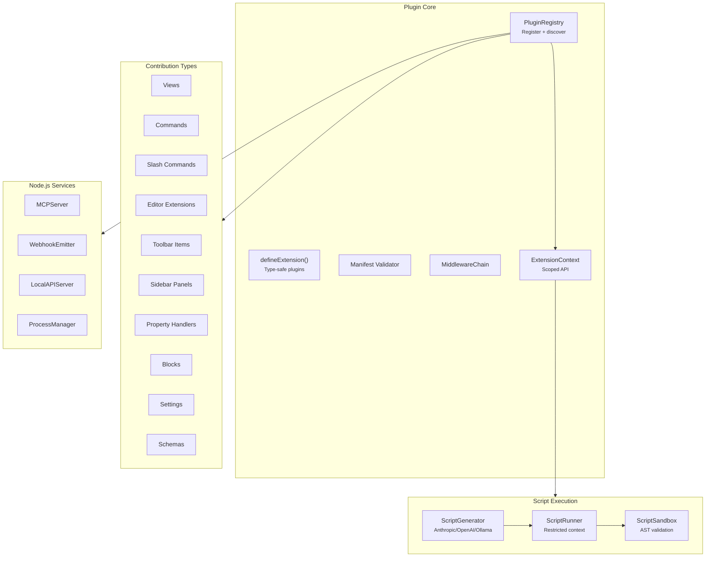

# @xnetjs/plugins

Plugin system for xNet -- registry, sandboxed script execution, AI-powered script generation, and service integrations.

## Installation

```bash
pnpm add @xnetjs/plugins
```

## Features

- **Plugin registry** -- Register, enable/disable, and discover plugins
- **Extension system** -- `defineExtension()` for type-safe plugin definitions
- **Contribution types** -- Views, commands, slash commands, editor extensions, toolbar items, sidebar panels, property handlers, blocks, settings, schemas
- **Manifest validation** -- Validate plugin manifests before registration
- **Shortcut manager** -- Global keyboard shortcut registry
- **Middleware chain** -- Composable middleware for plugin operations
- **Extension context** -- Scoped API surface for plugins
- **Plugin/Script schemas** -- Plugins and scripts stored as Nodes
- **Sandboxed execution** -- Safe script execution with AST validation (acorn)
- **Script runner** -- Execute validated scripts in a restricted context
- **AI script generation** -- Generate scripts via Anthropic, OpenAI, or Ollama
- **Services** (Node.js only):
  - Webhook emitter
  - Service client (HTTP)
  - Process manager
  - Local API server
  - MCP server (Model Context Protocol)

## Usage

### Plugin Registry

```typescript
import { PluginRegistry, defineExtension, validateManifest } from '@xnetjs/plugins'

const registry = new PluginRegistry()

// Define a plugin extension
const myPlugin = defineExtension({
  id: 'my-plugin',
  name: 'My Plugin',
  version: '1.0.0',
  contributions: {
    commands: [
      {
        id: 'my-command',
        label: 'Do Something',
        handler: () => {
          /* ... */
        }
      }
    ],
    views: [{ id: 'my-view', label: 'Custom View', component: MyViewComponent }]
  }
})

registry.register(myPlugin)
```

### Sandboxed Scripts

```typescript
import { ScriptSandbox, ScriptRunner } from '@xnetjs/plugins'

// Validate and run user scripts safely
const sandbox = new ScriptSandbox()
const runner = new ScriptRunner(sandbox)

const result = await runner.run(
  `
  const items = context.query({ schema: 'myapp://Task' })
  return items.filter(t => t.status === 'todo').length
`,
  { context: extensionContext }
)
```

### AI Script Generation

```typescript
import { ScriptGenerator } from '@xnetjs/plugins'

const generator = new ScriptGenerator({
  provider: 'anthropic',
  apiKey: process.env.ANTHROPIC_API_KEY
})

const script = await generator.generate(
  'Create a script that counts overdue tasks and sends a summary'
)
```

### Shortcut Manager

```typescript
import { ShortcutManager } from '@xnetjs/plugins'

const shortcuts = new ShortcutManager()
shortcuts.register('mod+shift+t', () => openTaskPanel())
shortcuts.register('mod+/', () => openSlashMenu())
```

### Node.js Services

```typescript
// Import from the /node subpath
import { MCPServer, WebhookEmitter, LocalAPIServer } from '@xnetjs/plugins/node'

// MCP server for AI tool integration
const mcp = new MCPServer(registry, store)
await mcp.start(3001)

// Webhook emitter for external integrations
const webhooks = new WebhookEmitter()
webhooks.on('node:created', 'https://example.com/webhook')

// Local API server for plugin HTTP access
const api = new LocalAPIServer(registry, store)
await api.start(3002)
```

## Architecture



## Modules

| Module                        | Description                           |
| ----------------------------- | ------------------------------------- |
| `registry.ts`                 | Plugin registry                       |
| `types.ts`                    | Plugin, Extension, Contribution types |
| `manifest.ts`                 | Manifest validation                   |
| `contributions.ts`            | Contribution type definitions         |
| `shortcuts.ts`                | Global shortcut manager               |
| `middleware.ts`               | Composable middleware chain           |
| `context.ts`                  | Scoped extension context              |
| `schemas/plugin.ts`           | Plugin node schema                    |
| `schemas/script.ts`           | Script node schema                    |
| `sandbox/sandbox.ts`          | Script sandbox                        |
| `sandbox/runner.ts`           | Script runner                         |
| `sandbox/ast-validator.ts`    | AST validation (acorn)                |
| `ai/generator.ts`             | AI script generation                  |
| `ai/providers.ts`             | LLM provider adapters                 |
| `services/mcp-server.ts`      | MCP server (Node.js)                  |
| `services/webhook-emitter.ts` | Webhook emitter (Node.js)             |
| `services/local-api.ts`       | Local API server (Node.js)            |
| `services/process-manager.ts` | Process manager (Node.js)             |

## Dependencies

- `@xnetjs/core`, `@xnetjs/data`
- `acorn` -- JavaScript AST parsing for sandbox validation
- Peer deps: `@tiptap/core`, `react`

## Testing

```bash
pnpm --filter @xnetjs/plugins test
```

8 test files covering registry, middleware, sandbox, shortcuts, AI, local API, webhooks, and MCP.
