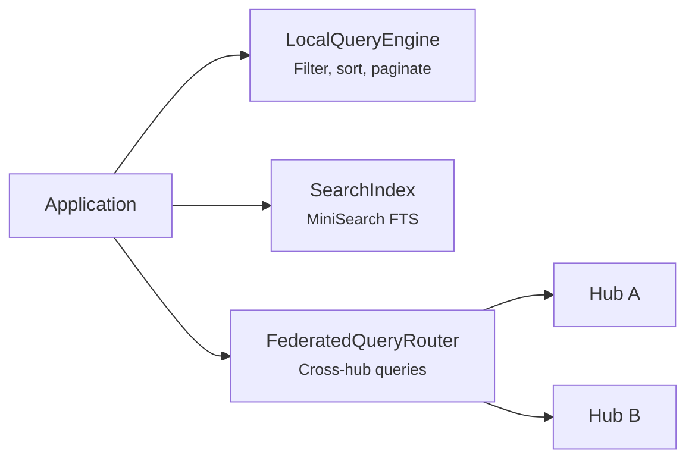

# @xnet/query

Local query engine, full-text search, and federated query routing for xNet.

## Installation

```bash
pnpm add @xnet/query
```

## Features

- **Local query engine** -- Filter, sort, paginate nodes from local storage
- **Full-text search** -- MiniSearch-powered indexing and search
- **Federated query router** -- Route local queries now, remote sources when available

## Usage

```typescript
import { createLocalQueryEngine } from '@xnet/query'

// Create query engine
const engine = createLocalQueryEngine(listDocumentIds, getDocument)

// Query with filters, sorting, and pagination
const results = await engine.query({
  type: 'page',
  filters: [{ field: 'workspace', operator: 'eq', value: 'default' }],
  sort: [{ field: 'updated', direction: 'desc' }],
  limit: 20,
  offset: 0
})
```

```typescript
import { createSearchIndex } from '@xnet/query'

// Full-text search
const index = createSearchIndex()
index.add(doc)
index.add(anotherDoc)

const matches = index.search({ text: 'hello', limit: 10 })
```

```typescript
import { createFederatedQueryRouter } from '@xnet/query'

// Federated router (local execution today)
const router = createFederatedQueryRouter(networkNode, engine)
const results = await router.execute(queryParams)
```

## Architecture



## Modules

| Module                 | Description                       |
| ---------------------- | --------------------------------- |
| `local/engine.ts`      | Local query engine                |
| `search/index.ts`      | MiniSearch full-text search index |
| `federation/router.ts` | Federated query routing           |
| `types.ts`             | Query, Filter, Sort types         |

## Dependencies

- `@xnet/core`, `@xnet/data`, `@xnet/identity`, `@xnet/network`, `@xnet/storage`
- `minisearch` -- Full-text search engine

## Testing

```bash
pnpm --filter @xnet/query test
```
