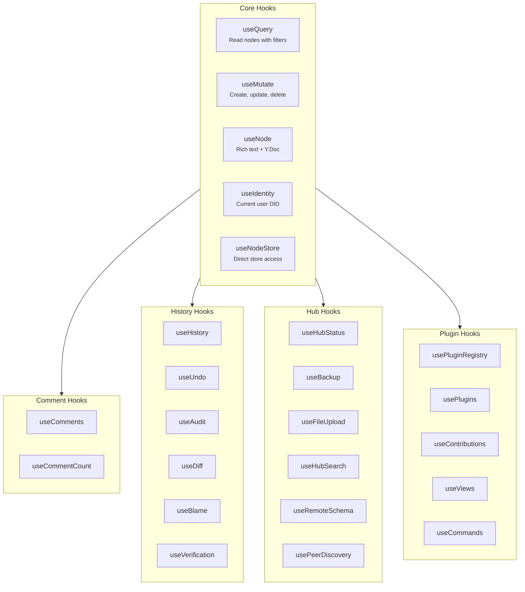

# @xnet/react

React hooks for xNet -- the primary API for building xNet applications.

## Installation

```bash
pnpm add @xnet/react @xnet/data
```

## Quick Start

```tsx
import { XNetProvider, useQuery, useMutate, useNode } from '@xnet/react'
import { MemoryNodeStorageAdapter, defineSchema, text, select } from '@xnet/data'

// 1. Define your schema
const TaskSchema = defineSchema({
  name: 'Task',
  namespace: 'myapp://',
  properties: {
    title: text({ required: true }),
    status: select({
      options: [
        { id: 'todo', name: 'To Do' },
        { id: 'done', name: 'Done' }
      ] as const
    })
  }
})

// 2. Wrap your app with the provider
function App() {
  return (
    <XNetProvider
      config={{
        nodeStorage: new MemoryNodeStorageAdapter(),
        authorDID: identity.did,
        signingKey: privateKey
      }}
    >
      <TaskApp />
    </XNetProvider>
  )
}
```

## Hook Categories



## Core Hooks

### `useQuery` -- Read Data

Query nodes with automatic real-time updates.

```tsx
import { useQuery } from '@xnet/react'

function TaskList() {
  const { data: tasks, loading, error } = useQuery(TaskSchema)

  if (loading) return <p>Loading...</p>
  if (error) return <p>Error: {error.message}</p>

  return (
    <ul>
      {tasks.map((task) => (
        <li key={task.id}>
          {task.title} {/* Direct property access -- no .properties needed */}
          <span>{task.status}</span>
        </li>
      ))}
    </ul>
  )
}
```

**Query by ID:**

```tsx
const { data: task } = useQuery(TaskSchema, taskId)
```

**Filtered & Sorted:**

```tsx
const { data: todoTasks } = useQuery(TaskSchema, {
  where: { status: 'todo' },
  orderBy: { createdAt: 'desc' },
  limit: 20
})
```

### `useMutate` -- Write Data

Create, update, and delete nodes.

```tsx
import { useMutate } from '@xnet/react'

function CreateTaskButton() {
  const { create, isPending } = useMutate()

  const handleCreate = async () => {
    const task = await create(TaskSchema, {
      title: 'New Task',
      status: 'todo'
    })
    console.log('Created:', task.id)
  }

  return (
    <button onClick={handleCreate} disabled={isPending}>
      {isPending ? 'Creating...' : 'Create Task'}
    </button>
  )
}
```

**Update:**

```tsx
const { update } = useMutate()
await update(TaskSchema, taskId, { status: 'done' }) // Type-checked!
```

**Delete:**

```tsx
const { remove } = useMutate()
await remove(taskId) // Soft delete
```

**Transactions (atomic):**

```tsx
const { mutate } = useMutate()

await mutate([
  { type: 'update', id: task1.id, data: { order: 1 } },
  { type: 'update', id: task2.id, data: { order: 2 } },
  { type: 'delete', id: task3.id }
])
```

### `useNode` -- Rich Text Editing

Load a node with its Y.Doc for collaborative rich text editing.

```tsx
import { useNode } from '@xnet/react'
import { RichTextEditor } from '@xnet/editor/react'

const PageSchema = defineSchema({
  name: 'Page',
  namespace: 'myapp://',
  properties: { title: text({ required: true }) },
  document: 'yjs'
})

function DocumentEditor({ pageId }) {
  const {
    data: page, // FlatNode -- page.title works directly
    doc, // Y.Doc for rich text
    update, // Type-safe property updates
    loading,
    error,
    syncStatus, // 'offline' | 'connecting' | 'connected'
    peerCount, // Connected peers
    presence // [{ did, name, color, lastSeen, isStale }]
  } = useNode(PageSchema, pageId, {
    createIfMissing: { title: 'Untitled' },
    did: myDid
  })

  if (loading) return <p>Loading...</p>
  if (!page || !doc) return <p>Not found</p>

  return (
    <div>
      <input value={page.title} onChange={(e) => update({ title: e.target.value })} />
      <RichTextEditor ydoc={doc} />
    </div>
  )
}
```

## Additional Hooks

### Comment Hooks

```tsx
const { threads, addComment, resolveThread } = useComments({ nodeId })
const count = useCommentCount(nodeId)
```

### History Hooks

```tsx
const { timeline, materializeAt, diff } = useHistory(nodeId)
const { undo, redo, canUndo, canRedo } = useUndo(nodeId)
const { entries, activity } = useAudit(nodeId)
const { diff: runDiff, result } = useDiff(nodeId)
const { blame } = useBlame(nodeId)
const { verify, quickCheck } = useVerification(nodeId)
```

### Hub Hooks

```tsx
const status = useHubStatus()
const { upload: uploadBackup, download: downloadBackup } = useBackup()
const { upload, uploading, progress } = useFileUpload()
const { search, results } = useHubSearch()
const { schema } = useRemoteSchema(schemaId)
const { peers } = usePeerDiscovery()
```

### Plugin Hooks

```tsx
const { registry } = usePluginRegistry()
const { plugins } = usePlugins()
const { contributions } = useContributions('view')
const { views } = useViews()
const { commands, execute } = useCommands()
```

## Sync Infrastructure

The package includes a full sync infrastructure layer:

| Module                  | Description                        |
| ----------------------- | ---------------------------------- |
| `WebSocketSyncProvider` | WebSocket-based sync with hub      |
| `SyncManager`           | Orchestrates sync across providers |
| `NodePool`              | Manages Y.Doc instances            |
| `ConnectionManager`     | WebSocket connection lifecycle     |
| `NodeStoreSyncProvider` | Syncs NodeStore changes            |
| `MetaBridge`            | Bridges node metadata to Yjs       |
| `OfflineQueue`          | Queues mutations while offline     |
| `BlobSync`              | Syncs file blobs to hub            |

## Type Safety with FlatNode

All hooks return `FlatNode<Schema>` which flattens properties to the top level:

```tsx
// Properties are directly accessible
const title = page.title // string (correctly typed)
```

## API Reference

### `useQuery`

| Parameter     | Type                    | Description               |
| ------------- | ----------------------- | ------------------------- |
| `schema`      | `DefinedSchema<P>`      | The schema to query       |
| `idOrFilter?` | `string \| QueryFilter` | Node ID or filter options |

### `useMutate`

Returns: `create`, `update`, `remove`, `restore`, `mutate`, `isPending`, `pendingCount`

### `useNode`

| Parameter  | Type               | Description                   |
| ---------- | ------------------ | ----------------------------- |
| `schema`   | `DefinedSchema<P>` | Schema with `document: 'yjs'` |
| `id`       | `string \| null`   | Node ID                       |
| `options?` | `UseNodeOptions`   | Configuration                 |

## Related Packages

- `@xnet/data` -- Schema system and NodeStore
- `@xnet/editor` -- Rich text editor components
- `@xnet/history` -- Time machine and audit hooks
- `@xnet/plugins` -- Plugin system hooks
- `@xnet/identity` -- DID and key management
