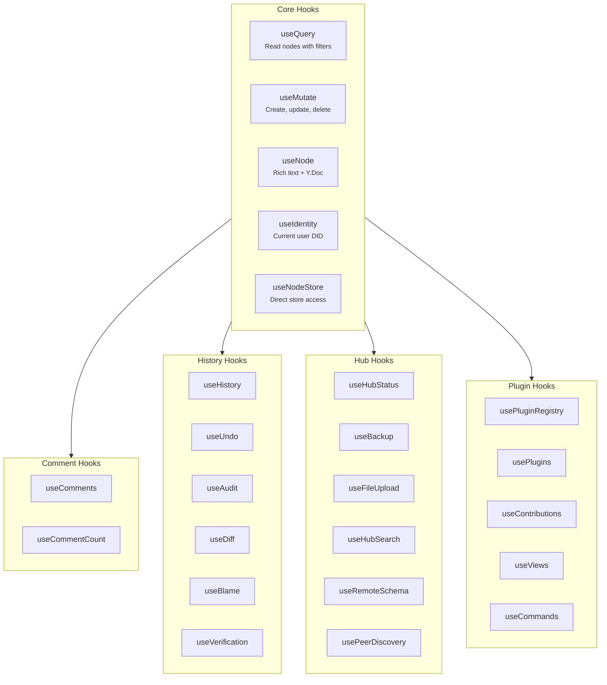

# @xnetjs/react

React hooks for xNet -- the primary API for building xNet applications.

> **Alpha software.** xNet is released but early: this package is on npm and
> usable today, but its API can change between releases, sometimes without a
> migration path. Pin your version. See the
> [project README](https://github.com/crs48/xNet#readme) for what alpha means here.

> **Status:** Mixed
> Stable root contract: `XNetProvider`, `useXNet`, `useQuery`, `useMutate`, `useNode`, `useIdentity`, `ErrorBoundary`, `OfflineIndicator`
> Experimental entrypoints: `@xnetjs/react/database`, `@xnetjs/react/experimental`
> Internal entrypoint: `@xnetjs/react/internal`

See [`docs/reference/api-lifecycle-matrix.md`](../../docs/reference/api-lifecycle-matrix.md) for the current lifecycle table and migration guidance.

## Installation

```bash
pnpm add @xnetjs/react @xnetjs/data
```

## Quick Start

```tsx
import { XNetProvider, useQuery, useMutate, useNode } from '@xnetjs/react'
import { MemoryNodeStorageAdapter, defineSchema, text, select } from '@xnetjs/data'

// 1. Define your schema
const TaskSchema = defineSchema({
  name: 'Task',
  namespace: 'myapp://',
  properties: {
    title: text({ required: true }),
    status: select({
      options: [
        { id: 'todo', name: 'To Do' },
        { id: 'done', name: 'Done' }
      ] as const
    })
  }
})

// 2. Wrap your app with the provider
function App() {
  return (
    <XNetProvider
      config={{
        nodeStorage: new MemoryNodeStorageAdapter(),
        authorDID: identity.did,
        signingKey: privateKey,
        runtime: {
          mode: 'worker',
          fallback: 'main-thread'
        }
      }}
    >
      <TaskApp />
    </XNetProvider>
  )
}
```

`XNetProvider` now exposes runtime policy explicitly. Use `useXNet().runtimeStatus` to inspect the requested mode, active mode, and any visible fallback when bootstrapping web, Electron, or test environments.

## Hook Categories



## Core Hooks

### `useQuery` -- Read Data

Query nodes with automatic real-time updates.

```tsx
import { useQuery } from '@xnetjs/react'

function TaskList() {
  const { data: tasks, loading, error } = useQuery(TaskSchema)

  if (loading) return <p>Loading...</p>
  if (error) return <p>Error: {error.message}</p>

  return (
    <ul>
      {tasks.map((task) => (
        <li key={task.id}>
          {task.title} {/* Direct property access -- no .properties needed */}
          <span>{task.status}</span>
        </li>
      ))}
    </ul>
  )
}
```

**Query by ID:**

```tsx
const { data: task } = useQuery(TaskSchema, taskId)
```

**Filtered & Sorted:**

```tsx
const { data: todoTasks } = useQuery(TaskSchema, {
  where: { status: 'todo' },
  orderBy: { createdAt: 'desc' },
  page: { first: 20 }
})
```

Legacy `limit` and `offset` options remain supported. Prefer `page.first` for new bounded reads; it lowers to the same descriptor as `limit` until cursor pagination lands.

**Cursor pagination:**

```tsx
const {
  data: tasks,
  fetchNextPage,
  hasMore,
  isFetchingNextPage
} = useInfiniteQuery(TaskSchema, {
  where: { status: 'todo' },
  orderBy: { updatedAt: 'desc' },
  pageSize: 50
})

await fetchNextPage()
```

`useInfiniteQuery` is a convenience wrapper over the same `useQuery` descriptor runtime. It requests pages with `page.after`, accumulates loaded pages, and returns both flattened `data` and per-page `pages`.

Use `page.count` to control count work when a source cannot answer exact totals cheaply:

```tsx
const { pageInfo } = useQuery(TaskSchema, {
  orderBy: { updatedAt: 'desc' },
  page: { first: 50, count: 'estimate' }
})

console.log(pageInfo.totalCount, pageInfo.countMode) // number | null, exact | estimate | none
```

**Materialized views:**

Use `materializedView` for hot saved views that should reuse a storage-backed result ID list across renders and pages.

```tsx
const {
  data: openTasks,
  materialized,
  plan
} = useQuery(TaskSchema, {
  where: { status: 'todo' },
  orderBy: { updatedAt: 'desc' },
  page: { first: 50 },
  materializedView: {
    viewId: 'tasks.todo.by-updated-desc',
    maxAgeMs: 30_000
  }
})

console.log(materialized?.cacheHit, plan?.materializedRefreshReason)
```

`viewId` should be stable, descriptive, and scoped to the view semantics, such as `tasks.todo.by-updated-desc`. Use `maxAgeMs` when a cached view may be reused for a bounded time even if no writes invalidate it. Set `forceRefresh: true` for explicit refresh actions; the query result exposes `materialized.cacheHit`, `materialized.rowCount`, and diagnostic `plan.materializedRefreshReason`.

Materialized views are an optimization for plaintext, storage-queryable local data. Stores with read authorization or encrypted node content bypass storage materialization and evaluate after auth/decryption so hidden or encrypted properties are not leaked through index counts, SQL, or materialized row IDs.

**Local and remote reads:**

`useQuery` defaults to local reads. Main-thread runtimes can opt into progressive remote reads by supplying a `remoteNodeQueryClient` to `XNetProvider` and requesting a remote execution mode.

```tsx
<XNetProvider
  config={{
    nodeStorage,
    authorDID,
    signingKey,
    remoteNodeQueryClient: hubQueryClient,
    remoteNodeQueryRouting: {
      localRowThreshold: 10_000,
      hybridRowThreshold: 100_000
    }
  }}
>
  <App />
</XNetProvider>
```

```tsx
const { data, source, completeness, staleness, verification, error } = useQuery(TaskSchema, {
  where: { status: 'todo' },
  page: { first: 50, count: 'estimate' },
  mode: 'local-then-remote',
  source: 'hub'
})
```

`mode: 'local-then-remote'` renders the local snapshot first, then merges hub or federated results by node ID while preserving the newest `updatedAt` version. Remote failures keep the local snapshot and expose `error`, `source: 'hybrid'`, and partial `completeness` metadata. `mode: 'remote'` uses the remote client as the primary source and does not hydrate local results first.

`source: 'auto'` keeps the read local by default, then lets the main-thread bridge request a `local-then-remote` refresh when a configured `remoteNodeQueryClient` exists and the first local result crosses `remoteNodeQueryRouting` thresholds. Search and spatial descriptors can also opt into remote completion through the same threshold config.

`mode: 'stream'` keeps the same React API while allowing a remote client to push `snapshot`, `insert`, `update`, `delete`, `reset`, `progress`, and `error` events into the bridge cache. The main-thread bridge starts a remote stream when the query is subscribed, stops it when the last subscriber unmounts, and falls back to a one-shot remote query when a client exposes `query()` but not `stream()`. Stream queries expose `stream` metadata on the hook result and appear in the Query Debugger stream timeline when devtools are mounted.

```tsx
const { data, stream } = useQuery(TaskSchema, {
  where: { status: 'todo' },
  mode: 'stream',
  source: 'hub'
})

console.log(stream?.lastEvent, stream?.status, stream?.progress?.phase)
```

```ts
const hubQueryClient = {
  async query(request) {
    return hub.fetchNodeQuery(request)
  },
  stream(request, observer) {
    const stream = hub.openNodeQueryStream(request)
    stream.on('event', (event) => observer.next(event))
    stream.on('error', (error) => observer.error?.(error))
    stream.on('close', () => observer.complete?.())
    return () => stream.close()
  },
  subscribeInvalidations(observer) {
    const unsubscribe = hub.onNodeQueryInvalidation((event) => {
      observer.next({
        type: 'node-query/invalidate',
        schemaId: event.schemaId,
        nodeIds: event.nodeIds,
        reason: 'poke'
      })
    })
    return unsubscribe
  }
}
```

Remote metadata is surfaced on the hook result:

- `completeness` explains whether remote data is complete, partial, or unknown.
- `staleness` reports whether the remote source is fresh, stale, or unknown.
- `verification` reports whether remote nodes were verified, unverified, failed, or mixed.

Remote invalidation pokes refresh matching active remote-capable queries without clearing their current local or hybrid snapshot. Worker remote transport and hub-side authorization enforcement are still roadmap items tracked in the exploration.

**Advanced AST reads:**

`useFind` is the guarded bridge between the canonical `QueryAST` in `@xnetjs/data` and the current React read runtime. Today it executes node-query ASTs that lower cleanly to `useQuery` descriptors: schema match, `eq` predicates, `and` conjunctions, ordering, pagination, and loaded-snapshot aggregates. Relation includes, query sets, and non-equality predicates return a planner error with `blockers` instead of silently running a partial query.

```tsx
import { count, defineNodeQueryAST, queryOperators } from '@xnetjs/data'
import { useFind } from '@xnetjs/react'

const task = queryOperators<(typeof TaskSchema)['_properties']>()

const openTaskQuery = defineNodeQueryAST(TaskSchema, {
  where: task.eq('status', 'todo'),
  orderBy: { updatedAt: 'desc' },
  page: { first: 50, count: 'estimate' },
  aggregates: [count('visibleTasks')]
})

const { data, aggregates, canExecute, blockers, plannerGate } = useFind(TaskSchema, openTaskQuery)
```

`aggregates.scope` is currently `loaded-snapshot`, so grouped and scalar aggregates are computed from the rows loaded into the hook result. Use this for visible summaries and saved/shared descriptors that should pass planner validation before React subscribes. Keep relation includes, query sets, and storage/hub aggregate pushdown behind the canonical AST planner until the dedicated executors land.

**Query API roadmap:**

`useQuery` is the stable read hook for xNet applications today. The consolidated roadmap for richer local and remote reads, pagination metadata, streaming, realtime sync, materialized views, search, spatial queries, and future relation-aware planning is documented in [0139 Improving The useQuery API](../../docs/explorations/0139_[x]_IMPROVING_THE_USEQUERY_API.md), with execution follow-up tracked in the [useQuery API roadmap implementation plan](../../docs/plans/usequery-api-roadmap/README.md).

### `useMutate` -- Write Data

Create, update, and delete nodes.

```tsx
import { useMutate } from '@xnetjs/react'

function CreateTaskButton() {
  const { create, isPending } = useMutate()

  const handleCreate = async () => {
    const task = await create(TaskSchema, {
      title: 'New Task',
      status: 'todo'
    })
    console.log('Created:', task.id)
  }

  return (
    <button onClick={handleCreate} disabled={isPending}>
      {isPending ? 'Creating...' : 'Create Task'}
    </button>
  )
}
```

**Update:**

```tsx
const { update } = useMutate()
await update(TaskSchema, taskId, { status: 'done' }) // Type-checked!
```

**Delete:**

```tsx
const { remove } = useMutate()
await remove(taskId) // Soft delete
```

**Transactions (atomic):**

```tsx
const { mutate } = useMutate()

await mutate([
  { type: 'update', id: task1.id, data: { order: 1 } },
  { type: 'update', id: task2.id, data: { order: 2 } },
  { type: 'delete', id: task3.id }
])
```

**Bulk deterministic imports:**

`useMutate().bulk()` exposes the same batch write path as `NodeStore.batchWrite()` through the active
DataBridge. Use it for importer, restore, migration, or AI-assisted bulk-edit surfaces where the UI
needs counters and phase timings instead of per-node mutation results.

```tsx
const { bulk, isPending } = useMutate()

const result = await bulk({
  kind: 'deterministic-import',
  drafts: socialDrafts,
  policy: {
    indexMode: 'touched',
    notificationMode: 'batch',
    syncMode: 'defer'
  }
})

console.log(result.nodeIds.length, result.timings.applyMs, result.storage?.propertyRowsWritten)
```

Bulk writes are still signed NodeStore writes. The batch policy controls indexing and live
notification cost; `syncMode: 'defer'` is available for runtimes that can coalesce outbound
replication. `touched` indexes are the default import choice for immediate query correctness without a
whole-schema rebuild.

### `useNode` -- Rich Text Editing

Load a node with its Y.Doc for collaborative rich text editing.

```tsx
import { useNode } from '@xnetjs/react'
import { RichTextEditor } from '@xnetjs/editor/react'

const PageSchema = defineSchema({
  name: 'Page',
  namespace: 'myapp://',
  properties: { title: text({ required: true }) },
  document: 'yjs'
})

function DocumentEditor({ pageId }) {
  const {
    data: page, // FlatNode -- page.title works directly
    doc, // Y.Doc for rich text
    update, // Type-safe property updates
    loading,
    error,
    syncStatus, // 'offline' | 'connecting' | 'connected'
    peerCount, // Connected peers
    presence // [{ did, name, color, lastSeen, isStale }]
  } = useNode(PageSchema, pageId, {
    createIfMissing: { title: 'Untitled' },
    did: myDid
  })

  if (loading) return <p>Loading...</p>
  if (!page || !doc) return <p>Not found</p>

  return (
    <div>
      <input value={page.title} onChange={(e) => update({ title: e.target.value })} />
      <RichTextEditor ydoc={doc} />
    </div>
  )
}
```

## Additional Hooks

### Comment Hooks

```tsx
const { threads, addComment, resolveThread } = useComments({ nodeId })
const count = useCommentCount(nodeId)
```

### History Hooks

```tsx
const { timeline, materializeAt, diff } = useHistory(nodeId)
const { undo, redo, canUndo, canRedo } = useUndo(nodeId)
const { entries, activity } = useAudit(nodeId)
const { diff: runDiff, result } = useDiff(nodeId)
const { blame } = useBlame(nodeId)
const { verify, quickCheck } = useVerification(nodeId)
```

### Hub Hooks

```tsx
const status = useHubStatus()
const { upload: uploadBackup, download: downloadBackup } = useBackup()
const { upload, uploading, progress } = useFileUpload()
const { search, results } = useHubSearch()
const { schema } = useRemoteSchema(schemaId)
const { peers } = usePeerDiscovery()
```

### Plugin Hooks

```tsx
const { registry } = usePluginRegistry()
const { plugins } = usePlugins()
const { contributions } = useContributions('view')
const { views } = useViews()
const { commands, execute } = useCommands()
```

## Sync Infrastructure

The package includes a full sync infrastructure layer:

| Module                  | Description                        |
| ----------------------- | ---------------------------------- |
| `WebSocketSyncProvider` | WebSocket-based sync with hub      |
| `SyncManager`           | Orchestrates sync across providers |
| `NodePool`              | Manages Y.Doc instances            |
| `ConnectionManager`     | WebSocket connection lifecycle     |
| `NodeStoreSyncProvider` | Syncs NodeStore changes            |
| `MetaBridge`            | Bridges node metadata to Yjs       |
| `OfflineQueue`          | Queues mutations while offline     |
| `BlobSync`              | Syncs file blobs to hub            |

## Type Safety with FlatNode

All hooks return `FlatNode<Schema>` which flattens properties to the top level:

```tsx
// Properties are directly accessible
const title = page.title // string (correctly typed)
```

## API Reference

### `useQuery`

| Parameter     | Type                    | Description               |
| ------------- | ----------------------- | ------------------------- |
| `schema`      | `DefinedSchema<P>`      | The schema to query       |
| `idOrFilter?` | `string \| QueryFilter` | Node ID or filter options |

### `useMutate`

Returns: `create`, `update`, `remove`, `restore`, `mutate`, `isPending`, `pendingCount`

### `useNode`

| Parameter  | Type               | Description                   |
| ---------- | ------------------ | ----------------------------- |
| `schema`   | `DefinedSchema<P>` | Schema with `document: 'yjs'` |
| `id`       | `string \| null`   | Node ID                       |
| `options?` | `UseNodeOptions`   | Configuration                 |

## Related Packages

- `@xnetjs/data` -- Schema system and NodeStore
- `@xnetjs/editor` -- Rich text editor components
- `@xnetjs/history` -- Time machine and audit hooks
- `@xnetjs/plugins` -- Plugin system hooks
- `@xnetjs/identity` -- DID and key management
