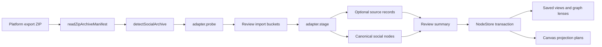
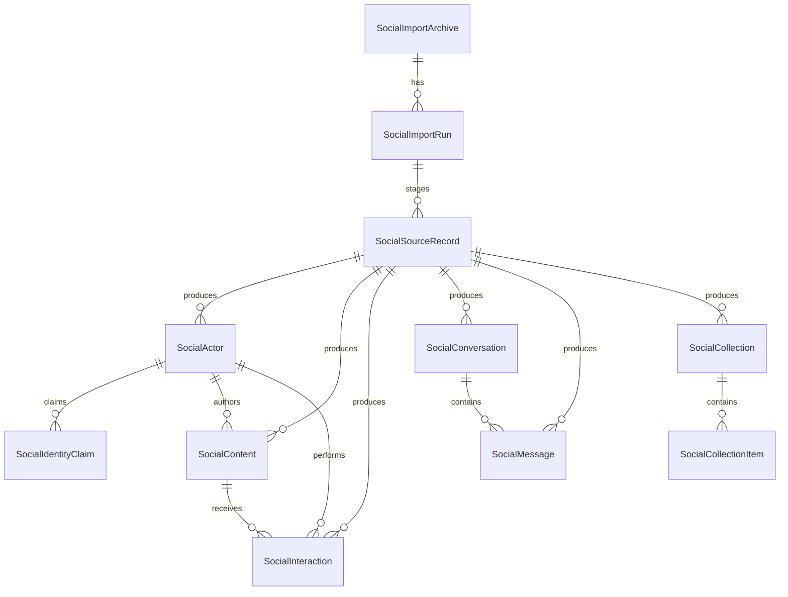

# @xnetjs/social

Social graph import and query primitives for xNet.

This package turns platform export archives into a queryable cross-platform social graph. It is
intentionally split into three layers:

- Canonical schemas for actors, content, interactions, conversations, messages, collections, import
  runs, and source-record provenance.
- Import contracts and helpers for detecting archives, probing importable buckets, staging records,
  deduplicating deterministic IDs, and committing staged canonical nodes.
- Query affordances for saved views, graph lenses, and bounded canvas projection plans.

The package does not own file pickers, review UI, or raw archive blob storage. Electron and other app
surfaces should use this package to stage importable data, present a review step, and then commit the
approved nodes through the local data store.

## Entry Points

```ts
import { socialSchemas } from '@xnetjs/social/schemas'
import { detectSocialArchive, readZipArchiveManifest } from '@xnetjs/social/import'
import { grokAdapter, instagramAdapter } from '@xnetjs/social/importers'
import { createSocialGraphLenses } from '@xnetjs/social/lenses'
import { createSocialCanvasProjectionPlan } from '@xnetjs/social/projection'
import { createDefaultSocialSavedViews } from '@xnetjs/social/views'
```

The root entry point re-exports all of these public APIs:

```ts
import {
  collectStagedRecords,
  createStagingSummary,
  createZipJsonEntryReader,
  detectSocialArchive,
  grokAdapter,
  instagramAdapter,
  socialSchemas
} from '@xnetjs/social'
```

## Import Flow



Typical staging code:

```ts
import {
  collectStagedRecords,
  createSocialNodeId,
  createStagingSummary,
  createZipJsonEntryReader,
  detectSocialArchive,
  grokAdapter,
  instagramAdapter,
  readZipArchiveManifest
} from '@xnetjs/social'

const adapters = [instagramAdapter, grokAdapter]

export async function stageSocialArchive(archivePath: string) {
  const manifest = await readZipArchiveManifest(archivePath)
  const detection = detectSocialArchive(adapters, manifest)

  if (!detection) {
    throw new Error('No social import adapter matched this archive')
  }

  const probe = await detection.adapter.probe({ manifest })
  const selectedBuckets = probe.buckets
    .filter((bucket) => bucket.defaultSelected)
    .map((bucket) => bucket.id)

  const archiveId = createSocialNodeId('import-archive', [
    manifest.archiveHash ?? manifest.filename,
    manifest.byteSize
  ])
  const importedAt = new Date().toISOString()
  const records = await collectStagedRecords(
    detection.adapter.stage(
      {
        manifest,
        archiveId,
        importedAt,
        readJsonEntry: await createZipJsonEntryReader(archivePath)
      },
      { buckets: selectedBuckets }
    )
  )

  return {
    adapterId: detection.adapter.id,
    probe,
    records,
    summary: createStagingSummary(records)
  }
}
```

Committing staged records from a renderer or service layer should happen after review. The package
exports `buildSocialCommitOperations` and `commitStagedSocialNodes` for NodeStore-backed callers.
Source records can be stored when provenance, replay, or auditability matters; they can also be
omitted when the user wants only canonical graph data.

## Data Model

The data model is hybrid by design: normalize common social concepts, keep platform specificity as
properties and optional source records.



Use canonical schemas first:

- `SocialActor` for accounts, people, organizations, channels, assistants, and bots.
- `SocialIdentityClaim` for handles, profile URLs, email-like identities, and platform IDs.
- `SocialContent` for posts, reels, videos, links, comments-as-content, prompts, responses, and
  generated media records.
- `SocialInteraction` for follows, likes, saves, comments, shares, reactions, views, and references.
- `SocialConversation` and `SocialMessage` for direct messages, chat threads, and AI transcripts.
- `SocialCollection` and `SocialCollectionItem` for saved folders, playlists, albums, projects, and
  other ordered or grouped membership.

Keep platform details in fields such as `platform`, platform IDs, URLs, `contentKind`,
`interactionKind`, `privacyClass`, `visibility`, timestamps, and source references. Add a
platform-specific schema only when a source has behavior that cannot be queried well through the
canonical graph.

This gives xNet one query surface for questions like:

- Which accounts do I follow across Instagram, X, YouTube, Reddit, and Spotify?
- Which people, channels, or artists appear in both my saved content and conversations?
- Which AI conversations cite the same URLs or creators as my social activity?
- Which friends' exported graphs mention the same actors, links, collections, or communities?

## Built-In Adapters

### Instagram

The Instagram adapter currently detects Meta export ZIPs and stages these buckets:

- Profile
- Following
- Followers
- Likes
- Saves
- Comments
- Media
- Messages
- Account metadata, excluded by default
- Ads and attention logs, excluded by default

The adapter maps export records into actors, identity claims, content, interactions, conversations,
messages, collections, collection items, and optional source records.

### Grok

The Grok adapter currently detects Grok export ZIPs and stages these buckets:

- Conversations
- Assets
- Account metadata, excluded by default
- Billing metadata, excluded by default

The adapter maps exported backend records into self and assistant actors, conversations, messages,
projects, tasks, generated-media content, and optional source records.

## Privacy And Provenance

Every import bucket and staged record carries a `privacyClass`. Sensitive buckets should not be
selected by default. Callers can opt into sensitive data with an explicit review control.

Source records exist to preserve provenance without forcing platform-specific tables into the primary
query model. They store hashes, source paths, record IDs, privacy classification, warnings, and a
shape summary. Avoid committing raw private payloads into source records unless the calling app has a
clear local-storage policy and user approval.

`.exports/` archives are local fixtures for development only and should never be committed.

## Adding A Platform Importer

- [ ] Add an adapter file under `src/importers/`.
- [ ] Implement `SocialImportAdapter.detect` using manifest path signals before reading payloads.
- [ ] Implement `probe` with buckets, privacy classes, defaults, warnings, and ignored reasons.
- [ ] Implement `stage` as an async iterable that respects `ImportSelection`.
- [ ] Use `createSourceRecord` for provenance and `createStagedNode` for canonical graph records.
- [ ] Use deterministic IDs from stable platform IDs, normalized handles, source paths, and URLs.
- [ ] Prefer canonical schemas over platform-specific schemas for posts, comments, likes, messages,
      follows, playlists, videos, tracks, and channels.
- [ ] Add focused tests with sanitized fixtures or generated payloads.
- [ ] Export the adapter from `src/importers/index.ts`.
- [ ] Add the adapter to the app surface that chooses supported importers.

Good next candidates are X, Google/YouTube, Reddit, Claude, OpenAI, Spotify, Apple Music, and other
services once representative export archives are available.

## Validation

```bash
pnpm --filter @xnetjs/social test
pnpm --filter @xnetjs/social typecheck
pnpm --filter @xnetjs/social build
```
