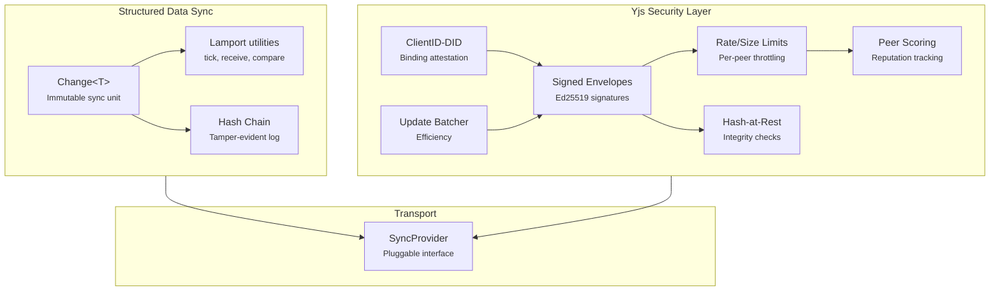

# @xnetjs/sync

Unified sync primitives for xNet -- Change\<T\>, Lamport clocks, hash chains, and a comprehensive Yjs security layer.

## Installation

```bash
pnpm add @xnetjs/sync
```

## Features

- **Change\<T\>** -- Universal immutable sync unit for structured data
- **Lamport clocks** -- Logical timestamps for causal ordering (tick, receive, compare)
- **Hash chains** -- Tamper-evident linked update logs with fork detection
- **SyncProvider interface** -- Pluggable sync transport abstraction
- **Yjs security layer**:
  - Signed envelopes (Ed25519) for Yjs updates
  - Rate and size limits per peer
  - Hash-at-rest integrity verification
  - Peer scoring (reputation tracking)
  - ClientID-DID binding (attestation)
  - Yjs hash chain integration
  - Update batching for efficiency

## Usage

```typescript
import {
  createUnsignedChange,
  signChange,
  createLamportClock,
  tick,
  receive,
  compareLamportTimestamps
} from '@xnetjs/sync'

let clock = createLamportClock(did)
const [nextClock, lamport] = tick(clock)
clock = nextClock

const unsigned = createUnsignedChange({
  id: crypto.randomUUID(),
  type: 'task/update',
  payload: { title: 'Updated title' },
  parentHash: null,
  authorDID: did,
  lamport
})

const change = signChange(unsigned, signingKey)

// Merge remote Lamport time into local clock
clock = receive(clock, change.lamport.time)

// Deterministic ordering
const [, later] = tick(clock)
const cmp = compareLamportTimestamps(change.lamport, later)
```

```typescript
import { validateChain, detectFork, topologicalSort } from '@xnetjs/sync'

// Hash chain verification
const valid = validateChain(changes)
const fork = detectFork(chain1, chain2)
const sorted = topologicalSort(changes)
```

```typescript
import { signYjsUpdate, verifyYjsEnvelope } from '@xnetjs/sync'

// Signed Yjs envelopes
const envelope = signYjsUpdate(update, did, signingKey, clientId)
const { valid, update } = verifyYjsEnvelope(envelope)
```

## Architecture



## Modules

| Module                    | Description                                             |
| ------------------------- | ------------------------------------------------------- |
| `change.ts`               | Change\<T\> creation and types                          |
| `clock.ts`                | Lamport clock implementation                            |
| `chain.ts`                | Hash chain validation, fork detection, topological sort |
| `provider.ts`             | SyncProvider interface                                  |
| `yjs-envelope.ts`         | Ed25519-signed Yjs update envelopes                     |
| `yjs-limits.ts`           | Rate and size limits for Yjs updates                    |
| `yjs-integrity.ts`        | Hash-at-rest integrity verification                     |
| `yjs-peer-scoring.ts`     | Peer reputation scoring                                 |
| `clientid-attestation.ts` | ClientID-DID binding                                    |
| `yjs-change.ts`           | Yjs hash chain integration                              |
| `yjs-batcher.ts`          | Update batching for efficiency                          |

## Dependencies

- `@xnetjs/core` -- Core types
- `@xnetjs/crypto` -- Signing, hashing
- `@xnetjs/identity` -- DID operations

## Testing

```bash
pnpm --filter @xnetjs/sync test
```

10 test files covering all modules.
