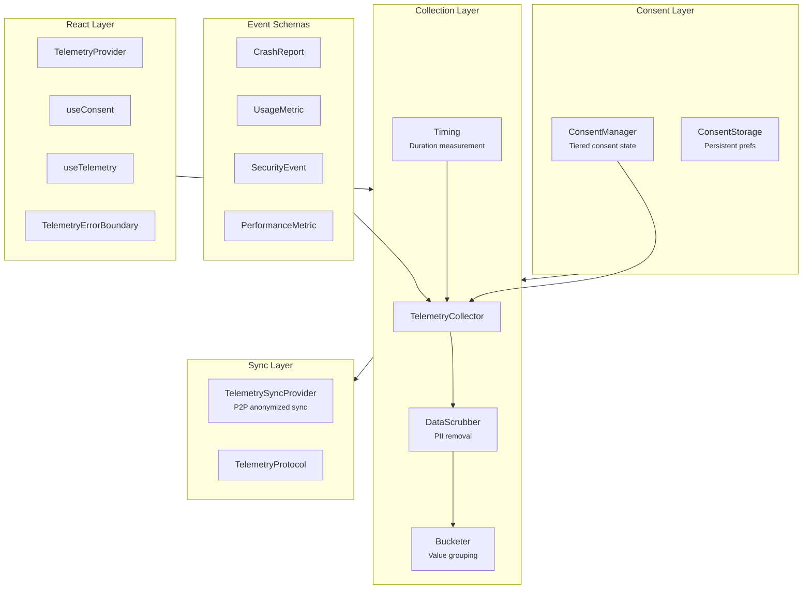

# @xnet/telemetry

Privacy-preserving telemetry for xNet -- tiered consent, data scrubbing, k-anonymity, and optional P2P sync.

## Installation

```bash
pnpm add @xnet/telemetry
```

## Features

- **Tiered consent** -- Four levels: off, anonymous, pseudonymous, identified
- **Consent manager** -- Persistent consent state with granular controls
- **Telemetry schemas** -- Typed event schemas for crash reports, usage metrics, security events, and performance metrics
- **Telemetry collector** -- Collects events with automatic data scrubbing and bucketing
- **k-anonymity** -- Ensures data cannot be linked back to individuals
- **Data scrubbing** -- Strips PII from telemetry payloads
- **Bucketing** -- Groups values into ranges for additional privacy
- **Timing utilities** -- Measure operation duration
- **React hooks** -- `useTelemetry`, `useConsent`, `TelemetryProvider`, `TelemetryErrorBoundary`
- **P2P sync** -- Optional anonymized telemetry sharing via sync provider

## Usage

### Consent Management

```typescript
import { ConsentManager } from '@xnet/telemetry'

const consent = new ConsentManager()

// Set consent level
consent.setLevel('anonymous') // 'off' | 'anonymous' | 'pseudonymous' | 'identified'

// Check current level
consent.getLevel() // 'anonymous'

// Granular controls
consent.setCategory('crashes', true)
consent.setCategory('usage', false)
```

### Telemetry Collection

```typescript
import { TelemetryCollector } from '@xnet/telemetry'

const collector = new TelemetryCollector(consent)

// Track events
collector.trackUsage('page_view', { page: '/dashboard' })
collector.trackPerformance('render', { duration: 45 })
collector.trackCrash(error)
collector.trackSecurity('auth_failure', { reason: 'expired_token' })
```

### React Integration

```tsx
import {
  TelemetryProvider,
  useConsent,
  useTelemetry,
  TelemetryErrorBoundary
} from '@xnet/telemetry'

function App() {
  return (
    <TelemetryProvider collector={collector}>
      <TelemetryErrorBoundary>
        <ConsentBanner />
        <YourApp />
      </TelemetryErrorBoundary>
    </TelemetryProvider>
  )
}

function ConsentBanner() {
  const { level, setLevel } = useConsent()
  return (
    <div>
      <p>Current: {level}</p>
      <button onClick={() => setLevel('anonymous')}>Allow anonymous</button>
    </div>
  )
}

function TrackedComponent() {
  const { track } = useTelemetry()
  return <button onClick={() => track('button_click', { id: 'save' })}>Save</button>
}
```

## Architecture



## Consent Levels

| Level          | Data Collected          | Identifiers       |
| -------------- | ----------------------- | ----------------- |
| `off`          | Nothing                 | None              |
| `anonymous`    | Aggregated metrics only | None              |
| `pseudonymous` | Detailed events         | Random session ID |
| `identified`   | Full telemetry          | DID               |

## Modules

| Module                             | Description                         |
| ---------------------------------- | ----------------------------------- |
| `consent/manager.ts`               | Consent level management            |
| `consent/storage.ts`               | Persistent consent storage          |
| `schemas/crash.ts`                 | Crash report schema                 |
| `schemas/usage.ts`                 | Usage metric schema                 |
| `schemas/security.ts`              | Security event schema               |
| `schemas/performance.ts`           | Performance metric schema           |
| `collection/collector.ts`          | Event collection engine             |
| `collection/scrubbing.ts`          | PII data scrubbing                  |
| `collection/bucketing.ts`          | Value bucketing for k-anonymity     |
| `collection/timing.ts`             | Operation timing                    |
| `hooks/TelemetryContext.tsx`       | React context provider              |
| `hooks/useConsent.ts`              | Consent management hook             |
| `hooks/useTelemetry.ts`            | Telemetry tracking hook             |
| `hooks/TelemetryErrorBoundary.tsx` | Error boundary with crash reporting |
| `sync/provider.ts`                 | P2P telemetry sync                  |
| `sync/protocol.ts`                 | Sync protocol definition            |

## Dependencies

- `@xnet/core`, `@xnet/data`
- Optional peer dep: `react`

## Testing

```bash
pnpm --filter @xnet/telemetry test
```
