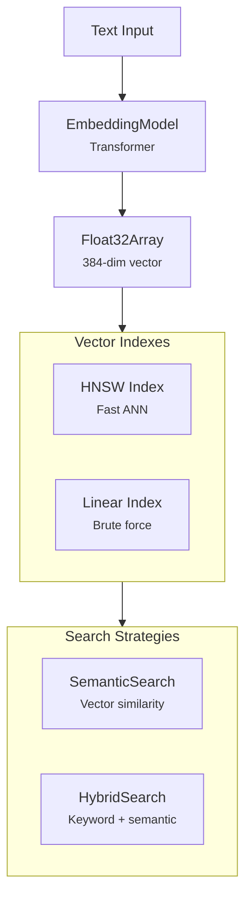

# @xnet/vectors

Vector embeddings, HNSW indexing, and semantic/hybrid search for xNet.

## Installation

```bash
pnpm add @xnet/vectors
```

## Features

- **Embedding model** -- Load transformer models for text-to-vector conversion
- **HNSW index** -- Hierarchical Navigable Small World graph for fast nearest-neighbor search
- **Linear index** -- Brute-force vector index for small datasets
- **Semantic search** -- Query by meaning, not just keywords
- **Hybrid search** -- Combined keyword + semantic search with score fusion
- **Distance functions** -- Cosine similarity, Euclidean distance

## Usage

### Embedding

```typescript
import { loadEmbeddingModel, MockEmbeddingModel } from '@xnet/vectors'

// Load a real model (browser or Node)
const model = await loadEmbeddingModel('all-MiniLM-L6-v2')
const vector = await model.embed('Hello world')

// Mock model for testing
const mock = new MockEmbeddingModel(384)
const testVector = await mock.embed('test input')
```

### Vector Index

```typescript
import { VectorIndex } from '@xnet/vectors'

const index = new VectorIndex({ dimensions: 384 })
index.add('doc1', vector1)
index.add('doc2', vector2)

const results = index.search(queryVector, { limit: 10 })
// => [{ id: 'doc1', score: 0.95 }, { id: 'doc2', score: 0.82 }]
```

### Semantic Search

```typescript
import { SemanticSearch } from '@xnet/vectors'

const search = new SemanticSearch(model, index)
await search.index('doc1', 'The quick brown fox')
await search.index('doc2', 'A lazy dog sleeps')

const results = await search.query('fast animal', { limit: 5 })
```

### Hybrid Search

```typescript
import { HybridSearch } from '@xnet/vectors'

// Combines keyword matching + semantic similarity
const hybrid = new HybridSearch(keywordIndex, semanticSearch)
const results = await hybrid.search('fox jumping', {
  limit: 10,
  keywordWeight: 0.3,
  semanticWeight: 0.7
})
```

### Utilities

```typescript
import { cosineSimilarity, euclideanDistance } from '@xnet/vectors'

const similarity = cosineSimilarity(vectorA, vectorB) // 0 to 1
const distance = euclideanDistance(vectorA, vectorB)
```

## Architecture



## Modules

| Module         | Description                                             |
| -------------- | ------------------------------------------------------- |
| `embedding.ts` | Embedding model loading, mock model, distance functions |
| `hnsw.ts`      | HNSW and linear vector index implementations            |
| `search.ts`    | Semantic search engine                                  |
| `hybrid.ts`    | Hybrid keyword + semantic search                        |

## Dependencies

- `@xnet/core`, `@xnet/storage`
- `@xenova/transformers` -- ML model inference
- `usearch` -- HNSW index (optional native backend)

## Testing

```bash
pnpm --filter @xnet/vectors test
```

4 test files covering embedding, HNSW, search, and hybrid search.
