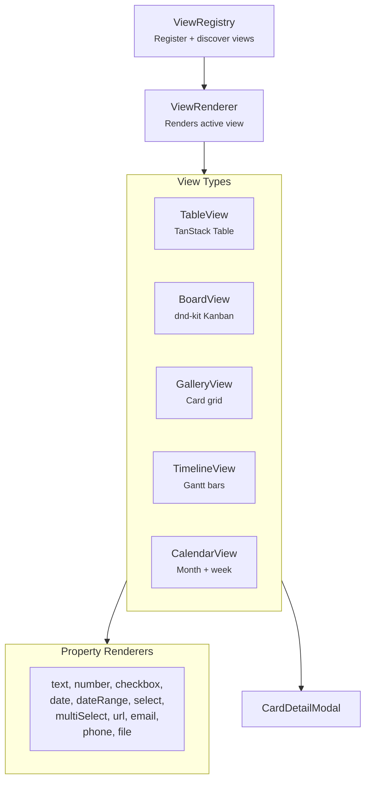

# @xnet/views

Database view components for xNet -- built-in views, property renderers, state hooks, and a view registry.

## Installation

```bash
pnpm add @xnet/views
```

## Features

- **Table** -- Spreadsheet with virtual scrolling (TanStack Table)
- **Board** -- Kanban with drag-drop columns (dnd-kit)
- **Gallery** -- Card grid with cover images
- **Timeline** -- Gantt chart with time bars
- **Calendar** -- Month and week views
- **Property renderers** -- Typed cell renderers for common schema property types
- **View registry** -- Register and discover view types
- **Card detail modal** -- Full node detail overlay
- **Comment indicators** -- Per-node comment counts

## Usage

```tsx
import { TableView, BoardView, GalleryView, TimelineView, CalendarView } from '@xnet/views'

// Table view
<TableView schema={TaskSchema} nodes={tasks} onNodeClick={handleClick} />

// Kanban board
<BoardView schema={TaskSchema} nodes={tasks} groupByField="status" />

// Gallery grid
<GalleryView schema={TaskSchema} nodes={tasks} coverField="image" />

// Timeline / Gantt
<TimelineView schema={TaskSchema} nodes={tasks} dateField="dueDate" />

// Calendar
<CalendarView schema={TaskSchema} nodes={tasks} dateField="dueDate" />
```

### View Registry

```tsx
import { useState } from 'react'
import { useViewRegistry, ViewRenderer } from '@xnet/views'

function ViewSwitcher({ schema, nodes }) {
  const { views } = useViewRegistry()
  const [viewType, setViewType] = useState(views[0]?.type ?? 'table')
  const view = {
    id: `view-${viewType}`,
    name: 'Default view',
    type: viewType,
    visibleProperties: [],
    sorts: []
  }

  return (
    <div>
      {views.map((v) => (
        <button key={v.type} onClick={() => setViewType(v.type)}>
          {v.name}
        </button>
      ))}
      <ViewRenderer viewType={viewType} schema={schema} view={view} data={nodes} />
    </div>
  )
}
```

### State Hooks

Each view has a companion state hook:

```tsx
import { useTableState, useBoardState, useGalleryState } from '@xnet/views'

const tableState = useTableState({ schema, nodes, sorting, filters })
const boardState = useBoardState({ schema, nodes, groupByField: 'status' })
const galleryState = useGalleryState({ schema, nodes, coverField: 'image' })
```

## Architecture



## Property Renderers

| Type          | Renderer               |
| ------------- | ---------------------- |
| `text`        | Editable text input    |
| `number`      | Numeric input          |
| `checkbox`    | Toggle switch          |
| `date`        | Date picker            |
| `dateRange`   | Start/end date picker  |
| `select`      | Single-choice dropdown |
| `multiSelect` | Multi-choice tags      |
| `url`         | Clickable link         |
| `email`       | Mailto link            |
| `phone`       | Tel link               |
| `file`        | File badge             |

## Dependencies

- `@xnet/core`, `@xnet/data`, `@xnet/react`, `@xnet/ui`
- `@tanstack/react-table` -- Table virtualization
- `@tanstack/react-virtual` -- Virtual scrolling
- `@dnd-kit/core`, `@dnd-kit/sortable` -- Drag and drop

## Testing

```bash
pnpm --filter @xnet/views test
```

7 test files covering registry, board, gallery, timeline, calendar, and property renderers.
