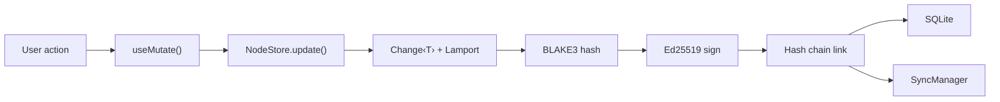
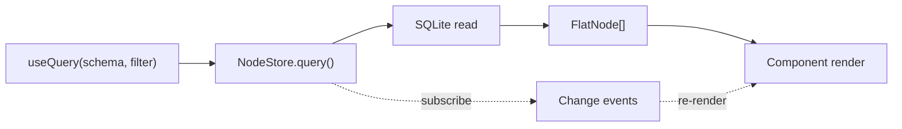
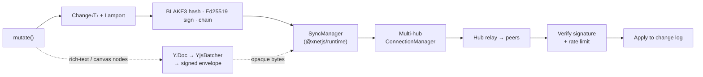

## Layered architecture

xNet is organized as a layered stack where each package builds on the ones below it. Lower packages never import from higher ones.

```
┌─────────────────────────────────────────┐
│  apps/electron  ·  apps/web             │  Applications
├─────────────────────────────────────────┤
│  @xnetjs/react                            │  React bindings (thin)
│  useQuery · useMutate · useNode         │
│  useIdentity · XNetProvider             │
├─────────────────────────────────────────┤
│  @xnetjs/runtime                          │  Framework-agnostic client
│  createXNetClient · liveQuery           │
│  SyncManager · NodePool · MetaBridge    │
├─────────────────────────────────────────┤
│  @xnetjs/data                             │  Data layer
│  defineSchema · NodeStore               │
│  15 property types · validation         │
├─────────────────────────────────────────┤
│  @xnetjs/sync                             │  Sync primitives
│  Lamport clocks · Change<T> · chains    │
│  Yjs security · envelopes · scoring     │
├─────────────────────────────────────────┤
│  @xnetjs/storage                          │  Persistence
│  SQLite adapter                        │
├─────────────────────────────────────────┤
│  @xnetjs/identity                         │  Identity
│  DID:key · UCAN · key management        │
├─────────────────────────────────────────┤
│  @xnetjs/crypto                           │  Cryptography
│  BLAKE3 · Ed25519 · XChaCha20           │
└─────────────────────────────────────────┘
```

## Additional packages

| Package          | Purpose                                                             |
| ---------------- | ------------------------------------------------------------------- |
| `@xnetjs/plugins`  | 4-layer plugin system (scripts, extensions, services, integrations) |
| `@xnetjs/canvas`   | Infinite canvas with spatial indexing                               |
| `@xnetjs/editor`   | TipTap rich text editor with Yjs collaboration                      |
| `@xnetjs/network`  | libp2p node, WebRTC/WebSocket transport, peer security              |
| `@xnetjs/devtools` | 7 debug panels for inspecting sync, store, schema, and more         |

## Design principles

**Minimal coupling** — Each package has a focused responsibility. The crypto package knows nothing about schemas. The data package knows nothing about React.

**No default exports** — Everything is a named export. Barrel files (`index.ts`) re-export from internal modules.

**Factory functions** — Classes are paired with factory functions (`createFoo()` alongside `class Foo`). This keeps the API surface consistent and makes testing easier.

**Immutability** — Core types like `LamportTimestamp` and `Change<T>` are treated as immutable. Functions return new objects instead of mutating in place.

**Validation over exceptions** — Functions return `{ valid: boolean, errors: [] }` objects instead of throwing. Exceptions are reserved for programmer errors, not data validation.

## How data flows

### Write path



### Read path



### Sync path

The interop kernel is the signed `Change<T>` log — **not** Yjs. Structured node
data replicates as signed changes; Yjs is a document codec whose updates ride the
same wire as opaque, signed bytes. See
[ADR-11](/docs/architecture/decisions/#adr-11-xnet-is-a-protocol--the-interop-kernel-is-the-change-log-not-yjs).



## Further reading

- [Package Graph](/docs/architecture/package-graph/) — The full dependency graph
- [Architecture Decisions](/docs/architecture/decisions/) — Why we made these choices
