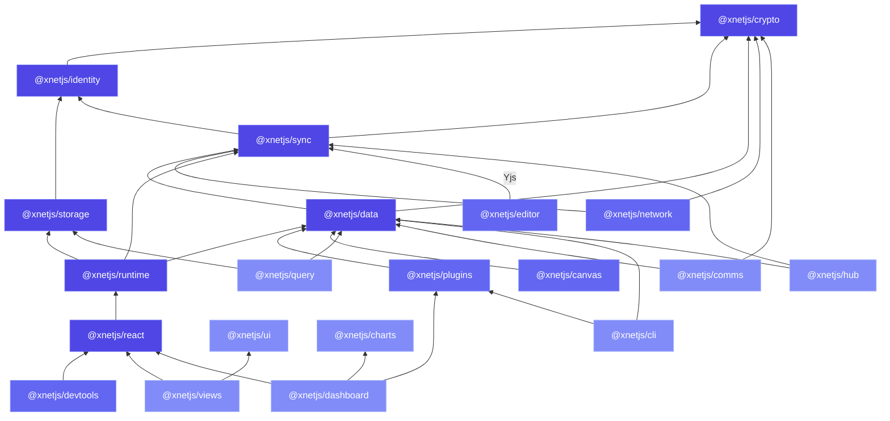

## Dependency graph

The workspace holds **30 packages**. The diagram shows the core chain and the
major feature packages; lower packages cannot import from higher ones:



## Package details

### @xnetjs/crypto

**Dependencies:** `@noble/hashes`, `@noble/curves`, `@noble/ciphers`

The foundation. Provides BLAKE3 hashing, Ed25519 signing, XChaCha20-Poly1305 encryption, X25519 key exchange, and encoding utilities. No xNet dependencies.

### @xnetjs/identity

**Dependencies:** `@xnetjs/crypto`

DID:key creation and parsing, Ed25519/X25519 key bundle management, UCAN token creation and verification, passkey storage.

### @xnetjs/storage

**Dependencies:** `@xnetjs/identity`

SQLite adapter for persisting Y.Doc state, node properties, offline queue entries, and registry data across web (OPFS), desktop, and mobile.

### @xnetjs/sync

**Dependencies:** `@xnetjs/crypto`, `@xnetjs/identity`

Core sync primitives: Lamport clocks, `Change<T>` type, hash chains, Yjs security layer (signed envelopes, rate limiting, peer scoring, clientID attestation, update batching, integrity checking).

### @xnetjs/data

**Dependencies:** `@xnetjs/sync`, `@xnetjs/crypto`

Schema system (`defineSchema`, 15 property types), NodeStore (CRUD + change tracking), type inference (`FlatNode`, `InferCreateProps`), validation and coercion.

### @xnetjs/runtime

**Dependencies:** `@xnetjs/data`, `@xnetjs/sync`, `@xnetjs/storage`

The framework-agnostic client. `createXNetClient()` assembles the store, MetaBridge, SyncManager, NodePool, Registry, OfflineQueue, and the multi-hub ConnectionManager; `liveQuery()` exposes the universal `{ getSnapshot, subscribe }` store contract. No React dependency — it powers React, other frameworks, CLIs, and servers alike. See [ADR-14](/docs/architecture/decisions/#adr-14-framework-agnostic-runtime--react-is-a-thin-binding).

### @xnetjs/react

**Dependencies:** `@xnetjs/runtime`, `react`

The thin React binding: `useQuery`, `useMutate`, `useNode`, `useIdentity`, `XNetProvider`, and the plugin hooks. The sync engine itself lives in `@xnetjs/runtime`; this package re-exports it and adapts it to React via `useSyncExternalStore`.

### @xnetjs/network

**Dependencies:** `@xnetjs/sync`, `@xnetjs/crypto`

libp2p node setup, WebRTC and WebSocket transport, connection gating, peer scoring (GossipSub-inspired), auto-blocking, rate limiting at the connection level.

### @xnetjs/plugins

**Dependencies:** `@xnetjs/data`, `acorn`

Plugin system: extension manifest, registry, context, 9 contribution types, middleware chain, script sandbox (AST validation, frozen context, timeout), AI script generation, services (ProcessManager, ServiceClient), integrations (LocalAPI, MCPServer, WebhookEmitter), shortcut manager.

### @xnetjs/editor

**Dependencies:** `@tiptap/core`, Yjs

TipTap editor wrapper with Yjs collaboration, custom extensions (Mermaid, etc.), slash command support.

### @xnetjs/canvas

**Dependencies:** `@xnetjs/data`

Infinite canvas with spatial indexing (R-tree), viewport management, zoom/pan, node positioning.

### @xnetjs/devtools

**Dependencies:** `@xnetjs/react`

10 debug panels: Nodes, Changes, Sync, Yjs, Queries, Telemetry, Schemas, Seed, History, and AuthZ. See the [DevTools guide](/docs/guides/devtools/).

### @xnetjs/ui

Shared design system: the monochrome token ramp (`surface`/`ink`/`hairline`), primitives, the shared task editor, and the unified drag payload. No xNet runtime dependencies.

### @xnetjs/query

**Dependencies:** `@xnetjs/data`, `@xnetjs/storage`

Query AST, saved-view descriptors, full-text search index, and the reactive saved-view runner that powers tables, boards, and widgets.

### @xnetjs/views

**Dependencies:** `@xnetjs/react`, `@xnetjs/ui`

Database view components: table, board, list, calendar, gallery, timeline — with compact modes for dashboards.

### @xnetjs/comms

**Dependencies:** `@xnetjs/data`, `@xnetjs/crypto`

Chat, presence, and calls: room manager (typed awareness sessions), chat service (signed message nodes, deterministic DM ids), the local notification engine, and the full-mesh WebRTC call manager. See [Chat, Presence & Calls](/docs/guides/chat-and-calls/).

### @xnetjs/dashboard & @xnetjs/charts

**Dependencies:** `@xnetjs/react`, `@xnetjs/plugins`, `@xnetjs/charts`

Widget contract, registry, grid runtime, and sandbox tiers; charts wraps ECharts behind a library-agnostic spec. See [Dashboards & Widgets](/docs/guides/dashboards/).

### @xnetjs/cli

**Dependencies:** `@xnetjs/plugins`, `@xnetjs/data`

The `xnet` command-line tool: scoped workspace checkouts, search/query, commit/daemon, sandboxed scripts, SKILL.md. See [Agent Interfaces](/docs/guides/agent-interfaces/).

### @xnetjs/hub

**Dependencies:** `@xnetjs/sync`, `@xnetjs/data`

The optional always-on node: relay, encrypted backup, full-text search, call signaling, UCAN-authorized actions. See the [Hub guide](/docs/guides/hub/).

### Supporting packages

`core` (shared primitives), `sqlite` & `data-bridge` (storage adapters), `canvas-core`, `editor`/`canvas` internals, `formula`, `history` (undo/redo), `social` (graph lenses & importers), `telemetry`, `abuse` (rate limiting & peer scoring), `vectors`, `sdk`.

## The rule

**Lower packages cannot import from higher ones.** This ensures:

- `@xnetjs/crypto` can be used standalone for any cryptographic operation
- `@xnetjs/sync` can be used without React for server-side or CLI tools
- `@xnetjs/data` can be used without a UI framework
- Each package is independently testable

## Applications

```
apps/web         — The flagship workbench PWA (documents, databases, canvas,
                   tasks, dashboards, chat & calls)
apps/electron    — Desktop wrapper adding background sync, ProcessManager,
                   LocalAPI, and the MCP server (@xnetjs/plugins/node)
apps/expo        — Mobile (in development)
```

The web app is the primary surface and uses the browser-safe subset; Electron adds the Node-only service layer on top.
