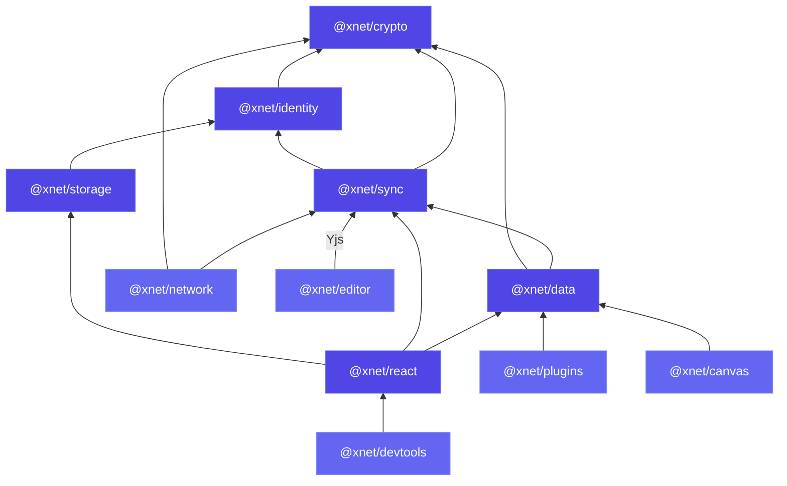

## Dependency graph

The core dependency chain flows upward. Lower packages cannot import from higher ones:



## Package details

### @xnet/crypto

**Dependencies:** `@noble/hashes`, `@noble/curves`, `@noble/ciphers`

The foundation. Provides BLAKE3 hashing, Ed25519 signing, XChaCha20-Poly1305 encryption, X25519 key exchange, and encoding utilities. No xNet dependencies.

### @xnet/identity

**Dependencies:** `@xnet/crypto`

DID:key creation and parsing, Ed25519/X25519 key bundle management, UCAN token creation and verification, passkey storage.

### @xnet/storage

**Dependencies:** `@xnet/identity`

IndexedDB adapter for persisting Y.Doc state, node properties, offline queue entries, and registry data. Platform-abstracted so it can be swapped for different storage backends.

### @xnet/sync

**Dependencies:** `@xnet/crypto`, `@xnet/identity`

Core sync primitives: Lamport clocks, `Change<T>` type, hash chains, Yjs security layer (signed envelopes, rate limiting, peer scoring, clientID attestation, update batching, integrity checking).

### @xnet/data

**Dependencies:** `@xnet/sync`, `@xnet/crypto`

Schema system (`defineSchema`, 15 property types), NodeStore (CRUD + change tracking), type inference (`FlatNode`, `InferCreateProps`), validation and coercion.

### @xnet/react

**Dependencies:** `@xnet/data`, `@xnet/sync`, `@xnet/storage`, `react`

React bindings: `useQuery`, `useMutate`, `useNode`, `useIdentity`, `XNetProvider`. Also contains the SyncManager, NodePool, Registry, OfflineQueue, ConnectionManager, MetaBridge, and plugin hooks.

### @xnet/network

**Dependencies:** `@xnet/sync`, `@xnet/crypto`

libp2p node setup, WebRTC and WebSocket transport, connection gating, peer scoring (GossipSub-inspired), auto-blocking, rate limiting at the connection level.

### @xnet/plugins

**Dependencies:** `@xnet/data`, `acorn`

Plugin system: extension manifest, registry, context, 9 contribution types, middleware chain, script sandbox (AST validation, frozen context, timeout), AI script generation, services (ProcessManager, ServiceClient), integrations (LocalAPI, MCPServer, WebhookEmitter), shortcut manager.

### @xnet/editor

**Dependencies:** `@tiptap/core`, Yjs

TipTap editor wrapper with Yjs collaboration, custom extensions (Mermaid, etc.), slash command support.

### @xnet/canvas

**Dependencies:** `@xnet/data`

Infinite canvas with spatial indexing (R-tree), viewport management, zoom/pan, node positioning.

### @xnet/devtools

**Dependencies:** `@xnet/react`

7 debug panels: Sync, Store, Schema, Identity, Network, Plugins, Performance.

## The rule

**Lower packages cannot import from higher ones.** This ensures:

- `@xnet/crypto` can be used standalone for any cryptographic operation
- `@xnet/sync` can be used without React for server-side or CLI tools
- `@xnet/data` can be used without a UI framework
- Each package is independently testable

## Applications

```
apps/electron    — Full-featured desktop app (all packages)
apps/web         — PWA (pages only, subset of features)
```

The Electron app uses all packages including `@xnet/plugins/node` for ProcessManager, LocalAPI, and MCP server. The web app uses the browser-safe subset.
