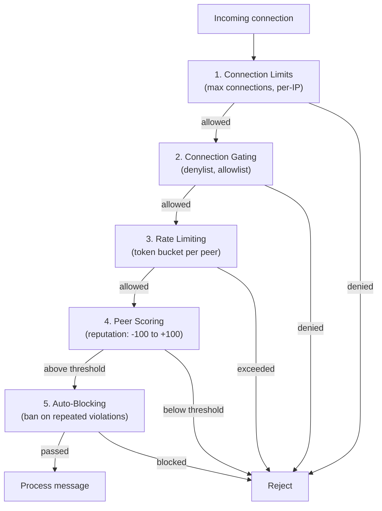

## Overview

`@xnet/network` handles getting data between peers. It sits below the sync layer — sync decides _what_ to send, network decides _how_ to get it there.

The package provides:

- A libp2p node with WebRTC and WebSocket transports
- A layered security stack (connection gating, rate limiting, peer scoring, auto-blocking)
- A custom sync protocol over libp2p streams
- A y-webrtc provider for real-time document sync

## Transport stack

```
┌─────────────────────────────┐
│  y-webrtc provider          │  Real-time document sync
├─────────────────────────────┤
│  Custom sync protocol       │  /xnet/sync/1.0.0
├─────────────────────────────┤
│  libp2p                     │  Peer management, DHT
├─────────────────────────────┤
│  WebRTC  ·  WebSocket  ·  Relay  │  Transports
├─────────────────────────────┤
│  Noise encryption  ·  Yamux mux  │  Security + multiplexing
└─────────────────────────────┘
```

### Transports

- **WebRTC** — Browser-to-browser peer connections via data channels
- **WebSocket** — Signaling server connections, relay fallback
- **Circuit Relay v2** — NAT traversal via relay nodes when direct P2P fails

### Connection security

- **Noise protocol** — Authenticated encryption for all connections
- **Yamux** — Stream multiplexing over a single connection

## Security stack



Five layers of defense, each operating independently:

### 1. Connection limits

The `ConnectionTracker` enforces hard limits:

| Limit                  | Default | Strict | Relaxed |
| ---------------------- | ------- | ------ | ------- |
| Max connections        | 100     | 50     | 200     |
| Per peer               | 2       | 1      | 4       |
| Per IP                 | 5       | 3      | 10      |
| Max pending            | 20      | 10     | 50      |
| Streams per connection | 100     | 50     | 200     |
| Connections per minute | 30      | 15     | 60      |

Three presets: `DEFAULT_LIMITS`, `STRICT_LIMITS` (mobile/constrained), `RELAXED_LIMITS` (trusted network).

### 2. Connection gating

The `DefaultConnectionGater` intercepts connections at four points:

1. **Before accepting** — Check IP denylist
2. **Before dialing** — Check peer denylist
3. **After handshake** — Check limits, denylist, allowlist bypass
4. **Before stream** — Check stream limits

Allowlisted peers bypass all connection limits.

### 3. Rate limiting

Token bucket rate limiting at two levels:

**Per-peer sync rate:**

```ts
const limiter = new SyncRateLimiter() // 10 tokens/sec, 50 capacity
limiter.canSync(peerId) // consume 1 token
limiter.penalize(peerId, 'major') // reduce rate to 0.5x
limiter.restore(peerId) // reset to default
```

**Per-protocol rate:**

| Protocol              | Rate   | Capacity |
| --------------------- | ------ | -------- |
| `/xnet/sync/1.0.0`    | 10/sec | 50       |
| `/xnet/changes/1.0.0` | 20/sec | 100      |
| `/xnet/query/1.0.0`   | 5/sec  | 20       |

Penalized peers get dynamically reduced rates.

### 4. Peer scoring

Reputation-based scoring inspired by GossipSub v1.1. Peers start at 0, range is -100 to +100:

**Positive factors:**
| Factor | Weight |
|--------|--------|
| Sync success | +0.5 |
| Valid change | +0.1 |
| Uptime (per minute) | +0.01 (cap +10) |
| Low latency (\<100ms) | +5 |

**Negative factors:**
| Factor | Weight |
|--------|--------|
| Sync failure | -2 |
| Invalid signature | **-50** |
| Invalid data | -10 |
| Rate limit violation | -5 |

**Thresholds:** warn at 0, throttle at -20, disconnect at -50. Scores decay by 1% per minute toward zero.

### 5. Auto-blocking

The `AutoBlocker` bans peers that exceed event count thresholds:

| Event               | Count | Window | Block Duration |
| ------------------- | ----- | ------ | -------------- |
| Invalid signature   | 3     | 60s    | **24 hours**   |
| Rate limit exceeded | 10    | 60s    | 1 hour         |
| Connection flood    | 20    | 60s    | 1 hour         |
| Invalid data        | 5     | 5 min  | 12 hours       |

Blocks auto-expire. The auto-blocker integrates with the peer scorer — when a peer's score drops below the disconnect threshold, it's automatically blocked for 1 hour.

## Access control

`PeerAccessControl` provides workspace-scoped access with this priority:

```
global deny > workspace deny > allowlist mode > default allow
```

When allowlist mode is enabled for a workspace, only explicitly allowlisted peers can sync. Deny entries support expiration.

## Security logging

All security events are logged in a fail2ban-compatible format:

```
2026-02-04T12:00:00.000Z XNET_SECURITY: type=invalid_signature severity=high peer=a1b2c3d4 action=blocked
```

Peer IDs are hashed for privacy. Events route by severity: critical/high to `console.error`, medium to `console.warn`, low to `console.log`.

## Custom sync protocol

The `/xnet/sync/1.0.0` protocol provides structured document sync over libp2p streams:

1. Requester sends a `sync-request` with the local Yjs state vector
2. Responder replies with a `sync-response` containing the diff
3. Requester applies the update via `Y.applyUpdate()`

Messages are serialized with msgpack and length-prefixed.

## Further reading

- [Sync Architecture](/xNet/docs/concepts/sync-architecture/) — How network fits into the sync stack
- [Cryptography](/xNet/docs/concepts/cryptography/) — The primitives used for signing and verification
- [Hub & Signaling](/xNet/docs/guides/hub/) — The signaling server that brokers connections
