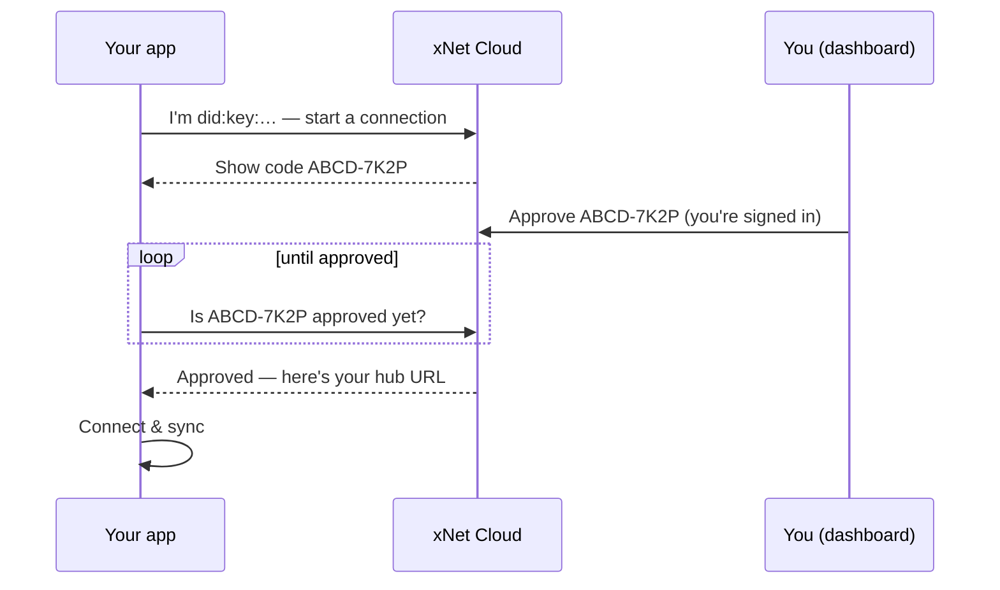

import { Tabs, TabItem, Steps } from '@astrojs/starlight/components'

:::note[You will learn]

- How the two identities (billing vs. passkey) fit together
- How to connect the **web**, **desktop**, and **mobile** apps to your managed hub
- What the short device code is and how approval works
- How to troubleshoot a connection that won't complete

:::

After you subscribe at [xnet.fyi/cloud](https://xnet.fyi/cloud), xNet Cloud
provisions a dedicated, always-on **hub** for your data. Your apps still hold the
plaintext — the hub only ever stores encrypted updates and relays them between your
devices. This guide links an app to that hub.

You can open the relevant steps any time from the **Connect your apps** card on your
[dashboard](https://cloud.xnet.fyi/dashboard).

## Two identities, one account

xNet keeps the *who pays* and *whose data* questions separate on purpose:

- **Billing identity** — the email you sign in to the dashboard with. Custodial and
  recoverable (a normal password/passkey reset).
- **Data identity (your passkey)** — a `did:key` created **on your device** when you
  first open the app. Non-custodial: it never leaves the device, and it's what proves
  a device may read and write your data. We never see its private key.

Connecting a device is the moment these two are bound together: you prove the billing
side (you're signed in to the dashboard) **and** the data side (your app holds the
passkey) at the same time.

## Connect your app

<Tabs>
  <TabItem label="Web">
    <Steps>

    1. Open the [web app](https://xnet.fyi/app) (or click **Open web app** on your
       dashboard).
    2. When prompted, **create your passkey**. This is your data identity — it stays
       on your device.
    3. Choose **Connect xNet Cloud hub**. The app shows a short code like
       `ABCD-7K2P`.
    4. On your dashboard, open **Connect your apps → Enter a code**, type the code,
       and approve. The app finishes connecting automatically.

    </Steps>
  </TabItem>

  <TabItem label="Desktop">
    The desktop app connects to your hub by its URL.

    <Steps>

    1. On your dashboard, copy your **hub URL** (the **Connect your apps → Desktop**
       tab, or the **Endpoint** row — it looks like `wss://…hub.xnet.fyi`).
    2. In the desktop app, open **Settings → Network** and paste it into the
       **Signaling server** field.
    3. Restart the app, then create your passkey and choose **Connect xNet Cloud
       hub**.
    4. Approve the short code it shows on your dashboard under **Enter a code**.

    </Steps>

    :::note
    One-click desktop connect (an `xnet://` link that fills this in for you) is on the
    way. Until then, the copy-and-paste step above is all that's needed.
    :::

  </TabItem>

  <TabItem label="Mobile">
    <Steps>

    1. Install xNet on your phone and open it.
    2. Create your passkey, then choose **Connect xNet Cloud hub**.
    3. Approve the short code it shows on your dashboard under **Connect your apps →
       Enter a code**.

    </Steps>
  </TabItem>
</Tabs>

## What the device code is

The short code is a standard
[device authorization](https://datatracker.ietf.org/doc/html/rfc8628) flow — the same
pattern you've used to sign a TV or a CLI into an account:

The code is short-lived (about 10 minutes). If it expires, just restart the
connection from your app to get a fresh one.

## Troubleshooting

- **"Code not found or expired."** Codes last ~10 minutes. Restart **Connect xNet
  Cloud hub** in your app for a new one, then enter it promptly.
- **Desktop app won't connect after pasting the URL.** Make sure you pasted the full
  `wss://…` hub URL into **Signaling server**, then fully restart the app. You still
  need to create your passkey and approve a code — pasting the URL alone only points
  the app at the hub.
- **Hub shows "Sleeping" on the dashboard.** Cold hubs wake on the next connection;
  give it a few seconds after your app reconnects.
- **Still stuck?** See the [pricing FAQ](https://xnet.fyi/cloud/pricing#faq) or check
  the [status page](https://xnet.fyi/status).

## Related

- [Hub & Signaling](/docs/guides/hub/) — self-host your own hub instead
- [Identity & Keys](/docs/guides/identity/) — how passkeys and `did:key` work
- [Electron Setup](/docs/guides/electron/) — the desktop app
