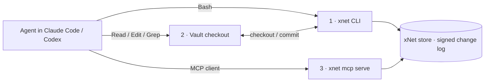

:::note[You will learn]

- How to connect a coding agent to your workspace with one command
- The three lanes an agent uses, cheapest first
- How writes stay safe when the app and the agent touch the same data
  :::

The same way people point Claude Code at an Obsidian vault, you can point it at
your **xNet workspace** — and read, search, query, and edit your pages,
databases, and canvases without leaving the terminal. The
[Agent Interfaces](/docs/guides/agent-interfaces/) guide covers the surfaces in
depth; this one is the quick on-ramp.

## One-step connect

```bash
xnet connect claude-code            # project scope, read-only
xnet connect claude-code --user     # also install the skill for all projects
xnet connect claude-code --writes   # register the MCP server with write access
xnet connect codex                  # Codex: AGENTS.md + .codex/config.toml
```

`xnet connect` is **idempotent** — it installs the `SKILL.md`, registers the
`xnet` MCP server, writes a `CLAUDE.md`/`AGENTS.md` contract, and (with
`--vault <dir>`) bootstraps a scoped checkout with an index. Re-running it
reports what is already in place and changes nothing. It finishes by running
`xnet doctor --agent-access`, which confirms the backend, full-text search, and
signing identity are all reachable.

## Works whether or not the app is running

The agent verbs resolve a backend automatically:

1. the desktop app's local API (`:31415`) when it is running, otherwise
2. a standalone SQLite store — discovered from the app's data directory, or
   pointed at explicitly with `--db <path>` (or `$XNET_DB`).

So an agent can work against your data even with the app closed, and web-only
users can point at any local store. Writes made this way are signed by a key you
provide (`--key`, `$XNET_SIGNING_KEY`) or by an
[enrolled agent passport](/docs/guides/identity/) (`--agent <name>`); the CLI
refuses to persist a write under a silent throwaway identity.

## Three lanes, cheapest first



1. **CLI** — `xnet search`/`query`/`db get` print plain stdout. Reach here
   first: it costs far fewer tokens than loading a wall of MCP tool schemas.
2. **Vault** — `xnet checkout --query "…"` materializes a **scoped** slice as
   Markdown you edit, then `xnet commit` lifts the edits back through validated
   mutation plans. Never check out the whole workspace.
3. **MCP** — the registered `xnet` server is the fallback for shell-less
   clients (Claude Desktop, browser). It is **read-only** unless you connected
   with `--writes`.

## Safe when the app and the agent collide

The store stays the source of truth, and every edit becomes a validated plan —
never a blind file-to-database sync. If the app writes a node after you checked
it out, committing your now-stale vault edit surfaces a **conflict** instead of
overwriting the newer value:

```bash
$ xnet status
conflict  Pages/shared-page.md  stale-export  based on updatedAt:10, live is updatedAt:11
```

Fix the file against the current value and commit again. Stale edits never
silently win.

## Further reading

- [Agent Interfaces](/docs/guides/agent-interfaces/) — the checkout layout, the
  full CLI, `SKILL.md`, and the slim MCP surface
- [Identity](/docs/guides/identity/) — agent passports and signing
