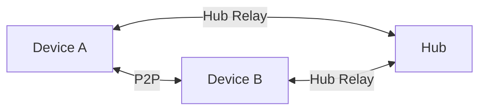

import { Tabs, TabItem } from '@astrojs/starlight/components'

:::note[You will learn]

- What the Hub does and why you might want one
- How to deploy a Hub in under 2 minutes
- How to connect your app to a Hub
- How to monitor and manage your Hub
  :::

## What is the Hub?

xNet works fully peer-to-peer — no server required. A Hub improves availability and adds services that are hard on mobile devices:

| Without Hub                          | With Hub                           |
| ------------------------------------ | ---------------------------------- |
| Sync only when both peers are online | Sync anytime — Hub bridges the gap |
| No backup                            | Encrypted backup (zero-knowledge)  |
| No full-text search across devices   | Server-side FTS5 search            |
| P2P only                             | P2P when possible, Hub when not    |

The Hub never sees your plaintext data. It stores encrypted updates and relays them to your devices.



## Quick Start: Deploy on Railway

The fastest way to get a Hub running. No Docker, no SSH, no TLS setup.

[](https://railway.app/template/xnet-hub)

**What happens:**

1. Railway clones the xNet repo
2. Builds the Hub from its Dockerfile
3. Creates a persistent volume for SQLite + blobs
4. Gives you a URL: `hub-xyz.up.railway.app`

**Cost:** $0-2/month for a personal Hub (covered by Railway's $5 Hobby credit).

### After Deploying

Your Hub is live. Copy the URL and configure your app:

```tsx
import { XNetProvider } from '@xnetjs/react'
import { XNetDevToolsProvider } from '@xnetjs/devtools'
;<XNetProvider
  config={{
    hubUrl: 'wss://hub-xyz.up.railway.app'
  }}
>
  <XNetDevToolsProvider>
    <App />
  </XNetDevToolsProvider>
</XNetProvider>
```

## Platform Comparison

| Platform | Best for                   | Typical cost | Notes                           |
| -------- | -------------------------- | ------------ | ------------------------------- |
| Railway  | One-click, lowest friction | $0-2/mo      | Ideal default for personal Hubs |
| Fly.io   | Auto-suspend, global edge  | $2-6/mo      | Suspend/resume adds ~2s wake    |
| VPS      | Full control               | $4-5/mo      | You manage TLS + upgrades       |

## Alternative Deployments

<Tabs>
  <TabItem label="Fly.io">
    Best for auto-suspend cost savings or multi-region experiments.

    ```bash
    # Install Fly CLI
    curl -L https://fly.io/install.sh | sh
    fly auth login

    # Deploy
    cd packages/hub
    fly launch --no-deploy
    fly volumes create xnet_hub_data --size 1 --region sjc
    fly deploy
    ```

    Cost: ~$2-6/month depending on usage. Machines can auto-suspend when idle.

    For multi-region (future), add additional regions and volumes, then enable hub federation for query routing.

  </TabItem>

  <TabItem label="VPS (Docker)">
    Best for full control or predictable cost.

    ```bash
    docker run -d \
      --name xnet-hub \
      -p 4444:4444 \
      -v xnet-hub-data:/data \
      --restart unless-stopped \
      ghcr.io/crs48/xnet-hub:latest
    ```

    You'll need to configure TLS yourself (Caddy, nginx, or Cloudflare Tunnel).

    Cost: $4-5/month for a basic VPS (Hetzner, DigitalOcean).

  </TabItem>

  <TabItem label="Local">
    Best for development and testing.

    ```bash
    npx @xnetjs/hub --port 4444 --data ~/.xnet-hub
    ```

    No TLS, no persistence guarantees. Use for local development only.

  </TabItem>
</Tabs>

## Configuration

### Environment Variables

| Variable                    | Default           | Description                                   |
| --------------------------- | ----------------- | --------------------------------------------- |
| `PORT`                      | `4444`            | Listen port (Railway injects this)            |
| `HUB_DATA_DIR`              | `./xnet-hub-data` | SQLite + blob storage directory               |
| `HUB_LOG_LEVEL`             | `info`            | Log verbosity: debug, info, warn, error       |
| `HUB_PUBLIC_URL`            | —                 | Public URL for discovery + federation         |
| `RAILWAY_VOLUME_MOUNT_PATH` | —                 | Auto-set by Railway when a volume is attached |
| `XNET_DIAGNOSTICS_URL`      | —                 | Opt-in: upstream sink for scrubbed crash reports (see below) |
| `XNET_DIAGNOSTICS_SECRET`   | —                 | Opt-in: shared secret for diagnostics sharing |
| `XNET_DIAGNOSTICS_INBOX`    | `open`            | Crash inbox mode: `open`, `authed`, or `off`  |
| `XNET_SHARE_CRASH_COUNTS`   | —                 | Opt-in: tee fingerprint-level crash *counts* upstream |

### Your hub is your crash console (default on)

Every hub runs a first-party **diagnostics inbox**: your deployment's own
clients report crashes to `POST /diagnostics/ingest` on *your* hub, and the
reports go nowhere else. The quarantine lives in its own `diagnostics.db`
(8 KB per report, deduplicated by fingerprint, 30-day retention for handled
reports, hard row cap), and the operator drains it from the app — **Settings →
Privacy &amp; Diagnostics → Import reports** — into a Diagnostics Space where
the workbench is the triage console (Inbox / By release / By fingerprint saved
views, a `new → acked → fixed → released` status field, comments).

The ingest is rate-limited per client IP and accepts only allowlisted,
length-bounded, twice-scrubbed fields. Set `XNET_DIAGNOSTICS_INBOX=authed` to
require authentication for it on hubs exposed to the open internet, or `off`
to disable the inbox entirely.

Escalation to xNet is a separate, layered choice — three switches, each off
by default:

1. **Send one report** — from the console, "Send to xNet" previews the exact
   payload and forwards it through the sharing route below. Requires sharing
   to be configured; without it, the route does not exist.
2. **Share crash counts** — `XNET_SHARE_CRASH_COUNTS=on` (plus the sharing
   config below) tees *fingerprint-level* data upstream on each automatic
   crash: error name, release, surface, grouping hash, and count. Never the
   message, stack, breadcrumbs, or any identifier.
3. **Let xNet help debug** — grant xNet's support identity time-boxed,
   read-only access to your Diagnostics Space from the same settings panel.
   It expires on its own and can be revoked in one click.

### Diagnostics sharing (opt-in, off by default)

Your hub keeps its own errors to itself. If you'd like xNet to help debug your
hub, set both `XNET_DIAGNOSTICS_URL` and `XNET_DIAGNOSTICS_SECRET` to enable the
`POST /diagnostics/report` route, which forwards **scrubbed, content-free** crash
reports upstream — the sender's DID is hashed (never sent raw) and document
content is never included. Leave them unset (the default) and nothing is
forwarded; `GET /diagnostics/health` simply reports `sharing: false`.

The upstream sink is xNet Cloud's first-party `POST /diagnostics` ingest
(exploration 0315): reports land in a quarantine and are drained into
`debug-report` nodes in the operator's own xNet workspace, where the workbench
_is_ the triage console — filterable tables, a `new → acked → fixed → released`
status field, and comments. **xNet does not use a third-party error service such
as Sentry.** The client keeps a dormant, vendor-neutral Sentry seam (no
`@sentry/*` SDK is installed and no DSN is minted), so if you self-host a
Sentry-compatible backend you can point that seam at it — [Bugsink][bugsink]
(single container, SQLite) or [GlitchTip][glitchtip] (MIT, Sentry-SDK
compatible) are the proven small-footprint options — but nothing ships enabled.

[bugsink]: https://www.bugsink.com/
[glitchtip]: https://glitchtip.com/

### CLI Flags

| Flag                | Description                      |
| ------------------- | -------------------------------- |
| `--port`            | Listen port                      |
| `--data`            | Data directory                   |
| `--no-auth`         | Disable UCAN authentication      |
| `--storage`         | Storage backend: sqlite, memory  |
| `--public-url`      | Public hub URL for discovery     |
| `--max-connections` | Max concurrent WebSocket clients |
| `--max-blob-size`   | Max backup blob size             |
| `--awareness-ttl`   | Awareness TTL in ms              |
| `--discovery-ttl`   | Peer discovery TTL in ms         |

## Connect Your App

### React (Renderer)

```tsx
import { XNetProvider } from '@xnetjs/react'
import { XNetDevToolsProvider } from '@xnetjs/devtools'

;<XNetProvider
  config={{
    hubUrl: 'wss://your-hub.example.com'
  }}
>
  <XNetDevToolsProvider>
    <App />
  </XNetDevToolsProvider>
</XNetProvider>
```

### Electron (Main)

```ts
const manager = new SyncManager({
  hubUrl: 'wss://your-hub.example.com'
})
```

## Operations

### Health & Metrics

| Endpoint       | Purpose                                |
| -------------- | -------------------------------------- |
| `GET /health`  | JSON status, uptime, platform metadata |
| `GET /metrics` | Prometheus metrics                     |

### Core Endpoints

| Endpoint                    | Purpose                       |
| --------------------------- | ----------------------------- |
| `PUT /backup/:docId`        | Upload encrypted backup       |
| `GET /backup/:docId`        | Download encrypted backup     |
| `GET /backup`               | List backups for your DID     |
| `PUT /files/:cid`           | Upload content-addressed file |
| `GET /files/:cid`           | Download file                 |
| `POST /schemas`             | Publish schema                |
| `GET /schemas/resolve/:iri` | Resolve schema                |
| `POST /dids/register`       | Register peer discovery       |
| `GET /dids/:did`            | Resolve peer                  |

### Backups

The Hub stores encrypted blobs. Your app encrypts before upload.

| Endpoint             | Purpose                   |
| -------------------- | ------------------------- |
| `PUT /backup/:docId` | Upload encrypted backup   |
| `GET /backup/:docId` | Download encrypted backup |
| `GET /backup`        | List backups for your DID |

### Query + Search

Queries run locally first, with Hub results filling in the gaps:

```ts
const results = await queryClient.search('budget', {
  federate: true,
  limit: 20
})
```

## Migration

Moving between platforms is straightforward:

1. Stop the old Hub (`SIGTERM` flushes SQLite)
2. Copy the data directory (`/data` or your `HUB_DATA_DIR`)
3. Start the new Hub with the same data dir
4. Update your app's `hubUrl`

Railway → VPS/Fly.io is just a volume export + upload. Fly.io → Railway is the same process in reverse.

## Further Reading

- [Your Own Server](/docs/guides/server/) — run xNet on your own backend with your own auth instead of a Hub
- [Sync Guide](/docs/guides/sync/)
- [Sync Architecture](/docs/concepts/sync-architecture/)
- [Electron Setup](/docs/guides/electron/)
