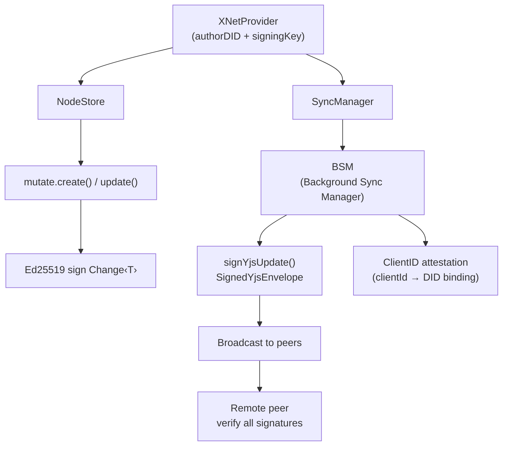

:::note[You will learn]

- How to generate Ed25519 key pairs and DID:key identifiers
- The HybridKeyBundle (classical + post-quantum keys)
- The PQ Key Registry: associating ML-DSA keys with DIDs
- How to use `useSecurity()` to control signature level
- How to create and verify UCAN authorization tokens
- Key recovery via seed phrase and multi-device access
- How identity flows through the stack (provider → hooks → sync)
  :::

## DID:key identifiers

Every xNet user has a **Decentralized Identifier** (DID) derived from their Ed25519 public key. The format follows the W3C DID:key method:

```
did:key:z6Mk...
```

The public key is embedded directly in the DID, making it **self-certifying** — you can extract the public key and verify signatures without any external resolver or blockchain.

### How it's constructed

1. Take the 32-byte Ed25519 public key
2. Prepend the multicodec prefix `0xed01` (Ed25519 public key)
3. Encode with base58btc (multibase prefix `z`)
4. Prefix with `did:key:`

### Generate an identity

```ts
import { generateIdentity, isValidDID } from '@xnetjs/identity'

const { identity, privateKey } = generateIdentity()
// identity.did = "did:key:z6Mk..."
// identity.publicKey = Uint8Array (32 bytes)
// identity.created = Date.now()

isValidDID(identity.did) // true
```

### Parse a DID

```ts
import { parseDID } from '@xnetjs/identity'

const publicKey = parseDID('did:key:z6Mk...')
// Returns the 32-byte Ed25519 public key
```

## Key bundles

Every xNet identity uses a **HybridKeyBundle** — classical keys (Ed25519 + X25519) bundled with post-quantum keys (ML-DSA-65) to protect against both current and future quantum attacks.

| Key             | Algorithm | Size (bytes) | Purpose                                |
| --------------- | --------- | ------------ | -------------------------------------- |
| `signingKey`    | Ed25519   | 32           | Sign changes, Yjs updates, UCAN tokens |
| `encryptionKey` | X25519    | 32           | Classical key exchange                 |
| `pqSigningKey`  | ML-DSA-65 | 4,032        | Post-quantum signatures (Level 1/2)    |
| `pqPublicKey`   | ML-DSA-65 | 1,952        | PQ verification key (cached)           |

The DID is derived from the Ed25519 public key only — the DID format is unchanged and stays compact.

```ts
import { generateHybridKeyBundle, deriveHybridKeyBundle } from '@xnetjs/identity'

// Random generation — includes PQ keys by default
const bundle = generateHybridKeyBundle()
// bundle.signingKey    — Ed25519 private key (32 bytes)
// bundle.encryptionKey — X25519 private key (32 bytes)
// bundle.pqSigningKey  — ML-DSA-65 private key (4,032 bytes)
// bundle.pqPublicKey   — ML-DSA-65 public key (1,952 bytes)
// bundle.identity      — { did, publicKey, created }

// Deterministic from a seed (same seed = same identity on every device)
const bundle2 = deriveHybridKeyBundle(masterSeed)
```

### Storage

Key bundles are serialized, encrypted with XChaCha20-Poly1305, and stored via `PasskeyStorage`. In production, the encryption key is derived from WebAuthn/passkey credentials.

```ts
import { BrowserPasskeyStorage } from '@xnetjs/identity'

const storage = new BrowserPasskeyStorage()
const storedKey = await storage.store(bundle, credentialId)
const recovered = await storage.retrieve(storedKey, credentialId)
```

### X25519 from Ed25519

The Ed25519 signing key can be birationally converted to an X25519 encryption key, so a single DID:key embeds both capabilities. xNet uses this conversion throughout the authorization system — the hub and other users can derive your X25519 public key directly from your DID, with no additional key exchange ceremony:

```ts
import { edwardsToMontgomeryPub } from '@noble/curves/ed25519'

// Derive the X25519 public key from an Ed25519 public key
const x25519Pub = edwardsToMontgomeryPub(ed25519PublicKey)
```

## PQ Key Registry

The DID:key format stays Ed25519-based (compact, human-readable). To support Level 1/2 verification, the **PQ Key Registry** associates each DID with its ML-DSA public key via a `PQKeyAttestation` — a self-signed proof binding the two keys together.

```ts
import { MemoryPQKeyRegistry, createPQKeyAttestation } from '@xnetjs/identity'

// Create an attestation binding your DID to your PQ public key
const attestation = await createPQKeyAttestation({
  did: bundle.identity.did,
  pqPublicKey: bundle.pqPublicKey,
  signingKey: bundle.signingKey, // Ed25519 signs the attestation
  pqSigningKey: bundle.pqSigningKey // ML-DSA also signs for cross-attestation
})

// Store in registry
const registry = new MemoryPQKeyRegistry()
await registry.store(attestation)

// Look up during verification
const pqPub = await registry.lookup(someUserDid)
```

The hub maintains a public PQ Key Registry for all registered users. When another user encrypts data for you, they look up your ML-DSA public key here to wrap the content key at Level 1/2.

## Security level in React

Use `XNetProvider` to set the default signing level for your app, and `useSecurity()` to inspect or override it per-operation:

```tsx
import { XNetProvider } from '@xnetjs/react'

// Configure default security level
;<XNetProvider
  config={{
    authorDID: identity.did,
    signingKey: bundle.signingKey,
    pqSigningKey: bundle.pqSigningKey,
    security: {
      level: 1, // 0=Fast, 1=Hybrid(default), 2=PQ-Only
      minVerificationLevel: 1, // reject signatures below this level
      verificationPolicy: 'strict' // both Ed25519 AND ML-DSA must verify
    }
  }}
>
  <App />
</XNetProvider>
```

```ts
import { useSecurity } from '@xnetjs/react'

function HighSecurityAction() {
  const { level, setLevel, canSignAtLevel } = useSecurity()

  return (
    <button
      onClick={() => setLevel(2)}       // elevate to PQ-only for this action
      disabled={!canSignAtLevel(2)}     // false if PQ keys not available
    >
      Sign with maximum security
    </button>
  )
}
```

`useSecurity()` also exposes stats visible in the DevTools Security panel: current level, signature counts by level, and verification cache hit rate.

## Key recovery

### Seed phrase

Your identity can be derived deterministically from a BIP-39 seed phrase. Back up the seed phrase and you can always restore your identity — and regain access to all your encrypted data — on any device:

```ts
import { deriveSeedPhrase, recoverFromSeedPhrase } from '@xnetjs/identity'

// Generate a new identity with a recoverable seed
const { mnemonic, bundle } = deriveSeedPhrase()
// mnemonic: "correct horse battery staple ..."

// Recover on a new device — produces the same DID and key pair
const recoveredBundle = recoverFromSeedPhrase(mnemonic)
```

The seed phrase generates the Ed25519 signing key, and the X25519 encryption key is derived from it via birational conversion — not independently. This ensures the DID, signing key, and encryption key are always consistent.

### Social recovery

As a fallback when the seed phrase is unavailable, xNet supports Shamir's Secret Sharing. Split the seed across trusted contacts (e.g., 3-of-5 threshold) so any quorum can reconstruct your identity:

```ts
import { splitSeed, reconstructSeed } from '@xnetjs/identity'

const shares = splitSeed(mnemonic, { threshold: 3, total: 5 })
// Distribute shares to trusted contacts

const recovered = reconstructSeed(anyThreeShares) // any 3 of 5 work
```

### Encrypted hub backup

With opt-in hub backup, your key bundle is stored encrypted on a hub, unlocked by a passphrase or WebAuthn credential. The hub never sees the plaintext key:

```ts
import { HubKeyBackup } from '@xnetjs/identity'

const backup = new HubKeyBackup(hubUrl)
await backup.store(bundle, { passphrase: 'my-secret-passphrase' })
const restored = await backup.retrieve({ passphrase: 'my-secret-passphrase' })
```

## Multi-device access

When you sign in on a second device:

1. The new device generates a device-specific key pair
2. It derives the same primary key from your seed phrase
3. Your primary key wraps content keys for each device

All devices share the same DID — collaborators don't need to know which device you're on.

## Cryptographic primitives

The `@xnetjs/crypto` package provides all the low-level operations:

### Hashing (BLAKE3)

```ts
import { hash, hashHex } from '@xnetjs/crypto'

const digest = hash(data) // Uint8Array
const hex = hashHex(data) // hex string
const b64 = hashBase64(data) // base64url string
const sha = hash(data, 'sha256') // SHA-256 fallback
```

### Signing (Ed25519)

```ts
import { generateSigningKeyPair, sign, verify } from '@xnetjs/crypto'

const { publicKey, privateKey } = generateSigningKeyPair()
const signature = sign(message, privateKey)
const valid = verify(message, signature, publicKey) // boolean
```

### Encryption (XChaCha20-Poly1305)

```ts
import { generateKey, encrypt, decrypt } from '@xnetjs/crypto'

const key = generateKey() // 32 bytes
const encrypted = encrypt(plaintext, key) // { nonce, ciphertext }
const decrypted = decrypt(encrypted, key) // Uint8Array
```

### Key exchange (X25519 + HKDF)

```ts
import { generateKeyPair, deriveSharedSecret } from '@xnetjs/crypto'

const alice = generateKeyPair()
const bob = generateKeyPair()
const shared = deriveSharedSecret(alice.privateKey, bob.publicKey)
// Both sides derive the same 32-byte shared secret
```

## UCAN tokens

UCANs (User Controlled Authorization Networks) are self-signed capability tokens for decentralized authorization. They replace traditional API keys or OAuth tokens. UCAN tokens are signed with the hybrid signature at whatever level the signer's `SecurityContext` specifies.

### Structure

```ts
interface UCANToken {
  iss: string // Issuer DID
  aud: string // Audience DID
  exp: number // Expiration (Unix seconds)
  att: UCANCapability[] // Capabilities granted
  prf: string[] // Proof chain (parent tokens)
  sig: Uint8Array // Ed25519 signature
}

interface UCANCapability {
  with: string // Resource URI: 'xnet://doc/123' or '*'
  can: string // Action: 'read', 'write', or '*'
}
```

### Create a token

```ts
import { createUCAN } from '@xnetjs/identity'

const token = createUCAN({
  issuer: alice.did,
  issuerKey: alice.privateKey,
  audience: bob.did,
  capabilities: [
    { with: 'xnet://doc/123', can: 'write' },
    { with: 'xnet://doc/*', can: 'read' }
  ],
  expiration: Date.now() / 1000 + 3600, // 1 hour (default)
  proofs: [] // Parent tokens for delegation
})
```

### Verify a token

```ts
import { verifyUCAN, hasCapability } from '@xnetjs/identity'

const result = verifyUCAN(token)
if (result.valid) {
  const canWrite = hasCapability(result.payload, 'xnet://doc/123', 'write')
}
```

Verification extracts the issuer's public key from their DID (no external resolver), checks expiration, and verifies the Ed25519 signature.

### Delegation chains


UCANs support transitive delegation via the `prf` (proofs) field:

```ts
// Alice grants Bob write access
const aliceToBob = createUCAN({
  issuer: alice.did,
  issuerKey: alice.privateKey,
  audience: bob.did,
  capabilities: [{ with: 'xnet://doc/123', can: 'write' }]
})

// Bob delegates read access to Carol, citing Alice's grant as proof
const bobToCarol = createUCAN({
  issuer: bob.did,
  issuerKey: bob.privateKey,
  audience: carol.did,
  capabilities: [{ with: 'xnet://doc/123', can: 'read' }],
  proofs: [aliceToBob]
})
```

## Integration with React

Identity is provided to the app through `XNetProvider`:

```tsx
import { XNetProvider } from '@xnetjs/react'
import { XNetDevToolsProvider } from '@xnetjs/devtools'
;<XNetProvider
  config={{
    authorDID: identity.did,
    signingKey: privateKey,
    identity: identity
    // ...
  }}
>
  <XNetDevToolsProvider>
    <App />
  </XNetDevToolsProvider>
</XNetProvider>
```

The `useIdentity` hook exposes identity state to components:

```ts
import { useIdentity } from '@xnetjs/react'

function Profile() {
  const { identity, isAuthenticated, did } = useIdentity()

  if (!isAuthenticated) return <LoginScreen />
  return <p>Signed in as {did}</p>
}
```

## Related

- [Authorization](/docs/guides/authorization/) — Roles, grants, and encryption-first access control
- [Cryptography](/docs/concepts/cryptography/) — Ed25519, X25519, and the encrypted envelope model

## How identity flows through the stack



1. `XNetProvider` creates a `NodeStore` with `authorDID` and `signingKey`
2. Every `mutate.create()` / `mutate.update()` call signs the change with Ed25519
3. `SyncManager` receives the signing credentials and passes them to the BSM
4. Yjs updates are signed as `SignedYjsEnvelope` before broadcast
5. ClientID attestations bind the Yjs clientID to the DID
6. Remote peers verify all signatures before applying changes
