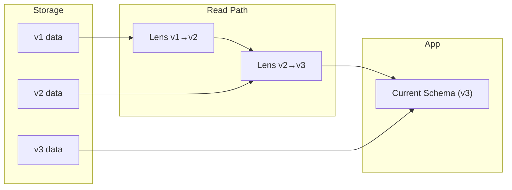
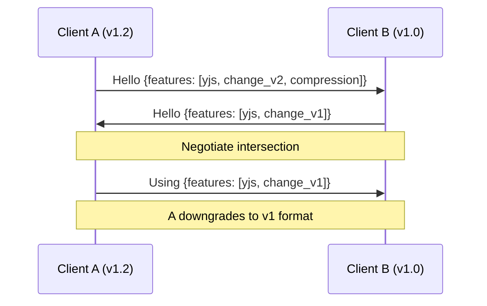
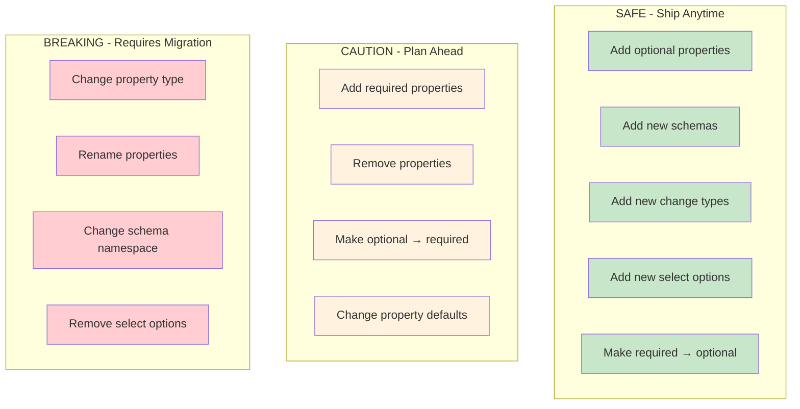
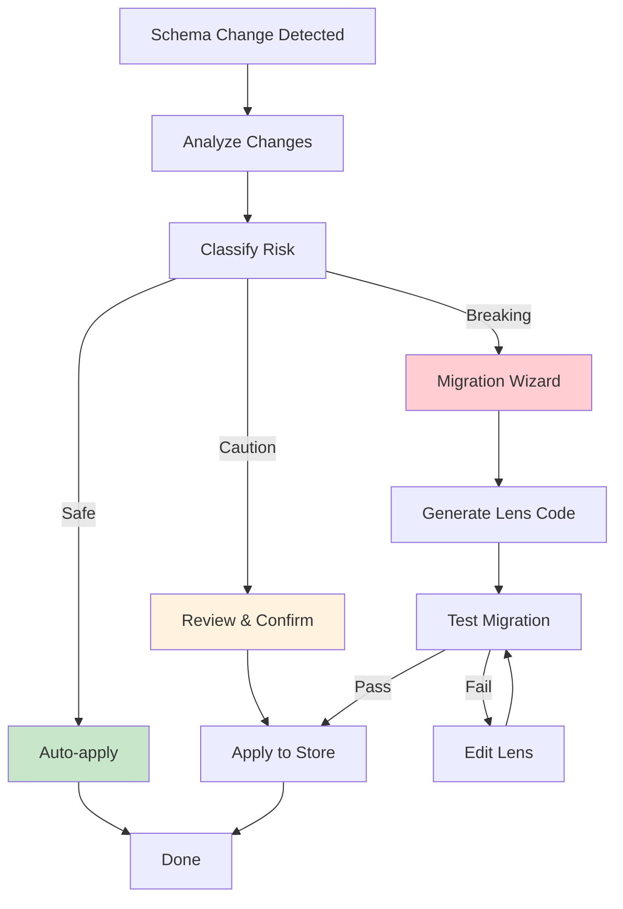
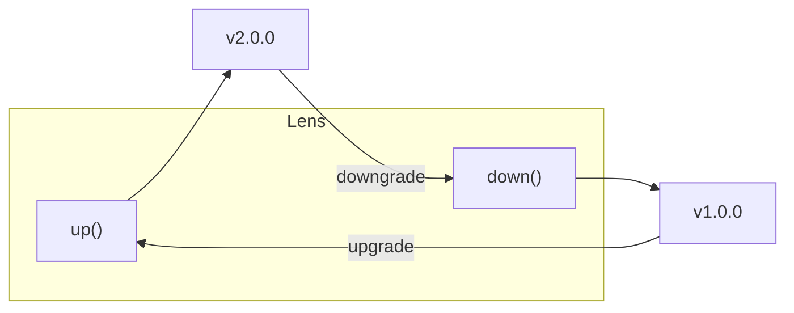
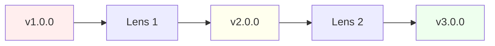
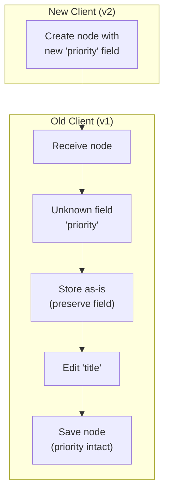
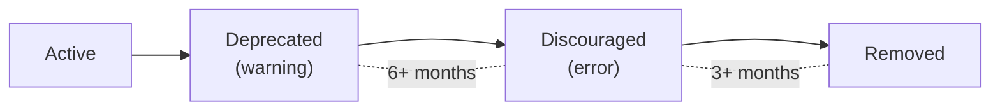

:::note[You will learn]

- How protocol versioning and schema versioning work
- How to create migrations with lenses
- How version negotiation keeps peers compatible
- How to use CLI tools for schema management
- How to diagnose and repair data issues
  :::

## Overview

xNet uses a **translate-on-read** approach to version compatibility:



1. Data is stored in its original format
2. Migrations are applied when reading, not when writing
3. Old clients can still read new data (graceful degradation)
4. No batch migrations required

This means you can ship schema changes incrementally without breaking existing clients.

## Protocol versioning

The sync protocol is versioned separately from schemas. Every `Change<T>` includes a `protocolVersion`:

```ts
interface Change<T> {
  id: string
  type: string
  payload: T
  protocolVersion: number // Currently: 1
  hash: ContentId
  parentHash: ContentId | null
  authorDID: DID
  signature: Uint8Array
  lamport: LamportTimestamp
}
```

### Version compatibility

| Your Version | Peer Version | Behavior                                           |
| ------------ | ------------ | -------------------------------------------------- |
| v1           | v1           | Full compatibility                                 |
| v1           | v0 (legacy)  | Full backward compatibility                        |
| v1           | v2+          | Partial — unknown fields preserved, warning logged |

### Feature negotiation

When peers connect, they negotiate a common feature set:



```ts
// Handshake exchange
{
  clientVersion: '1.2.0',
  protocolVersion: 1,
  features: ['yjs_sync', 'change_v2', 'signatures', 'compression']
}
```

The negotiator finds the intersection of features both peers support. If a required feature is missing, the connection is downgraded or rejected.

## Schema versioning

Every schema should have a semantic version:

```ts
import { defineSchema } from '@xnet/data'

const TaskSchema = defineSchema({
  name: 'Task',
  version: '2.0.0', // Major.Minor.Patch
  properties: {
    title: { type: 'text' },
    status: { type: 'select', options: ['todo', 'doing', 'done'] },
    priority: { type: 'select', options: ['low', 'medium', 'high'] }
  }
})
```

### Version bump rules

| Change Type                     | Version Bump | Example           |
| ------------------------------- | ------------ | ----------------- |
| Add optional field              | Minor        | `1.0.0` → `1.1.0` |
| Add required field with default | Minor        | `1.0.0` → `1.1.0` |
| Remove field                    | Major        | `1.0.0` → `2.0.0` |
| Rename field                    | Major        | `1.0.0` → `2.0.0` |
| Change field type               | Major        | `1.0.0` → `2.0.0` |
| Fix bug in migration            | Patch        | `1.0.1` → `1.0.2` |

### Schema change classification

Every schema change falls into one of three risk categories:



#### Classification matrix

| Change Type            | Forward Safe | Backward Safe | Auto-Migrate | Manual Action    |
| ---------------------- | ------------ | ------------- | ------------ | ---------------- |
| Add optional property  | Yes          | Yes           | N/A          | None             |
| Add required property  | No           | Yes           | Yes          | Define default   |
| Remove property        | Yes          | No            | Yes          | None             |
| Change property type   | No           | No            | Maybe        | Define transform |
| Rename property        | No           | No            | Yes          | Define mapping   |
| Add select option      | Yes          | Yes           | N/A          | None             |
| Remove select option   | No           | No            | Maybe        | Define fallback  |
| Make optional→required | No           | Yes           | Yes          | Define default   |
| Make required→optional | Yes          | Yes           | N/A          | None             |

**Legend:**

- **Forward Safe**: Old clients can read data created by new clients
- **Backward Safe**: New clients can read data created by old clients
- **Auto-Migrate**: The system can generate migration code automatically

#### Migration wizard

Use the **Migrate** panel in DevTools to:

1. **Analyze** - Scan your store for schema changes
2. **Review** - See changes grouped by risk level
3. **Generate** - Auto-generate lens code for migrations
4. **Test** - Validate migrations on sample data
5. **Apply** - Apply migrations to your store



## Migrations with lenses

Lenses transform data between schema versions. They're bidirectional — you can upgrade and downgrade.



### Creating a lens

```ts
import { createLens, type SchemaLens } from '@xnet/data'

const taskV1ToV2: SchemaLens = createLens({
  from: '1.0.0',
  to: '2.0.0',

  // Transform v1 → v2
  up(node) {
    return {
      ...node,
      priority: node.priority ?? 'medium' // Add default
    }
  },

  // Transform v2 → v1
  down(node) {
    const { priority, ...rest } = node
    return rest // Remove new field
  }
})
```

### Registering lenses

```ts
import { LensRegistry } from '@xnet/data'

const registry = new LensRegistry()

// Register all lenses for a schema
registry.register('Task', taskV1ToV2)
registry.register('Task', taskV2ToV3)

// The registry automatically chains lenses
// v1 → v2 → v3 happens automatically
```



The registry finds the shortest path between any two versions and chains the lenses automatically.

### Reading with migration

```ts
import { NodeStore } from '@xnet/data'

const store = new NodeStore({ lensRegistry: registry })

// Read with automatic migration
const task = await store.getWithMigration(taskId, {
  targetVersion: '3.0.0'
})
// Data is transformed to v3 format

// Original data unchanged in storage
const original = await store.get(taskId)
// Still in its original version
```

## Common migration patterns

### Adding a field

```ts
const addPriority = createLens({
  from: '1.0.0',
  to: '1.1.0',
  up: (node) => ({
    ...node,
    priority: 'medium' // Sensible default
  }),
  down: (node) => {
    const { priority, ...rest } = node
    return rest
  }
})
```

### Renaming a field

```ts
const renameDueDate = createLens({
  from: '1.0.0',
  to: '2.0.0',
  up: (node) => {
    const { due_date, ...rest } = node
    return { ...rest, dueDate: due_date }
  },
  down: (node) => {
    const { dueDate, ...rest } = node
    return { ...rest, due_date: dueDate }
  }
})
```

### Splitting a field

```ts
const splitName = createLens({
  from: '1.0.0',
  to: '2.0.0',
  up: (node) => {
    const [firstName, ...rest] = (node.name || '').split(' ')
    return {
      ...node,
      firstName,
      lastName: rest.join(' ')
    }
  },
  down: (node) => ({
    ...node,
    name: `${node.firstName} ${node.lastName}`.trim()
  })
})
```

## React integration

### useQuery with migrations

```tsx
import { useQuery } from '@xnet/react'

function TaskList() {
  const { data: tasks } = useQuery({
    type: 'Task',
    targetVersion: '3.0.0' // Migrate to this version
  })

  // All tasks are v3 format, regardless of storage version
  return tasks.map((task) => <TaskCard key={task.id} task={task} />)
}
```

## CLI tools

### Extract schemas

```bash
# Extract current schema to JSON
xnet schema extract --output schemas/

# Creates schemas/Task.v2.0.0.json
```

### Compare schemas

```bash
# Compare two versions
xnet schema diff Task 1.0.0 2.0.0

# Output:
# + priority: select (added)
# ~ status: text → select (type changed)
```

### Validate migrations

```bash
# Check that lenses are registered for all version pairs
xnet migrate validate

# Output:
# ✓ Task: 1.0.0 → 2.0.0 (lens registered)
# ✓ Task: 2.0.0 → 3.0.0 (lens registered)
# ✗ Contact: 1.0.0 → 2.0.0 (no lens!)
```

### Diagnose issues

```bash
# Full diagnostic
xnet doctor

# Output:
# Checking nodes...
#   ✓ 1,234 nodes checked
#   ✓ All hashes valid
#   ⚠ 3 nodes have unknown schema types
#
# Summary:
#   Errors: 0
#   Warnings: 3
#   Status: HEALTHY (with warnings)
```

### Repair data

```bash
# Preview what would be fixed
xnet repair --dry-run

# Apply fixes
xnet repair
```

### Export and import

```bash
# Export all data to JSON
xnet export --output backup.json

# Import with migration
xnet import backup.json --migrate-to-current
```

## Graceful degradation

When encountering unknown data, xNet preserves it rather than discarding it:



### Unknown schema type

```ts
// Node with unknown schema type
const node = {
  '@type': 'xnet://example.com/FutureType',
  title: 'Something new',
  unknownField: { complex: 'data' }
}

// Old client behavior:
// - Stores node as-is
// - Can display raw data
// - Preserves unknown fields on save
```

### Unknown property type

```ts
// Property with future type
const property = {
  name: 'location',
  type: 'geo-polygon',  // Unknown type
  value: { points: [...] }
}

// Old client behavior:
// - Preserves value
// - Displays as JSON in UI
// - Round-trips correctly
```

## Deprecation policy

Features follow a deprecation lifecycle:



| Stage       | Behavior               | Duration     |
| ----------- | ---------------------- | ------------ |
| Active      | Works normally         | Indefinite   |
| Deprecated  | Works, warning logged  | Min 6 months |
| Discouraged | Works, error logged    | Min 3 months |
| Removed     | Feature does not exist | Permanent    |

Check for deprecations programmatically:

```ts
import { checkDeprecations } from '@xnet/sync'

const warnings = checkDeprecations({
  protocolVersion: 0,
  features: ['change_v1']
})

warnings.forEach((w) => {
  console.warn(`${w.feature}: ${w.message}`)
  console.warn(`  Deadline: ${w.deadline}`)
})
```

## DevTools panel

The Version DevTools panel shows:

- Current protocol version
- Connected peer versions
- Feature negotiation results
- Deprecation warnings
- Schema version distribution

Enable it in the DevTools:

```tsx
import { DevTools } from '@xnet/devtools'

function App() {
  return (
    <>
      <YourApp />
      <DevTools />
    </>
  )
}
```

## Best practices

1. **Always provide defaults** when adding fields:

   ```ts
   up: (node) => ({ ...node, priority: node.priority ?? 'medium' })
   ```

2. **Test both directions** — migrations should round-trip:

   ```ts
   const roundTripped = lens.down(lens.up(original))
   expect(roundTripped.title).toBe(original.title)
   ```

3. **Keep lenses simple** — one concern per lens, chain for complex migrations

4. **Version bumps are cheap** — don't be afraid to bump minor versions for additive changes

5. **Run `xnet doctor`** in CI to catch issues early

## Further reading

- [Sync Guide](/docs/guides/sync/) — How sync works
- [Schemas Overview](/docs/schemas/overview/) — Defining schemas
- [DevTools](/docs/guides/devtools/) — Debugging tools
