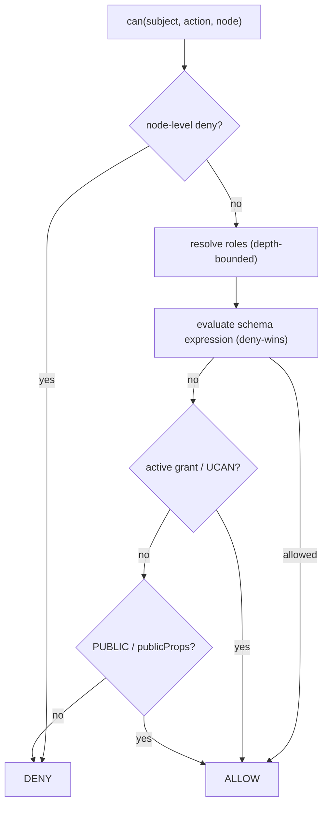

In XNet, authorization is **data, not application logic**: rules are declared on
schemas and delegated through grant nodes and UCAN tokens, and enforced at the
sync boundary. Because two implementations that disagree on policy make different
read/write decisions on the same graph, the decision *semantics* are normative.
Normative text:
[`04-authorization.md`](https://github.com/crs48/xNet/blob/main/docs/specs/protocol/04-authorization.md).

## Actions and decisions

```
action ∈ { read, create, update, write, delete, share, admin }
can(subject: DID, action, nodeId) → { allowed, reasons }
```

`create` and `update` are **refinements of `write`**: `create` governs bringing
a node into existence, `update` governs mutating one that exists. A schema may
declare either; when absent, each falls back to the schema's `write`
expression (and a legacy `write` check follows the `update` rule), so schemas
that only declare `write` behave exactly as before. Create checks evaluate
against the *draft* node built from the payload — container relations in the
payload (e.g. `space`, `channel`) resolve membership roles, which is how
creation into a shared container is gated. A grant carrying `write` satisfies
both refinements; a granular grant covers only itself.

```ts
actions: {
  read:   allow('owner', 'spaceMember'),
  create: allow('spaceMember'),          // members may add…
  update: allow('owner', 'spaceAdmin'),  // …only the author (or admins) may edit
  write:  allow('owner', 'spaceMember'), // fallback for engines without the split
  delete: allow('owner', 'spaceAdmin'),
  share:  allow('owner', 'spaceAdmin')
}
```

## Schema authorization

A schema may carry an `authorization` block defining **roles** (how a subject
earns a role on a node) and **actions** (which roles may perform each action):

```ts
interface AuthorizationDefinition {
  roles:   Record<string, RoleResolver>
  actions: Record<AuthAction, AuthExpression>
  publicProps?: string[]
  fieldRules?: Record<string, { allow: AuthExpression; deny?: AuthExpression }>
}
```

## Role resolvers

| Kind | Subject earns the role when… |
|---|---|
| **creator** | `subject == node.createdBy` |
| **property** | it appears in a named `person`/`relation` property (e.g. `editors`) |
| **relation** | it holds a role on a *related* node (inheritance) |
| **membership** | a membership edge (e.g. `SpaceMembership`) links it to a container with a role ≥ `minRole`, cascading to nested containers |

Resolution walks relations/memberships with a bounded depth and must terminate.

## The expression AST

```
expr ::= allow(role…) | deny(role…) | roleRef(name)
       | and(expr…) | or(expr…) | not(expr) | PUBLIC | AUTHENTICATED
```

**Deny wins:** if any matching `deny` is true, the action is denied regardless of
any `allow`. Evaluation is total and deterministic.

## Encryption as access control

For private nodes, **the ability to decrypt is the read‑control mechanism**:
content keys are wrapped per recipient (X25519 + XChaCha20). A subject not in the
recipient set can't read encrypted properties even if it receives the bytes.
`publicProps` and the four universal node fields stay readable for indexing and
attribution.

## Grants and UCAN

- **Grant nodes** — ordinary XNet nodes recording `{ issuer, grantee, resource,
  actions, expiresAt, revokedAt }`. Active iff not revoked and not expired.
- **UCAN tokens** — capability tokens (JWT/EdDSA) with a proof chain. Each
  capability must be an attenuation of its proof; child expiry ≤ parent; chains
  acyclic.

## Deterministic pipeline



Caching and indexing are private; the *decisions* must match the
decision‑trace [conformance vectors](/docs/protocol/conformance/).

Next: [Implement it in your language →](/docs/protocol/implement-in-your-language/)
