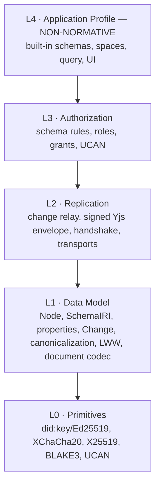

import { Card, CardGrid, LinkCard, Aside } from '@astrojs/starlight/components'

The `xNet` repository is **one implementation** of xNet. xNet itself is a
**protocol** — a written interface you can re‑implement in any language, over any
database, and still interoperate with every other conforming implementation. Like
Matrix, the AT Protocol, or ActivityPub, the standard is separate from any one
codebase.

<Aside type="tip" title="The normative spec lives in the repo">
  This page is the friendly tour. The **normative source of truth** is
  [`docs/specs/protocol/`](https://github.com/crs48/xNet/tree/main/docs/specs/protocol) — versioned
  with the code, backed by a machine‑checked conformance corpus.
</Aside>

## The boundary in one sentence

> A conforming xNet implementation agrees on the **cryptographic primitives**,
> the **data model** (especially the byte‑exact canonicalization of a change),
> the **replication wire format**, and the **authorization semantics** — and
> treats everything above (query, storage layout, UI, the built‑in app schemas)
> as private.

## Four normative layers

<CardGrid>
  <LinkCard
    title="L0 · Primitives"
    href="https://github.com/crs48/xNet/blob/main/docs/specs/protocol/01-primitives.md"
    description="did:key, Ed25519, XChaCha20-Poly1305, X25519, BLAKE3, UCAN — mostly a profile over existing standards."
  />
  <LinkCard
    title="L1 · Data Model"
    href="/docs/protocol/data-model/"
    description="The Node, the signed Change, and the byte-exact canonicalization that makes it all interoperate."
  />
  <LinkCard
    title="L2 · Replication"
    href="/docs/protocol/replication/"
    description="The wire messages, the signed Yjs envelope, and the version handshake."
  />
  <LinkCard
    title="L3 · Authorization"
    href="/docs/protocol/authorization/"
    description="Access control as data: schema rules, role resolvers, grants, and UCAN tokens."
  />
</CardGrid>

## The interop kernel (the part that makes it xNet)

The irreducible core is small. An implementation that does **only L0 + L1** can
already create, sign, verify, and converge nodes — fully participating in the
graph:

1. A **`did:key`** identity from an Ed25519 key.
2. A **Node** = four universal fields (`id`, `schemaId`, `createdAt`,
   `createdBy`) plus schema‑defined properties.
3. A **Change** = a signed, hash‑chained, Lamport‑stamped mutation whose
   canonical bytes and BLAKE3 hash are specified exactly.
4. **Last‑Write‑Wins** per‑property conflict resolution on the Lamport clock.

## Yjs is _not_ the protocol

A common misconception: "xNet is built on Yjs, so I'd have to port a CRDT." Not
so. Yjs is used only for the optional rich‑text **document body** of certain
nodes, and it travels the wire as **opaque bytes inside a signed envelope**. A
second implementation can relay and store that blob without parsing it, and still
participate fully. The CRDT is a **pluggable document codec**, not the
interop kernel. (See [data model](/docs/protocol/data-model/).)

## One umbrella version

Peers negotiate a single named bundle — `xnet/1.0` — exactly as Matrix bundles
breaking changes into _room versions_. It expands to the per‑subsystem versions
(change record, sync envelope, awareness, schema, crypto level). The
machine‑readable constant is `XNET_PROTOCOL_VERSION`, exported by `@xnetjs/sdk`.

## Prove it, don't just read it

Every claim in the spec is backed by a **language‑agnostic golden‑vector
corpus** shipped _with_ the spec and re‑checked in CI — so the prose can't drift
from reality. A ~100‑line Python kernel reproduces the same DIDs and verifies
TypeScript‑signed changes. Want to build your own implementation?

<LinkCard
  title="Implement xNet in your language →"
  href="/docs/protocol/implement-in-your-language/"
  description="A step-by-step kernel, the golden vectors, and how to claim conformance."
/>

<LinkCard
  title="Languages & SDKs →"
  href="/docs/languages/overview/"
  description="TypeScript, Swift, Rust, Python — and the JS frameworks — at honest, labeled maturity levels."
/>
