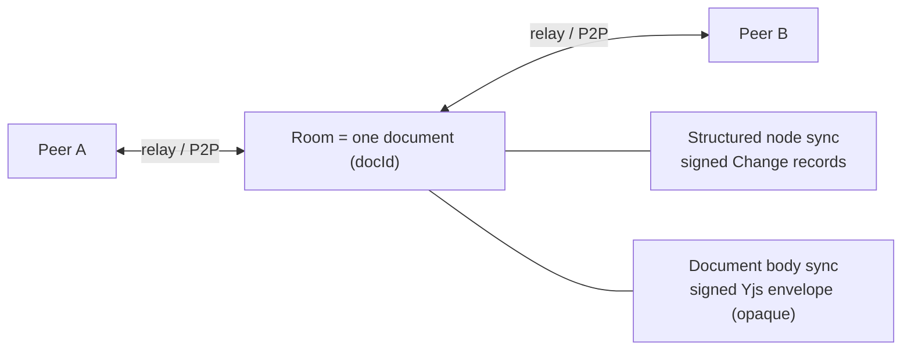
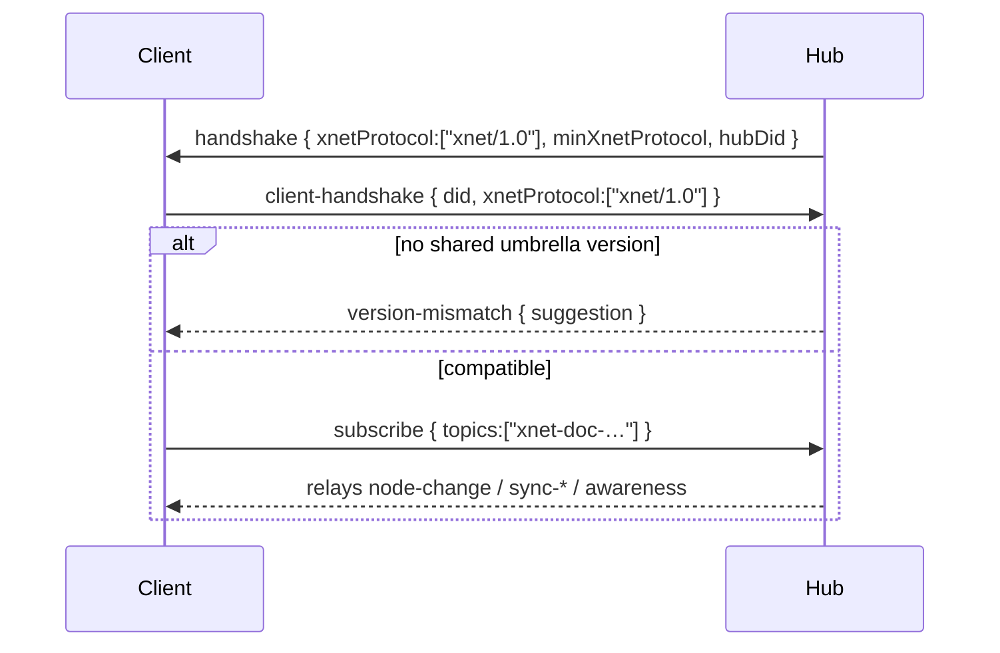

How nodes and document bodies move between peers. The message *semantics* are
defined once and bind to multiple transports. Normative text:
[`03-replication.md`](https://github.com/crs48/xNet/blob/main/docs/specs/protocol/03-replication.md).

## Two streams per document

A document (room) carries two complementary streams. An implementation must relay
both faithfully; it need only *interpret* the first.



## Structured node sync

```ts
{ type: "node-change", room, change }                    // one new signed change
{ type: "node-sync-request", room, sinceLamport }        // catch-up request
{ type: "node-sync-response", room, changes, highWaterMark } // catch-up batch
```

A receiver verifies each change's signature, applies idempotently (re‑applying a
known `hash` is a no‑op), and orders by `lamport`. `highWaterMark` enables
resumable catch‑up.

## The signed Yjs envelope

Document bodies sync with [y‑protocols](https://github.com/yjs/y-protocols)
sync v1, each update wrapped so the relay can authenticate authorship **without
parsing the CRDT**:

```jsonc
{
  "v": 2,
  "u": "base64(Yjs update bytes)",   // OPAQUE codec payload
  "m": { "a": "did:key:…", "c": 12345, "t": 1718641200000, "d": "<docId>" },
  "s": { "ed25519": "base64", "mlDsa": null, "level": 0 }
}
```

The signature covers `BLAKE3(update || JSON(meta))` and is verified against the
author DID. Relays forward the envelope byte‑preserving; a peer that doesn't
implement `yjs-v1` still forwards and stores `u`.

## Awareness

Ephemeral presence (cursor, selection, online status) uses y‑protocols
awareness. It is **not** persisted as node data and is exempt from the hash
chain; relays should rate‑limit and expire it.

## The version handshake



Two peers are compatible iff their `xnetProtocol` sets intersect; a peer with no
acceptable version refuses with a typed `version-mismatch` rather than partially
syncing. The token is `XNET_PROTOCOL_VERSION.id` (`"xnet/1.0"`) from `@xnetjs/sdk`.

## Transport bindings

The same logical messages bind to two transports: **WebSocket** (JSON frames,
browser ↔ hub) and **libp2p** (length‑prefixed msgpack over `/xnet/sync/1.0.0`,
P2P). A relay may bridge between them.

Next: [Authorization (L3) →](/docs/protocol/authorization/)
