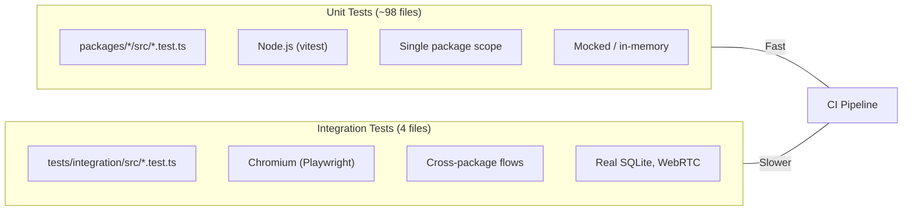

# @xnetjs/tests

Browser-mode integration tests for xNet's current hook and sync contracts.

These suites run under Vitest browser mode with Playwright-backed Chromium so cross-package flows execute against real browser APIs. The current focus is the converged React hook stack (`useNode`, `useQuery`, `useMutate`), Y.Doc sync behavior, and signaling/protocol boundaries.

## Structure

```
tests/
  integration/
    src/
      crud.test.tsx              # CRUD & persistence (Page + Database schemas)
      sync.test.ts               # Y.Doc sync protocol (y-protocols encoding)
      document-sync.test.tsx     # Multi-user document sync lifecycle
      webrtc-signaling.test.ts   # WebRTC signaling + data channels
      __screenshots__/           # Visual regression baselines
    vitest.config.ts             # Playwright browser mode, Chromium, 30s timeout
    tsconfig.json
    package.json
```

## Test Types

| File                       | Scope       | What It Tests                                                         |
| -------------------------- | ----------- | --------------------------------------------------------------------- |
| `crud.test.tsx`            | React hooks | `useNode`, `useQuery`, `useMutate` over the current provider contract |
| `sync.test.ts`             | Protocol    | Y.Doc sync encoding/decoding and signaling protocol coverage          |
| `document-sync.test.tsx`   | Multi-user  | `useNode` sync, offline merge, and remount persistence semantics      |
| `webrtc-signaling.test.ts` | Network     | Raw WebRTC data channel establishment (requires signaling server)     |

## Running

```bash
# Run integration tests
pnpm --filter @xnetjs/integration-tests test

# Run with visible browser (headed mode)
pnpm --filter @xnetjs/integration-tests test -- --browser.headless=false
```

## How It Works

- Uses **Vitest browser mode** with Playwright-backed Chromium, not jsdom
- React components render inside the browser via `@testing-library/react`
- CRUD and document-sync suites use `MemoryNodeStorageAdapter` so the current hook contract stays under deterministic coverage
- Sync-oriented suites forward Y.Doc updates directly to exercise merge and reconnect behavior without relying on removed legacy hook paths
- Networking coverage stays focused on protocol/signaling boundaries that require real browser APIs

## Relationship to Unit Tests

Unit tests live co-located with source code in each package (`packages/*/src/**/*.test.ts`). They run in Node via the root `vitest.config.ts`. Integration tests here run in a real browser to cover cross-package flows that depend on browser APIs or multi-package hook/runtime wiring.



## Related

- [Packages README](../packages/README.md) -- SDK packages with unit tests
- [Root vitest.config.ts](../vitest.config.ts) -- Unit test configuration
- [CI Workflow](../.github/workflows/ci.yml) -- Runs both unit and integration tests
