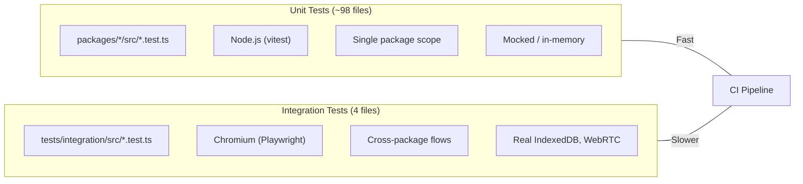

# @xnet/tests

Integration test suite for xNet. These tests run in a real browser (Chromium via Playwright) to exercise IndexedDB, WebRTC, and React hooks in an authentic environment.

## Structure

```
tests/
  integration/
    src/
      crud.test.tsx              # CRUD & persistence (Page + Database schemas)
      sync.test.ts               # Y.Doc sync protocol (y-protocols encoding)
      document-sync.test.tsx     # Multi-user document sync lifecycle
      webrtc-signaling.test.ts   # WebRTC signaling + data channels
      __screenshots__/           # Visual regression baselines
    vitest.config.ts             # Playwright browser mode, Chromium, 30s timeout
    tsconfig.json
    package.json
```

## Test Types

| File                       | Scope             | What It Tests                                                          |
| -------------------------- | ----------------- | ---------------------------------------------------------------------- |
| `crud.test.tsx`            | React + IndexedDB | `useDocument`, `useQuery`, `useMutate` with real persistence           |
| `sync.test.ts`             | Protocol          | Y.Doc sync encoding/decoding, signaling server connection              |
| `document-sync.test.tsx`   | Multi-user        | Live editing, disconnect/reconnect, CRDT merge, persistence after sync |
| `webrtc-signaling.test.ts` | Network           | Raw WebRTC data channel establishment (requires signaling server)      |

## Running

```bash
# Run integration tests
pnpm --filter @xnet/integration-tests test

# Run with visible browser (headed mode)
pnpm --filter @xnet/integration-tests test -- --browser.headless=false
```

## How It Works

- Uses **Vitest browser mode** with Playwright (not jsdom) for real browser APIs
- Each test gets a unique IndexedDB database name for isolation
- React components render inside the browser via `@testing-library/react`
- Sync tests simulate WebRTC transport by forwarding Y.Doc updates between two docs
- Screenshots are captured per-test for visual regression baselines

## Relationship to Unit Tests

Unit tests live co-located with source code in each package (`packages/*/src/**/*.test.ts`). They run in Node via the root `vitest.config.ts`. Integration tests here run in a real browser to cover cross-package flows that depend on browser-only APIs.



## Related

- [Packages README](../packages/README.md) -- SDK packages with unit tests
- [Root vitest.config.ts](../vitest.config.ts) -- Unit test configuration
- [CI Workflow](../.github/workflows/ci.yml) -- Runs both unit and integration tests
